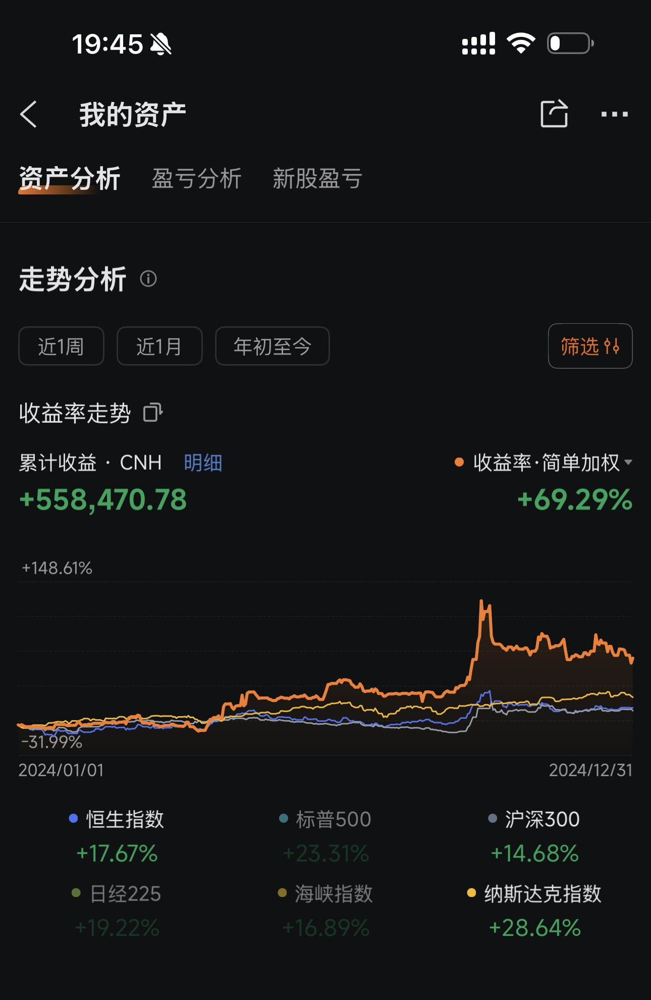
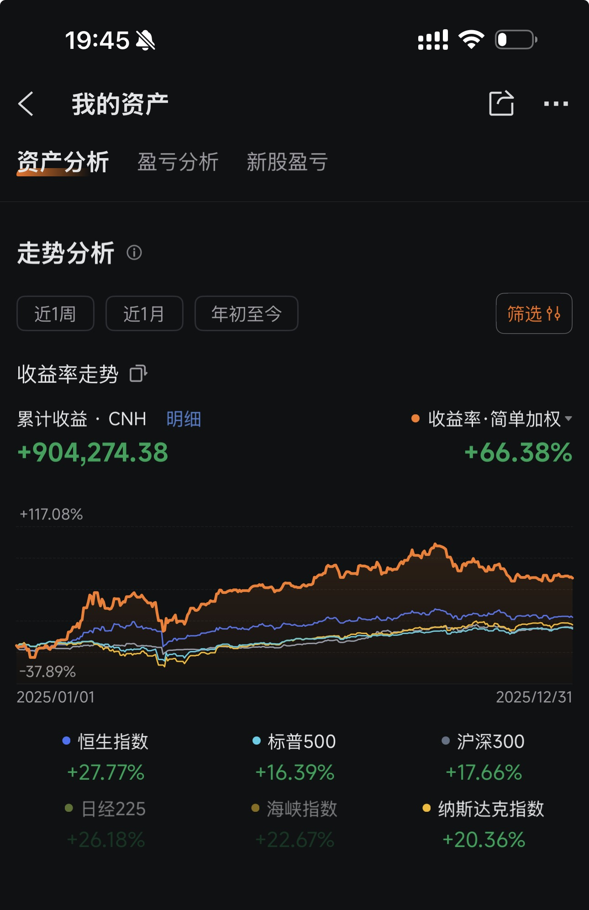

# AI Berkshire - AI 时代的价值投资研究框架

> "Price is what you pay, value is what you get." — Warren Buffett
>
> 用 AI 重新定义投资研究的深度与效率。

**AI Berkshire** 是一套基于 [Claude Code](https://claude.ai/code) 的投资研究 Skill 合集，将巴菲特、芒格、段永平、李录四位价值投资大师的方法论系统化、结构化，通过 AI Agent 实现专业级投资研究。

一个人 + Claude = 一个投研团队。

---

## Real Track Record

> 不是纸上谈兵。这套框架背后是真金白银验证的投资体系。

### 2024 全年收益：+69.29%



### 2025 年至今收益：+66.38%



### 与主要指数对比

| 指标 | 2024 全年 | 2025 至今 |
|------|----------|----------|
| **本框架实盘** | **+69.29%** | **+66.38%** |
| 恒生指数 | +17.67% | +27.77% |
| 标普500 | +23.31% | +16.39% |
| 沪深300 | +14.68% | +17.66% |
| 纳斯达克 | +28.64% | +20.36% |

**2024 年超额收益**：跑赢标普500 **46个百分点**，跑赢恒生指数 **52个百分点**

**2025 年超额收益**：跑赢标普500 **50个百分点**，跑赢恒生指数 **39个百分点**

**两年累计实盘收益超 146万元**，连续两年大幅跑赢全球主要指数。

> *免责声明：历史收益不代表未来表现。截图来自富途证券真实账户。*

---

## Why AI Berkshire?

传统投研的痛点：
- 一份深度研报需要 **3-5天**，覆盖面有限
- 个人投资者难以获得机构级研究资源
- 信息碎片化，缺乏系统化分析框架
- 情绪驱动决策，缺少纪律化 Checklist

**AI Berkshire 的解决方案**：

| 传统投研 | AI Berkshire |
|---------|-------------|
| 3-5天完成一份研报 | **10分钟**生成深度研究报告 |
| 单一视角分析 | 四大师多维度交叉验证 |
| 手工收集数据 | 多Agent并行搜索+自动交叉验证 |
| 容易遗漏风险 | 系统化风险清单+芒格式逆向思考 |
| 主观判断为主 | 结构化评分+明确买入/观望/回避建议 |

---

## Skills 一览

| Skill | 用途 | 适合场景 |
|-------|------|---------|
| [`/investment-research`](skills/investment-research.md) | 四大师综合深度分析 | 对一家上市公司进行全方位投资研究 |
| [`/investment-team`](skills/investment-team.md) | 多Agent并行投研团队 | 需要更快速、多角度同时分析 |
| [`/investment-checklist`](skills/investment-checklist.md) | 巴菲特买入前 Checklist | 快速筛选，决定是否值得深入研究 |
| [`/industry-research`](skills/industry-research.md) | 产业链全景扫描 | 研究一个行业/主题的全部投资机会 |
| [`/private-company-research`](skills/private-company-research.md) | 未上市公司深度研究 | 研究蚂蚁、SpaceX等未上市公司 |

---

## 快速开始

### 1. 安装 Claude Code

```bash
npm install -g @anthropic-ai/claude-code
```

### 2. 安装 Skills

将 `skills/` 目录下的 `.md` 文件复制到你的 Claude Code commands 目录：

```bash
# 克隆仓库
git clone https://github.com/xbtlin/ai-berkshire.git

# 复制 skills 到 Claude Code 全局 commands 目录
cp ai-berkshire/skills/*.md ~/.claude/commands/
```

### 3. 使用

在 Claude Code 中直接调用：

```
/investment-research 腾讯
/investment-checklist 茅台, 英伟达, 苹果
/industry-research 核电
/investment-team 美团
/private-company-research SpaceX
```

---

## 各 Skill 详细介绍

### 1. `/investment-research` — 四大师综合分析

最全面的单公司深度研究框架。按七个模块顺序执行：

```
数据收集 → 生意本质(段永平) → 护城河(巴菲特) → 逆向思考(芒格)
    → 管理层评估(段永平+巴菲特) → 文明趋势(李录) → 估值与安全边际
```

**核心特色**：
- AI研究偏见自觉机制（A/B/C级信息丰富度评级）
- 关键数据多源交叉验证（市值手算校验、至少2个独立来源）
- 四位大师的"追问"贯穿全文
- 三情景估值（乐观/中性/悲观）+ 反向DCF

**输出示例摘录**：

```markdown
## 综合决策备忘录

| 维度 | 结论 | 信心度 |
|------|------|--------|
| 生意质量（段永平） | 极佳：平台型生意，双边网络效应，边际成本趋零 | ★★★★★ |
| 护城河（巴菲特） | 宽阔且在变宽：网络效应+转换成本+规模效应三重叠加 | ★★★★☆ |
| 管理层（段永平+巴菲特） | 优秀：创始人掌舵，资本配置纪律强 | ★★★★☆ |
| 最大风险（芒格） | 监管政策不确定性，新业务亏损拖累整体利润 | ★★★☆☆ |
| 文明趋势（李录） | 顺应数字化消费趋势，但非"文明级范式转移" | ★★★★☆ |
| 估值（巴菲特+段永平） | 当前PE 18x，处于历史中位数偏低，有一定安全边际 | ★★★★☆ |

> **段永平**："这门生意的本质是连接消费者和商家，赚的是效率提升的钱。
> 好生意的标志是：用户越多，商家越多；商家越多，用户越多。飞轮一旦转起来，很难停下。"

> **芒格**："反过来想——如果这家公司明天消失，用户和商家会怎么办？
> 如果答案是'很快找到替代品'，那护城河就不够深。
> 如果答案是'生活会变得非常不方便'，那就值得关注。"
```

---

### 2. `/investment-team` — 多Agent投研团队

启动4个AI Agent并行研究，模拟真实投研团队协作：

```
┌─────────────────────────────────────────────┐
│              Team Lead (你)                  │
│         统筹协调 · 汇总研判                  │
├──────┬──────┬──────────┬───────────┤
│ Agent 1    │ Agent 2    │ Agent 3        │ Agent 4         │
│ 商业模式   │ 财务估值    │ 行业竞争       │ 风险管理层       │
│ 段永平视角 │ 巴菲特视角  │ 芒格视角       │ 李录视角         │
└──────┴──────┴──────────┴───────────┘
        ↓ 并行研究，实时汇报进度 ↓
              最终综合报告
```

**输出示例摘录**：

```markdown
## 一句话结论
> 美团是中国本地生活服务的绝对龙头，拥有多重网络效应护城河，
> 当前估值处于历史较低水平，长期投资价值显著，建议逢低建仓。

## 四维评分总表
| 维度 | 框架 | 评分 | 核心判断 |
|------|------|------|----------|
| 商业模式 & 护城河 | 段永平 | ★★★★☆ | 双边网络效应强劲，外卖+到店形成飞轮 |
| 财务 & 估值 | 巴菲特 | ★★★★☆ | 核心业务利润率持续改善，估值处于历史低位 |
| 行业 & 竞争 | 芒格 | ★★★☆☆ | 抖音入侵到店业务，竞争格局有恶化风险 |
| 风险 & 管理层 | 李录 | ★★★★☆ | 王兴战略眼光出色，但新业务烧钱需警惕 |

综合评分：3.8 / 5

## 投资建议
| 策略 | 建议 | 价格区间(港元) |
|------|------|---------------|
| 激进型 | 当前价位可建仓30% | 120-140 |
| 稳健型 | 等回调至100-110建仓 | 100-120 |
| 保守型 | 等待季报验证利润率趋势后再介入 | <100 |
```

---

### 3. `/investment-checklist` — 巴菲特买入前 Checklist

六关快速筛选，帮你在10分钟内决定一家公司是否值得深入研究：

```
第一关：能力圈（我能理解吗？）
    ↓ 通过
第二关：好生意（经济特征如何？）
    ↓ 通过
第三关：护城河（竞争优势深不深？）
    ↓ 通过
第四关：管理层（值得信任吗？）
    ↓ 通过
第五关：安全边际（价格便宜吗？）
    ↓ 通过
第六关：决策纪律（是理性还是FOMO？）
    ↓ 通过
   ✅ 镜子测试
```

**支持多公司对比**——一次筛选多个标的：

```
/investment-checklist 腾讯, 阿里巴巴, 美团, 拼多多
```

**输出示例摘录**：

```markdown
## 总览对比表

| 公司 | 通过？ | 能力圈 | 好生意 | 护城河 | 管理层 | 安全边际 | 核心结论 |
|------|-------|--------|--------|--------|--------|---------|---------|
| 腾讯 | ✅ 5/6 | ★★★★★ | ★★★★★ | ★★★★★ | ★★★★☆ | ★★★☆☆ | 生意极佳但估值偏高 |
| 阿里 | ❓ 4/6 | ★★★★☆ | ★★★★☆ | ★★★☆☆ | ★★☆☆☆ | ★★★★☆ | 便宜但治理有隐忧 |
| 美团 | ✅ 5/6 | ★★★★☆ | ★★★★☆ | ★★★★☆ | ★★★★☆ | ★★★★☆ | 估值合理，值得建仓 |
| 拼多多 | ✅ 5/6 | ★★★★☆ | ★★★★★ | ★★★☆☆ | ★★★☆☆ | ★★★☆☆ | 赚钱机器但护城河存疑 |

## 镜子测试

> "我以 380港元 买入 腾讯，因为：
> 1. 这门生意的本质是**社交网络+数字内容平台**，我理解它；
> 2. 它的护城河是**12亿用户的社交关系链**，而且在变宽；
> 3. 管理层**Pony Ma低调务实、资本配置优秀**，值得信赖；
> 4. 当前价格相当于内在价值的**8折**，有一定安全边际；
> 5. 即使我错了，下行风险可控，因为**账上净现金超2000亿、游戏现金流强劲**。"
>
> ✅ 通过镜子测试
```

---

### 4. `/industry-research` — 产业链全景扫描

从一个投资主题出发，完成产业链全景研究：

```
投资逻辑链构建 → 产业链全景图 → 全球上市公司扫描
    → 各环节头部公司四大师分析 → 投资组合配置建议
```

**输出示例摘录**：

```markdown
## 投资逻辑链：核电

底层趋势：AI数据中心电力需求爆发 + 碳中和目标
    → 导致：稳定清洁基荷电源需求激增
        → 创造：核电重启/新建/SMR的确定性需求
            → 受益：铀矿 → 燃料加工 → 设备制造 → 运营商

## 产业链全景图

上游：铀矿开采 → 铀转化 → 铀浓缩 → 燃料组件制造
中游：核岛设备 → 常规岛设备 → 仪控系统 → 工程建设
下游：核电运营 → 电力销售
辅助：核废料处理 → 退役服务 → SMR研发

## 推荐组合

| 层级 | 仓位 | 标的 | 环节 | 核心逻辑 |
|------|------|------|------|---------|
| 核心 | 50% | 中国广核(CGN)、Cameco | 运营+铀矿 | 确定性最高 |
| 卫星 | 30% | 中国核电、东方电气 | 运营+设备 | 国产替代受益 |
| 期权 | 15% | NuScale、Nano Nuclear | SMR | 高风险高弹性 |
| ETF | 替代 | URA、URNM | 全链 | 懒人方案 |
```

---

### 5. `/private-company-research` — 未上市公司深度研究

专为信息稀缺的未上市公司设计的"侦探式"研究框架：

**核心差异化**：
- **财务数据拼凑**：从招股书、母公司财报、融资新闻、行业数据多源拼凑
- **置信度标注**：每个数据点标注 🟢高 / 🟡中 / 🔴低 置信度
- **多方法估值交叉**：融资估值法 + 可比公司法 + DCF + 终局倒推法
- **退出路径分析**：IPO/并购/二级转让全路径评估

**输出示例摘录**：

```markdown
## 公司画像速览：SpaceX

| 项目 | 内容 |
|------|------|
| 最新估值 | ~$350B (2025年二级市场) 🟡 |
| 推算收入 | ~$130亿 (2024年) 🟡 |
| Starlink用户 | 400万+ (2024年底) 🟢 |
| 发射次数 | 100+ 次/年 (2024年) 🟢 |

## 估值判断

| 方法 | 估值区间 | 说明 |
|------|---------|------|
| 最近融资 | $350B | 二级市场报价，有流动性溢价 |
| 可比公司法 | $200-280B | 对标电信+航天+国防 |
| DCF(中性) | $250-350B | 假设Starlink 2027年$300亿收入 |
| 终局倒推 | $400-600B | 假设星链成为全球电信基础设施 |

综合合理估值区间：$250B - $400B

## 一页纸决策表
┌─────────────────────────────────────┐
│  公司：SpaceX    最新估值：$350B    │
│  阶段：成长期→成熟期过渡           │
├─────────────────────────────────────┤
│  核心投资逻辑：                     │
│  1. Starlink是人类历史上首个全球    │
│     卫星互联网，TAM超$1万亿         │
│  2. 火箭复用技术10年领先，           │
│     发射成本护城河极深               │
│  3. 政府+商业双轮驱动，             │
│     现金流确定性持续提升             │
├─────────────────────────────────────┤
│  结论：长期投资 / IPO后关注          │
│  预期回报倍数：2-4x (5年)           │
└─────────────────────────────────────┘
```

---

## 实战研究报告

> 以下是使用本框架生成的真实投资研究报告，展示 AI 投研的实际输出效果。

| 公司 | 使用 Skill | 核心结论 | 报告链接 |
|------|-----------|---------|---------|
| 腾讯控股 (0700.HK) | `/investment-research` | 生意极优+护城河极宽，14x前瞻PE合理偏低，建议450-550港元区间建仓 | [查看报告](reports/腾讯控股-投资研究报告.md) |

### 腾讯研究亮点

使用 `/investment-research 腾讯` 一键启动，3个 Agent 并行收集数据（财务估值、管理层商业模式、行业风险），10分钟内生成包含以下内容的深度报告：

- **AI偏见自觉**：A级信息充裕公司，重点做反共识检验
- **数据交叉验证**：总股本、市值、收入、净利润等关键数据多源校验
- **七步分析**：生意本质→护城河→逆向思考→管理层→文明趋势→估值→决策
- **三情景估值**：乐观830港元 / 中性580港元 / 悲观360港元
- **四大师模拟点评**：巴菲特、芒格、段永平、李录各抒己见

> *更多报告将持续添加。欢迎 PR 提交你用本框架生成的研究报告。*

---

## 设计理念

### 四大师方法论融合

```
              ┌──────────────────┐
              │    段永平         │
              │  "对的生意"       │
              │  商业模式本质      │
              └────────┬─────────┘
                       │
    ┌──────────────────┼──────────────────┐
    │                  │                  │
    ▼                  ▼                  ▼
┌────────┐     ┌──────────┐      ┌────────┐
│ 巴菲特  │     │   芒格    │      │  李录   │
│ 护城河  │     │ 逆向思考  │      │ 文明趋势│
│ 安全边际│     │ 风险清单  │      │ 范式转移│
│ 管理层  │     │ 偏误自查  │      │ 产业价值│
└────────┘     └──────────┘      └────────┘
```

### AI 研究偏见自觉

所有 Skill 内置"AI偏见防火墙"：

- **信息丰富度评级（A/B/C）**：区分"AI分析置信度"与"投资真实确定性"
- **数据交叉验证**：关键数据至少2个独立来源
- **市值手算校验**：防止单位错误（港币亿 vs 人民币亿 vs 美元亿）
- **反共识检查**：聪明人为什么不买/做空这家公司？
- **留白原则**：宁可说"数据不足"，也不用推测伪装确定性

### 金融严谨性工具 (`tools/financial_rigor.py`)

LLM 心算不可靠——PE算错一个小数点、市值单位搞混一个零，都可能导致错误的投资决策。本项目内置了程序化验证工具，在 Skill 执行过程中自动调用，确保关键数据的计算精度：

| 功能 | 命令 | 解决的问题 |
|------|------|-----------|
| **市值验算** | `verify-market-cap` | 股价×总股本 精确计算，与报告市值对比，检测单位错误 |
| **估值验算** | `verify-valuation` | PE/PB/ROE/FCF Yield 精确十进制计算，杜绝浮点漂移 |
| **多源交叉验证** | `cross-validate` | N个来源的同一数据自动比对，超过容差自动告警 |
| **三情景估值** | `three-scenario` | 乐观/中性/悲观精确计算目标价，可审计复现 |
| **Benford定律检测** | `benford` | 检测财务数据首位数字分布异常，识别可能的数据造假 |
| **精确计算器** | `calc` | 任意财务表达式精确计算，替代LLM心算 |

```bash
# 示例：腾讯市值验算
python3 tools/financial_rigor.py verify-market-cap \
  --price 510 --shares 9.11e9 --reported 4.65e12 --currency HKD

# 输出：
# ✅ 验证通过, 偏差仅 0.08%

# 示例：三情景估值
python3 tools/financial_rigor.py three-scenario \
  --price 510 --eps 23.5 --shares 91.1 \
  --growth 0.15 0.08 0.0 --pe 25 20 15 --currency HKD

# 输出：
# 乐观 (Bull)   15%  25x  35.74  893.5  +75.2%
# 中性 (Base)    8%  20x  29.60  592.1  +16.1%
# 悲观 (Bear)    0%  15x  23.50  352.5  -30.9%
```

**设计原则**：所有计算使用 Python `decimal.Decimal`（精确十进制），非 `float`（浮点近似）。`0.1 + 0.2 = 0.3` 在金融场景中不允许失败。

---

## 项目路线图

- [x] 四大师综合分析框架
- [x] 多Agent并行投研团队
- [x] 巴菲特买入前 Checklist
- [x] 产业链全景扫描
- [x] 未上市公司研究框架
- [x] 金融严谨性工具（精确算术、市值验算、多源交叉验证、Benford定律检测）
- [ ] 港股/A股/美股财报自动解读
- [ ] 投资组合跟踪与再平衡
- [ ] 历史回测：AI研报 vs 实际股价表现
- [ ] 宏观经济周期分析框架
- [ ] 基于MCP的实时数据接入（Wind/Bloomberg/Yahoo Finance）

---

## 免责声明

本项目仅供学习和研究目的。所有分析内容由 AI 生成，不构成任何投资建议。投资有风险，决策需谨慎。请始终做好自己的尽职调查（DYOR）。

---

## Star History

如果这个项目对你有帮助，请给一个 Star 支持！

## License

MIT License

---

> "The best investment you can make is in yourself." — Warren Buffett
>
> AI Berkshire：让每个人都拥有自己的投研团队。
