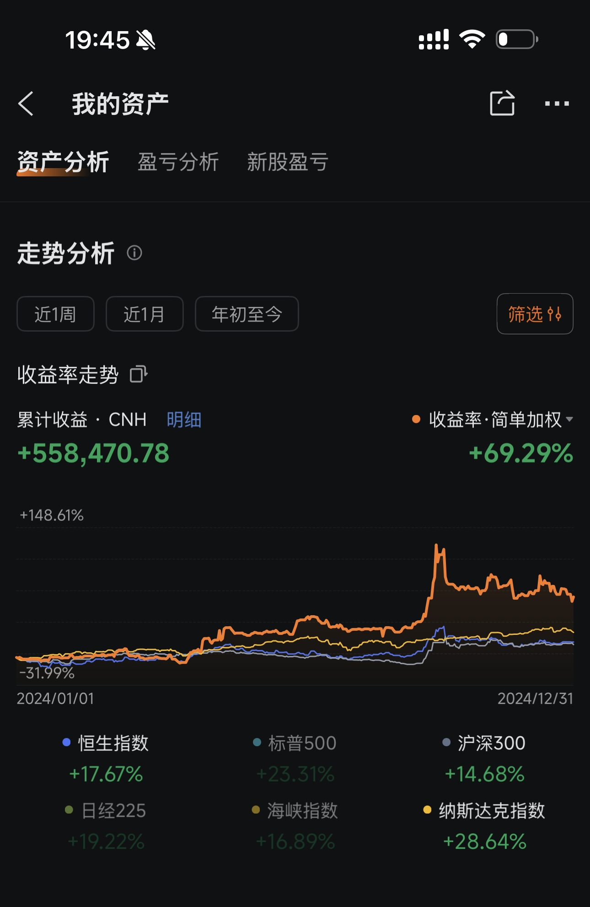
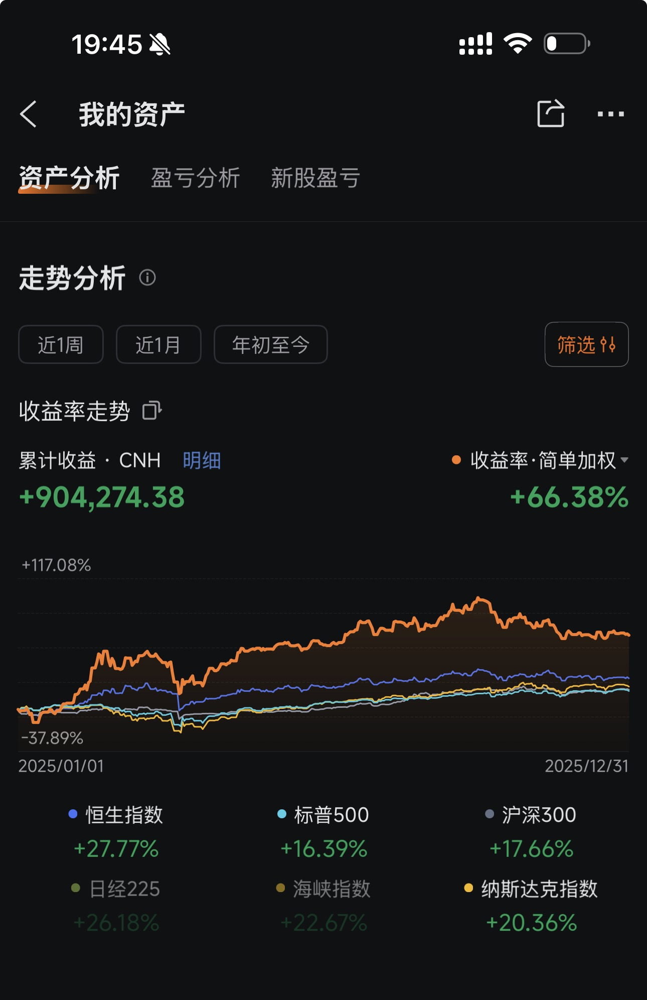
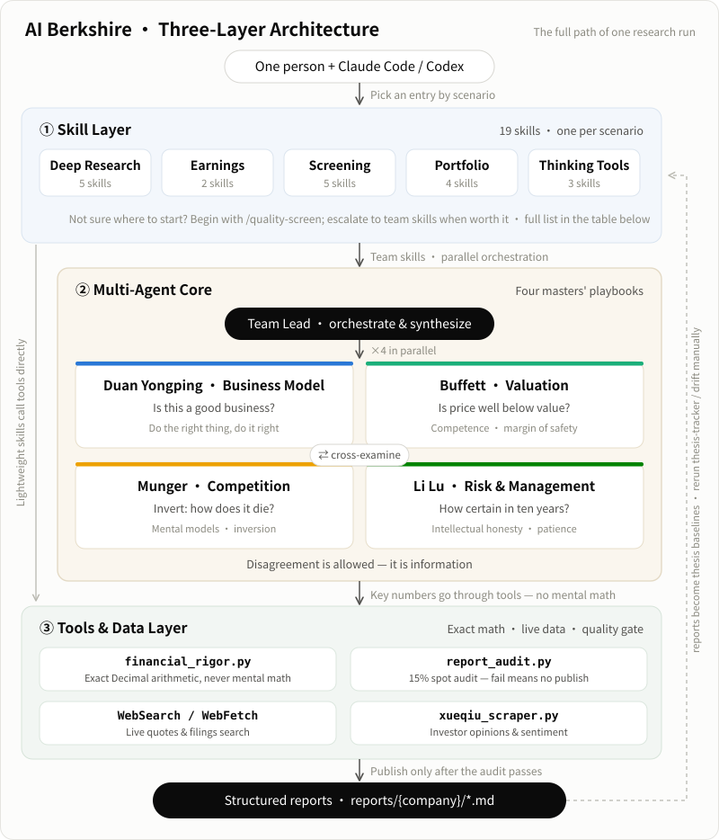
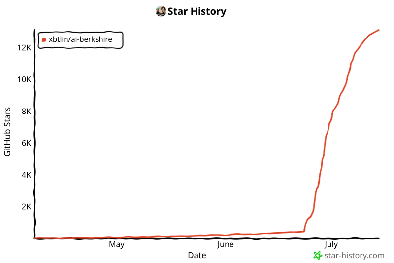

Italiano | [中文](README.md) | [English](README_EN.md) | [日本語](README_JA.md)

> La versione italiana è mantenuta dalla community. In caso di disallineamento, fanno fede la versione cinese e quella inglese.

[](https://trendshift.io/repositories/63696)

# AI Berkshire — Framework di ricerca sul value investing per l'era dell'AI

> "Il prezzo è quello che paghi, il valore è quello che ottieni." — Warren Buffett
>
> Ridefinire con l'AI la profondità e l'efficienza della ricerca sugli investimenti.

**AI Berkshire** è una raccolta di Skill di ricerca sugli investimenti compatibile sia con Claude Code sia con Codex. Sistematizza le metodologie di quattro maestri del value investing — Buffett, Munger, Duan Yongping e Li Lu — e produce ricerca di livello professionale attraverso Agent AI.

Una persona + Claude Code / Codex = un intero team di ricerca sugli investimenti.

[Track record](#track-record-reale) · [Perché non basta chiedere all'AI?](#perché-non-basta-chiedere-direttamente-allai) · [Skill](#panoramica-delle-skill-20-skill) · [Avvio rapido](#avvio-rapido) · [Report](#report-di-ricerca-reali) · [Filosofia di progetto](#filosofia-di-progetto)

---

## Track record reale

> Non si tratta di paper trading. Questo framework poggia su un portafoglio reale, con denaro vero e sottoposto ad audit.

### Rendimento dell'intero 2024: +69.29%



### Rendimento dell'intero 2025: +66.38%



### Confronto con i benchmark

| Benchmark | Intero 2024 | Intero 2025 |
|-----------|---------------|----------|
| **Questo framework (reale)** | **+69.29%** | **+66.38%** |
| Indice Hang Seng | +17.67% | +27.77% |
| S&P 500 | +23.31% | +16.39% |
| CSI 300 | +14.68% | +17.66% |
| NASDAQ Composite | +28.64% | +20.36% |

**Alpha 2024**: ha battuto l'S&P 500 di **46 punti percentuali** e l'Hang Seng di **52 punti percentuali**

**Alpha 2025**: ha battuto l'S&P 500 di **50 punti percentuali** e l'Hang Seng di **39 punti percentuali**

**In due anni i rendimenti reali cumulati superano 1.46 milioni di ¥**, con un risultato nettamente superiore a quello di tutti i principali indici globali per due anni consecutivi.

> *Avvertenza: i rendimenti passati non sono garanzia di risultati futuri. Gli screenshot provengono da un conto reale presso un broker (Futu Securities).*

---

## Perché non basta chiedere direttamente all'AI?

Certo, puoi chiedere a Claude: "Devo comprare Pinduoduo?" Otterrai un'analisi equilibrata "da un lato... dall'altro lato..." che si chiude con "investire comporta dei rischi, la decisione è tua".

**Quel tipo di analisi sembra corretto ma non può guidare decisioni concrete.**

AI Berkshire non risolve il problema "l'AI sa analizzare?" — risolve il problema della **qualità dell'analisi e della disciplina decisionale**. Ecco cosa cambia:

### 1. Impone un verdetto — niente posizioni ambigue

Se chiedi direttamente a un'AI, ottieni un'"analisi" che accontenta entrambe le tesi. AI Berkshire impone un output concreto: **Promosso / Bocciato / Zona Grigia**, con intervalli di prezzo specifici e raccomandazioni graduate.

> Risposta di un'AI generica: *"Pinduoduo ha potenziale di crescita ma deve anche affrontare pressioni competitive. Gli investitori dovrebbero valutare..."*
>
> Output di AI Berkshire:

> | Strategia | Raccomandazione | Intervallo di prezzo |
> |----------|---------------|-------------|
> | Aggressivo | Costruire una posizione al 20% al prezzo attuale | $95–105 |
> | Moderato | Attendere chiarezza sulla politica di buyback | $85–95 |
> | Conservativo | Non supera la soglia di certezza a 10 anni — bocciato | — |
>
> **Test dello Specchio**: se non riesci a spiegarlo in 5 frasi = non comprare. Senza eccezioni.

### 2. Dialettica a quattro maestri, non una singola prospettiva

Non è solo "analizza questo con il metodo di Buffett". Le quattro prospettive generano **vera tensione e contraddizioni** —

Prendiamo Pinduoduo come esempio:
- **Duan Yongping** (modello di business): ottimo business, modello C2M difficile da replicare → 3.7/5
- **Buffett** (valutazione finanziaria): P/E al netto della cassa ad appena 6.3x, una macchina da contanti → 4.4/5
- **Munger** (inversione): moat meno profondo di quanto appaia — Douyin ha raggiunto 4.000 miliardi di ¥ di GMV in 3 anni → 3.5/5
- **Li Lu** (certezza di lungo periodo): dubbi sulla cultura del management, incerto a 10 anni → 2.0/5

**Buffett dice "davvero a buon mercato", Li Lu dice "se c'è incertezza, non comprare"** — questo conflitto è lo stato reale delle decisioni d'investimento. Un singolo prompt non può produrre questa dialettica multiprospettica, ed è esattamente ciò che previene i punti ciechi.

### 3. Meccanismi strutturati contro i bias

Il maggiore pericolo dell'AI non è dare risposte sbagliate — è dare risposte che **sembrano corrette ma non reggono all'esame**. AI Berkshire incorpora nel processo più livelli di "anti-inganno":

| Meccanismo | Problema risolto | Esempio |
|-----------|---------------|---------|
| **Rating di ricchezza informativa (A/B/C)** | Previene l'illusione "più dati = più certezza" | Pop Mart classificata B: dati limitati, metriche stimate contrassegnate con livelli di confidenza |
| **Test di inversione alla Munger** | Costringe a ragionare sugli scenari di fallimento | "Come potrebbe morire Pinduoduo?" → Elenca 5 scenari con probabilità |
| **Checklist di esclusione rapida** | 8 linee rosse, ognuna è un veto | Problemi di integrità del management → rigetto immediato a prescindere dalla valutazione |
| **Verifica contrarian** | Evita di ragionare come la massa | "Perché gli investitori intelligenti sono short su questo titolo?" → Porta alla luce rischi trascurati |
| **Onestà intellettuale** | Preferisce il "non lo so" | Contrassegna le lacune dei dati come "zona grigia" invece di colmarle con speculazioni |

### 4. Precisione dei dati finanziari

Gli LLM non sanno fare calcoli a mente in modo affidabile. Sbagliare un P/E di un decimale o confondere HKD con CNY può portare a decisioni d'investimento catastrofiche.

**Caso reale**: analizzando Tencent, fonti diverse riportavano la capitalizzazione di mercato in "miliardi di HKD" e "miliardi di CNY". L'approccio di AI Berkshire:

```bash
# Verifica manuale della capitalizzazione: prezzo × azioni in circolazione, confronto incrociato con i dati dichiarati
python3 tools/financial_rigor.py verify-market-cap \
  --price 510 --shares 9.11e9 --reported 4.65e12 --currency HKD
# ✅ Verificato — scostamento di appena 0.08%
```

Tutti i calcoli usano Python `decimal.Decimal` (aritmetica decimale esatta), non `float`. I dati chiave richiedono almeno 2 fonti indipendenti per la validazione incrociata.

### 5. Processo di ricerca riproducibile

Se chiedi direttamente a un'AI, formato, profondità e copertura cambiano ogni volta — oggi l'analisi di Tencent include un punteggio del moat, domani quella di Meituan potrebbe dimenticarlo.

AI Berkshire garantisce: **stesso input → output strutturalmente coerente e altrettanto approfondito.** Questo significa che puoi:
- Confrontare 7 aziende fianco a fianco con criteri di punteggio identici
- Rianalizzare la stessa azienda dopo 6 mesi e confrontare direttamente le variazioni
- Allineare gli output di ricerca tra i membri del team

> Output reale — 7 aziende passate alla stessa Checklist:
>
> | Azienda | Verdetto | Cerchio di competenza | Buon business | Moat | Management | Margine di sicurezza | Totale |
> |---------|:-------:|:-------------------:|:------------:|:----:|:----------:|:---------------:|:-------:|
> | Kweichow Moutai | ✅ Promosso | ★★★★★ | ★★★★★ | ★★★★★ | ★★★☆☆ | ★★★★☆ | 4.7 |
> | Tencent | ✅ Promosso | ★★★★☆ | ★★★★★ | ★★★★★ | ★★★★★ | ★★★★☆ | 4.7 |
> | NVIDIA | ✅ Con riserva | ★★★★☆ | ★★★★★ | ★★★★★ | ★★★★★ | ★★★☆☆ | 4.3 |
> | Meituan | ✅ Con riserva | ★★★★☆ | ★★★★☆ | ★★★★☆ | ★★★★☆ | ★★★★☆ | 4.0 |
> | Kuaishou | ✅ Con riserva | ★★★☆☆ | ★★★★☆ | ★★★★☆ | ★★★★☆ | ★★★★★ | 4.0 |
> | Pinduoduo | ❓ Grigio | ★★★★☆ | ★★★★☆ | ★★★☆☆ | ★★★☆☆ | ★★★★★ | 3.8 |
> | Pop Mart | ❓ Grigio | ★★★☆☆ | ★★★★☆ | ★★★★☆ | ★★★★★ | ★★★☆☆ | 3.7 |

### 6. Parallelismo multi-Agent = profondità di ricerca moltiplicata

`/investment-team` lancia 4 Agent indipendenti che studiano un'azienda **contemporaneamente**. Ogni Agent effettua le proprie ricerche sul web, valida i dati in modo incrociato e arriva a conclusioni indipendenti. Non significa spezzare un prompt in quattro sezioni — sono 4 "analisti" che conducono ciascuno una ricerca completa, con un Team Lead che sintetizza il verdetto finale.

Se chiedi direttamente a un'AI, hai una sola finestra di contesto. Quattro Agent in parallelo significano 4× il volume di ricerca, 4× le fonti di informazione e 4 prospettive indipendenti.

<p align="center">
  
</p>

### In una frase

> **Chi interroga l'AI normalmente ottiene "analisi che sembrano corrette". Con AI Berkshire ottieni "report di ricerca da cui prendere davvero decisioni".**

---

## Architettura

<p align="center">
  
</p>


**Filosofia di progetto a tre livelli**:
- **Livello Skill**: astrae "ciò che vuoi fare" in 20 punti di ingresso chiari — ricerca approfondita, analisi dei risultati, screening settoriale, gestione del portafoglio e strumenti di pensiero. Si sceglie in base allo scenario.
- **Livello Agent**: le Skill di team (es. `/investment-team`, `/earnings-team`) eseguono in parallelo 4 Agent con le prospettive dei maestri sotto un Team Lead — ricercano e giudicano in modo indipendente, si contestano a vicenda prima della sintesi. Le Skill leggere saltano questo livello e chiamano direttamente gli strumenti.
- **Livello Tool**: calcoli ad alta precisione, ricerca web in tempo reale, audit dei report — garantiscono che i dati di ogni report siano rigorosi e verificabili.

---

## Panoramica delle Skill (20 Skill)

### 🔬 Ricerca approfondita

| Skill | A cosa serve | Quando usarla |
|-------|---------|-------------|
| [`/investment-research`](skills/investment-research.md) | Analisi complessiva a quattro maestri | Ricerca a tutto spettro su una società quotata |
| [`/investment-team`](skills/investment-team.md) | Team di ricerca multi-Agent in parallelo | 4 Agent in parallelo — il più rapido e completo |
| [`/management-deep-dive`](skills/management-deep-dive.md) | Analisi approfondita del management | "Comprare un'azione significa comprare le sue persone" — quando il management è la variabile chiave |
| [`/private-company-research`](skills/private-company-research.md) | Ricerca su società non quotate | Studiare società non quotate povere di informazioni come Ant Group, SpaceX |
| [`/deep-company-series`](skills/deep-company-series.md) | Serie di analisi approfondite in 8 parti | Serie di livello editoriale, ~120K parole dal reset cognitivo alla chiusura della decisione |

### 📊 Analisi dei risultati

| Skill | A cosa serve | Quando usarla |
|-------|---------|-------------|
| [`/earnings-review`](skills/earnings-review.md) | Lettura approfondita dei risultati (fonti primarie) | Leggere solo i documenti ufficiali — nessun report sell-side — come Buffett legge i bilanci annuali |
| [`/earnings-team`](skills/earnings-team.md) | Team sui risultati + articolo pubblicabile | I quattro maestri interpretano i risultati in parallelo → rifinitura editoriale → revisione del lettore → pronto per la pubblicazione |

### 🏭 Screening settoriale

| Skill | A cosa serve | Quando usarla |
|-------|---------|-------------|
| [`/industry-research`](skills/industry-research.md) | Scansione della catena del valore di un settore | Mappare tutte le opportunità d'investimento lungo la catena del valore di un settore |
| [`/industry-funnel`](skills/industry-funnel.md) | Screening a imbuto settoriale | Mercato intero → scrematura ≤10 → selezione finale 3, con analisi approfondita |
| [`/quality-screen`](skills/quality-screen.md) | Screening di qualità (7 metriche oggettive) | Eliminare rapidamente le aziende non di prima fascia; supporta screening su singolo titolo / settore / indice / lotti tematici |
| [`/bottleneck-hunter`](skills/bottleneck-hunter.md) | Cacciatore di colli di bottiglia della supply chain | Partire da un supertrend e individuare colli di bottiglia fisici della supply chain e opportunità di arbitraggio |
| [`/investment-checklist`](skills/investment-checklist.md) | Checklist pre-acquisto di Buffett | Sei filtri, 10 minuti per decidere se scavare più a fondo |

### 📈 Gestione del portafoglio

| Skill | A cosa serve | Quando usarla |
|-------|---------|-------------|
| [`/income-investment`](skills/income-investment.md) | Analisi azionaria centrata sul reddito | Distinguere reddito durevole, rendimento opportunistico e trappole di rendimento |
| [`/portfolio-review`](skills/portfolio-review.md) | Revisione e ottimizzazione del portafoglio | Passare da "studiare aziende" a "gestire un portafoglio" — dimensionamento, concentrazione, ribilanciamento |
| [`/thesis-tracker`](skills/thesis-tracker.md) | Tracker della tesi d'investimento | Sistema di disciplina post-acquisto: monitorare di continuo se la propria tesi è stata falsificata |
| [`/thesis-drift`](skills/thesis-drift.md) | Rilevamento della deriva della tesi d'investimento | Confrontare due tesi/report — separare le modifiche fattuali, di valutazione e di formulazione |
| [`/news-pulse`](skills/news-pulse.md) | Attribuzione rapida dei movimenti di prezzo | Quando un titolo schizza o crolla — capire "cosa è successo" in 10 minuti |

### 🧠 Strumenti di pensiero

| Skill | A cosa serve | Quando usarla |
|-------|---------|-------------|
| [`/dyp-ask`](skills/dyp-ask.md) | Domande e risposte con Duan Yongping | Affrontare qualsiasi domanda alla maniera di Duan Yongping — business, investimenti, vita |
| [`/financial-data`](skills/financial-data.md) | Recupero e validazione incrociata dei dati finanziari | Garantire che i dati chiave provengano da 2+ fonti indipendenti; segnala scostamenti >1% |
| [`/wechat-article`](skills/wechat-article.md) | Flusso di lavoro per articoli WeChat | Gli Agent autore, editore e lettore collaborano per produrre un articolo pubblicabile |

---

## Avvio rapido

### Costi e scelta del modello

Le Skill di ricerca approfondita eseguono, per come sono progettate, più passate di ricerca, controlli incrociati tra fonti e sintesi multi-Agent, quindi possono consumare un numero elevato di token. È il costo necessario per ottenere una copertura più completa di qualità del business, dati finanziari, struttura del settore e rischio.

Per le decisioni d'investimento ad alto impatto, la posizione del maintainer è che il modello più potente offra in genere il miglior ROI dell'analisi; risparmiare sul costo del modello non deve avvenire a scapito della qualità del giudizio dove conta davvero. I modelli più leggeri possono essere utili per triage, riepiloghi o domande a basso rischio, ma è da attendersi che moat, valutazione, management e sintesi del rischio dipendano in misura maggiore dalle capacità del modello.

Per controllare i costi, modula prima il flusso di lavoro invece di aspettarti che un'intera esecuzione di ricerca approfondita diventi economica: usa [`/quality-screen`](skills/quality-screen.md) per scartare subito le aziende più deboli, oppure [`/news-pulse`](skills/news-pulse.md) per una rapida attribuzione dei movimenti di prezzo. Lancia [`/investment-research`](skills/investment-research.md) o [`/investment-team`](skills/investment-team.md) solo quando il risultato merita un lavoro più approfondito.

### 1. Installare un client AI

Questo repository mantiene un unico workflow canonico e fornisce comandi Claude Code più Skill Codex. Installa il client che intendi usare.

Per gli utenti Claude Code:

```bash
npm install -g @anthropic-ai/claude-code
```

Per gli utenti Codex su macOS / Linux:

```bash
# macOS / Linux
curl -fsSL https://chatgpt.com/codex/install.sh | sh

# In alternativa, usare npm
npm install -g @openai/codex

# In alternativa, usare Homebrew
brew install --cask codex

# Verificare l'installazione
codex --version
```

Gli utenti Windows possono usare il programma di installazione ufficiale PowerShell: `powershell -ExecutionPolicy ByPass -c "irm https://chatgpt.com/codex/install.ps1 | iex"`.

Se `codex --version` stampa una versione, puoi proseguire con l'installazione delle Skill Codex di questo progetto.

#### Ridurre le richieste di approvazione

Queste Skill emettono molte chiamate agli strumenti e Claude Code ne chiede l'approvazione una a una per impostazione predefinita. Questo comportamento deriva dal sistema di permessi lato client di Claude Code; non è un'impostazione del repository che questo progetto possa cambiare.

Se ti fidi del workflow corrente e operi in un ambiente affidabile, avvia Claude Code in modalità skip-permissions:

```bash
claude --dangerously-skip-permissions
```

Attenzione: questa modalità disabilita le protezioni di approvazione degli strumenti di Claude Code. Usala solo quando ti fidi del repository, dei comandi e della directory di lavoro.

### 2. Installare le Skill

Per gli utenti Claude Code su macOS / Linux:

```bash
# Clonare il repository
git clone https://github.com/xbtlin/ai-berkshire.git

# Copiare le Skill nella directory globale dei comandi di Claude Code
cd ai-berkshire
./scripts/install-claude-commands.sh
```

Per gli utenti Claude Code su Windows PowerShell / Prompt dei comandi:

```bat
git clone https://github.com/xbtlin/ai-berkshire.git
cd ai-berkshire
.\scripts\install-claude-commands.bat
```

Per gli utenti Codex su macOS / Linux:

```bash
# Clonare il repository
git clone https://github.com/xbtlin/ai-berkshire.git

# Generare e installare le Skill Codex in ~/.codex/skills
cd ai-berkshire
./scripts/install-codex-skills.sh

# Facoltativo: installare gli slash prompt Codex in ~/.codex/prompts
# per avere un punto di ingresso /investment-research simile a Claude Code
./scripts/install-codex-prompts.sh
```

Per gli utenti Codex su Windows PowerShell / Prompt dei comandi:

```bat
git clone https://github.com/xbtlin/ai-berkshire.git
cd ai-berkshire
.\scripts\install-codex-skills.bat

REM Facoltativo: installare gli slash prompt Codex
.\scripts\install-codex-prompts.bat
```

Il repository mantiene tre punti di ingresso: `skills/*.md` sono le sorgenti dei comandi Claude Code; `codex-skills/*/SKILL.md` sono i pacchetti Skill Codex generati da `skills/*.md` tramite `scripts/sync-codex-skills.py`; `codex-prompts/*.md` sono un livello opzionale di compatibilità per gli slash prompt Codex.

### 3. Utilizzo

Invoca direttamente in Claude Code:

```bash
# Ricerca approfondita
/investment-research Tencent
/investment-team Meituan
/management-deep-dive Wang Xing, Meituan
/private-company-research SpaceX
/deep-company-series Pinduoduo

# Analisi dei risultati
/earnings-review Tencent 2025Q4
/earnings-team PDD annuale 2025

# Screening settoriale
/industry-research Energia nucleare
/industry-funnel Potenza di calcolo AI
/quality-screen Componenti dell'Indice Hang Seng
/bottleneck-hunter Infrastrutture AI
/investment-checklist Moutai, NVIDIA, Apple

# Gestione del portafoglio
/income-investment Verizon mode=existing role=core-income quantity=100 cost_basis=39.50 tax_residence=France horizon=5y
/portfolio-review Tencent 30%, Meituan 20%, Moutai 20%, Liquidità 30%
/thesis-tracker Pinduoduo
/thesis-drift Pinduoduo reports/PDD-thesis-2025Q4.md reports/PDD-thesis-2026Q1.md
/news-pulse Tencent

# Strumenti di pensiero
/dyp-ask Dov'è il vero moat di Pinduoduo?
/wechat-article Meituan
```

Dopo l'installazione per Codex, riavvia Codex e richiama le Skill per nome, per esempio:

```text
Usa investment-research per fare ricerca su Tencent
Usa earnings-review per analizzare i risultati annuali 2025 di PDD
Usa industry-funnel per fare screening sulla potenza di calcolo AI
Usa bottleneck-hunter per scansionare i colli di bottiglia delle infrastrutture AI
Usa thesis-drift per confrontare due tesi su Pinduoduo
Usa wechat-article per scrivere un articolo d'investimento su Meituan
```

Se installi gli slash prompt Codex, riavvia Codex e cercali nel menu `/`. Il punto di ingresso ufficiale dei custom prompt di Codex appare di solito come `prompts:<name>`, per esempio:

```text
/prompts:investment-research Tencent
```

---

## Descrizioni dettagliate delle Skill

### 1. `/investment-research` — Analisi complessiva a quattro maestri

Il framework più approfondito per la ricerca su una singola società. Esegue sette moduli in sequenza:

```
Raccolta dati → Essenza del business (Duan Yongping) → Moat (Buffett) → Inversione (Munger)
    → Valutazione del management (Duan Yongping + Buffett) → Trend di civiltà (Li Lu)
    → Valutazione & Margine di sicurezza
```

**Caratteristiche chiave**:
- Meccanismo di consapevolezza del bias di ricerca dell'AI (rating di ricchezza informativa A/B/C)
- Validazione incrociata multi-fonte sui dati chiave (calcolo manuale della capitalizzazione, 2+ fonti indipendenti)
- Le "domande di approfondimento" di ciascun maestro intrecciate lungo tutto il percorso
- Valutazione a tre scenari (ottimistico/base/pessimistico) + DCF inverso

**Estratto dell'output**:

> #### Memo decisionale complessivo
>
> | Dimensione | Conclusione | Confidenza |
> |-----------|-----------|------------|
> | Qualità del business (Duan Yongping) | Eccellente: business di piattaforma, effetti di rete bilaterali, costo marginale quasi nullo | ★★★★★ |
> | Moat (Buffett) | Ampio e in ampliamento: effetti di rete + costi di switching + economie di scala, su tre livelli | ★★★★☆ |
> | Management (Duan Yongping + Buffett) | Solido: guidato dal fondatore, eccellente disciplina nell'allocazione del capitale | ★★★★☆ |
> | Rischio principale (Munger) | Incertezza normativa; perdite dei nuovi business che trascinano gli utili complessivi | ★★★☆☆ |
> | Trend di civiltà (Li Lu) | Allineato alle tendenze del consumo digitale, ma non un "cambio di paradigma a livello di civiltà" | ★★★★☆ |
> | Valutazione (Buffett + Duan Yongping) | P/E attuale di 18x, leggermente sotto la mediana storica, margine di sicurezza modesto | ★★★★☆ |
>
> **Duan Yongping**: "L'essenza di questo business è connettere consumatori e commercianti — il profitto viene dai guadagni di efficienza. Il segno distintivo di un grande business: più utenti portano più commercianti, più commercianti portano più utenti. Una volta che il volano gira, è molto difficile fermarlo."
>
> **Munger**: "Inverti, sempre inverti — se questa azienda sparisse domani, cosa farebbero utenti e commercianti? Se la risposta è 'troverebbero rapidamente un sostituto', il moat non è abbastanza profondo. Se la risposta è 'la vita diventerebbe molto scomoda', allora merita attenzione."

---

### 2. `/investment-team` — Team di ricerca multi-Agent

Lancia 4 Agent AI in parallelo, simulando un vero team di ricerca sugli investimenti. Ogni Agent cerca in autonomia, analizza in autonomia e fornisce giudizi indipendenti. Il Team Lead sintetizza il giudizio finale.

**Estratto dell'output**:

> #### Conclusione in una riga
> Meituan è il leader indiscusso dei servizi locali (local life) in Cina, con moat multi-livello basati sugli effetti di rete. La valutazione attuale si colloca su minimi storici — valore significativo nel lungo termine. Si raccomanda di accumulare sui ribassi.
>
> #### Scorecard a quattro dimensioni
>
> | Dimensione | Framework | Punteggio | Giudizio chiave |
> |-----------|-----------|-------|---------------|
> | Modello di business & Moat | Duan Yongping | ★★★★☆ | Forti effetti di rete bilaterali; food delivery + in-store formano un volano |
> | Dati finanziari & Valutazione | Buffett | ★★★★☆ | Margini del core business in miglioramento costante; valutazione sui minimi storici |
> | Settore & Concorrenza | Munger | ★★★☆☆ | Douyin invade il business in-store; il panorama competitivo potrebbe deteriorarsi |
> | Rischio & Management | Li Lu | ★★★★☆ | Wang Xing ha una visione strategica eccezionale, ma il cash burn dei nuovi business va monitorato |
>
> **Punteggio composito: 3.8 / 5**
>
> #### Raccomandazione d'investimento
>
> | Strategia | Raccomandazione | Fascia di prezzo (HKD) |
> |----------|---------------|-------------------|
> | Aggressivo | Costruire una posizione al 30% al prezzo attuale | 120–140 |
> | Moderato | Attendere un ritracciamento a 100–110 per entrare | 100–120 |
> | Conservativo | Attendere i risultati trimestrali per confermare il trend dei margini | <100 |

---

### 3. `/investment-checklist` — Checklist pre-acquisto di Buffett

Sei filtri per uno screening rapido — si decide in 10 minuti se una società merita una ricerca più approfondita:

```
Filtro 1: Cerchio di competenza (Riesco a capirla?)
    ↓ Superato
Filtro 2: Buon business (Qual è l'economia sottostante?)
    ↓ Superato
Filtro 3: Moat (Quanto è profondo il vantaggio competitivo?)
    ↓ Superato
Filtro 4: Management (Ci si può fidare?)
    ↓ Superato
Filtro 5: Margine di sicurezza (Il prezzo è abbastanza basso?)
    ↓ Superato
Filtro 6: Disciplina decisionale (Razionalità o FOMO?)
    ↓ Superato
   ✅ Test dello Specchio
```

**Supporta il confronto multi-società** — screening di più target contemporaneamente:

```
/investment-checklist Tencent, Alibaba, Meituan, Pinduoduo
```

**Estratto dell'output**:

> #### Test dello Specchio
>
> "Sto comprando Tencent a HK$380 perché:
> 1. L'essenza di questo business è una **rete sociale + piattaforma di contenuti digitali** — la capisco;
> 2. Il suo moat è il **grafo sociale di 1.2 miliardi di utenti**, e si sta allargando;
> 3. Il management — **Pony Ma è sobrio, pragmatico e un eccellente allocatore di capitale** — è affidabile;
> 4. Il prezzo attuale rappresenta il **~80% del valore intrinseco**, e offre un margine di sicurezza significativo;
> 5. Anche se mi sbagliassi, il downside è gestibile perché **la cassa netta supera i 200 miliardi di ¥ e il flusso di cassa del gaming è solido come una roccia**."
>
> ✅ Test dello Specchio superato
>
> **Se non riesci a spiegarlo in 5 frasi = non comprare. Senza eccezioni.**

---

### 4. `/industry-research` — Scansione della catena del valore settoriale

Si parte da un tema d'investimento e si completa uno studio integrale della catena del valore del settore:

```
Catena logica d'investimento → Mappa della catena del valore → Scansione globale delle società quotate
    → Analisi a quattro maestri sui leader di segmento → Raccomandazione di allocazione di portafoglio
```

**Estratto dell'output**:

> #### Catena logica d'investimento: energia nucleare
>
> Trend di fondo: esplosione della domanda elettrica dei data center AI + obiettivi di neutralità carbonica
> → Determina: domanda in forte crescita di energia di base stabile e pulita
> → Crea: domanda deterministica per riavvii nucleari / nuove costruzioni / SMR
> → Beneficiari: estrazione di uranio → fabbricazione del combustibile → produzione di apparecchiature → operatori
>
> #### Portafoglio raccomandato
>
> | Livello | Peso | Target | Segmento | Logica chiave |
> |------|--------|--------|---------|------------|
> | Core | 50% | CGN / Cameco | Esercizio + Uranio | Massima certezza |
> | Satellite | 30% | CNNP / Dongfang Electric | Esercizio + Apparecchiature | Beneficiario della sostituzione domestica |
> | Opzione | 15% | NuScale / Nano Nuclear | SMR | Alto rischio, alta convessità |
> | ETF | Alternativa | URA / URNM | Intera catena | Approccio passivo |

---

### 5. `/industry-funnel` — Screening a imbuto settoriale

Partire da un settore/tema e restringere progressivamente: **Mercato intero → ≤10 → 3 analisi approfondite**:

```
Scansione dell'intero mercato (attività + rendimenti + unione delle top-30 per capitalizzazione → 30-60 società)
    ↓ 5 filtri rigidi di value investing
Scrematura ≤ 10
    ↓ Analisi dettagliata (300-500 parole ciascuna)
Analisi dettagliata ≤ 10
    ↓ Selezione finale (per complementarità di portafoglio, NON per punteggio top-3)
Analisi approfondita a quattro maestri su 3 società (800-1200 parole ciascuna)
    ↓
Portafoglio raccomandato (Core / Satellite / Opzione) + Segnali operativi
```

**Caratteristiche chiave**:
- Ogni livello ha criteri espliciti di mantenimento/esclusione — i nomi eliminati arrivano con una motivazione dichiarata (non è una black box)
- Le 3 finaliste sono selezionate per la **complementarità di portafoglio** (alta certezza + upside moderato + alta convessità), non in base ai punteggi di classifica
- Lista obbligatoria dei "candidati IPO futuri" per non lasciarsi sfuggire gli attori chiave del mercato privato
- Consapevolezza dei bias dell'AI: contrasta il bias large-cap / il bias anglofono / il bias narrativo / il bias solo-quotate

**Differenza rispetto a `/industry-research`**:
- `industry-research` mette a fuoco la struttura della catena del valore e la vista panoramica (suddivisa per segmento)
- `industry-funnel` mette a fuoco l'imbuto di selezione dei titoli (screening progressivo dall'intero mercato alle 3 finaliste)

**Test dal vivo: settore AI, 4 sub-track in parallelo (2026-05-09)**:

| Sub-track | Le 3 finaliste | Scelta della posizione core |
|-----------|---------|-------------------|
| Potenza di calcolo AI | TSMC / NVIDIA / SK Hynix | TSMC ★★★★★ |
| Modelli AI | Alphabet / Meta / Alibaba | Alphabet ★★★★★ |
| Applicazioni AI | Microsoft / Adobe / AppLovin | Microsoft + Adobe ★★★★ |
| Infrastrutture ed energia AI | Eaton / TBEA / Talen Energy | Eaton + TBEA ★★★★ |

**Intuizione chiave**: i più grandi vincitori del livello applicativo dell'AI non sono le aziende AI-native, ma i giganti consolidati con distribuzione, dati e integrazione nei flussi di lavoro. Fa eco allo schema "vendi picconi e pale" della bolla Internet 1995–2000 (Amazon e Apple hanno vinto; Pets.com no).

Report completi: [Potenza di calcolo AI](reports/AI算力-funnel-20260509.md) · [Modelli AI](reports/AI模型-funnel-20260509.md) · [Applicazioni AI](reports/AI应用-funnel-20260509.md) · [Infrastrutture ed energia AI](reports/AI基建电力-funnel-20260509.md)

---

### 6. `/private-company-research` — Ricerca approfondita sulle società non quotate

Un framework di ricerca "in stile detective" progettato per le società non quotate con poche informazioni disponibili:

**Elementi distintivi**:
- **Ricostruzione dei dati finanziari**: assemblati da documenti ufficiali dell'IPO, report della capogruppo, notizie sui round di finanziamento e dati di settore
- **Etichettatura della confidenza**: ogni dato contrassegnato con confidenza 🟢 Alta / 🟡 Media / 🔴 Bassa
- **Verifica incrociata della valutazione a più metodi**: valutazione del round di finanziamento + società comparabili + DCF + backsolve sullo scenario finale
- **Analisi delle vie d'uscita**: valutazione completa dei percorsi IPO / M&A / cessione secondaria

**Estratto dell'output**:

> #### Profilo aziendale: SpaceX
>
> | Voce | Dettaglio |
> |------|--------|
> | Ultima valutazione | ~$350B (mercato secondario 2025) 🟡 |
> | Ricavi stimati | ~$13B (2024) 🟡 |
> | Abbonati Starlink | 4M+ (fine 2024) 🟢 |
> | Cadenza di lancio | 100+ all'anno (2024) 🟢 |
>
> #### Valutazione complessiva
>
> | Metodo | Intervallo di valutazione | Note |
> |--------|----------------|-------|
> | Ultimo round di finanziamento | $350B | Prezzo del mercato secondario; include il premio di liquidità |
> | Società comparabili | $200–280B | Confrontate con telecom + aerospazio + difesa |
> | DCF (scenario base) | $250–350B | Assume ricavi Starlink di $30B entro il 2027 |
> | Backsolve sullo scenario finale | $400–600B | Assume che Starlink diventi infrastruttura telecom globale |
>
> **Intervallo di fair value composito: $250B – $400B**

---

### 7. `/news-pulse` — Attribuzione rapida dei movimenti di prezzo

Progettato per il caso "un titolo sale o crolla, capire in fretta cos'è successo". **Non è ricerca approfondita — è un'attribuzione rapida da 10–15 minuti**, per evitare vendite nel panico o spirali d'ansia interminabili quando le proprie posizioni si muovono.

**Elementi distintivi**:
- **Ricognizione parallela a 4 dimensioni**: eventi societari / politica regolatoria / concorrenti di settore / sentiment di mercato (sell-side + influencer + flussi di capitali southbound)
- **Attribuzione invece di elencazione**: non si limita a elencare tutte le notizie — giudica "quale evento spiega davvero questo movimento di prezzo"
- **Classificazione obbligatoria della natura**: Evento di valore / Fluttuazione di sentiment / **Causa reale sconosciuta** / Misto — dove "causa reale sconosciuta" è spesso l'output più prezioso (possibile front-running degli insider)
- **Azioni successive chiare**: se attivare una ricerca approfondita, rivedere la propria tesi o semplicemente osservare

**Quando usare cosa**:
| Scenario | Skill |
|----------|-------|
| Ricerca completa (ore) | `/investment-team` o `/investment-research` |
| Lettura approfondita dei risultati | `/earnings-review` |
| Tracciamento della tesi a lungo termine | `/thesis-tracker` |
| **Movimento di prezzo, attribuzione in 10 minuti** | **`/news-pulse`** |

**Estratto dell'output** (test dal vivo su Tencent 4/17–5/01, -10.47% in 14 giorni):

> #### Attribuzione in una riga
> Circa il 70–80% di questa discesa del -10.47% è stato trainato da flussi di capitale e sentiment (periodo di blackout dei buyback + vendite southbound + beta di settore + spostamento della narrazione AI). Il 20–30% viene dalla digestione rinviata dell'annuncio di raddoppio del capex AI — **nessun deterioramento fondamentale**. Il consenso sell-side resta Buy. Si tratta di un "pullback guidato da liquidità e sentiment", non di un evento di valore.
>
> #### Tabella di attribuzione
>
> | Spiegazione candidata | Contributo stimato | Confidenza |
> |----------------------|----------------------|------------|
> | Periodo di blackout dei buyback (strutturale, prima dei risultati del 5/13) | da -3% a -4% | Alta |
> | Capitali southbound diventati net seller su Tencent | da -2% a -3% | Alta |
> | Narrazione AI sottratta dai concorrenti (DeepSeek V4 / Qwen 3.6 / MoonDark 1T) | da -1% a -2% | Media |
> | Beta di settore/macro (petrolio + geopolitica + toni da falco della Fed di Warsh) | da -2% a -3% | Alta |
> | De-risking in vista dei risultati Q1 | da -1% a -2% | Media |
> | Deterioramento fondamentale | **0%** | Molto alta (escluso) |
>
> #### Classificazione della natura: ✅ Misto
> 70% flussi di capitale / sentiment + 20% timore sulla narrazione AI di lungo termine + 10% incertezza pre-Q1
>
> **Contro-evidenze chiave**: Duan Yongping ha venduto put su Tencent il 4/8 (rialzista); consenso Strong Buy di 24 analisti sell-side; NetEase salita del 2% il 4/30 controcorrente (esclude un problema del settore gaming); Tencent ha sottoperformato Hang Seng Tech di 7 punti percentuali (Hang Seng Tech in realtà è salito del 4% nel mese).

Utilizzo:

```
/news-pulse Tencent
/news-pulse Pinduoduo -12% in una settimana
/news-pulse miHoYo
```

---

## Report di ricerca reali

> Qui sotto trovi report di ricerca reali generati con questo framework, a dimostrazione della qualità concreta dell'output di ricerca basato sull'AI.

| Azienda | Skill usata | Conclusione chiave | Report |
|---------|-----------|----------------|--------|
| Pinduoduo (PDD) | `/investment-team` | Punteggio composito 3.4/5 — estremamente economica ma certezza a 10 anni insufficiente; adatta a una posizione moderata | [Vedi report](reports/拼多多/) |
| Tencent (0700.HK) | `/investment-research` | Monopolio nel social + allocazione del capitale superiore; P/E forward di 14x da ragionevole a basso | [Vedi report](reports/腾讯/) |
| Confronto tra 7 aziende | `/investment-checklist` | Moutai e Tencent promosse; NVIDIA, Meituan e Kuaishou con riserva; Pinduoduo e Pop Mart in zona grigia | [Vedi report](reports/多公司对比-checklist-20260408.md) |
| Tracker delle partecipazioni dei maestri | Ricerca personalizzata | Ultime partecipazioni 13F di Buffett / Li Lu / Duan Yongping + analisi del prezzo di carico su PDD | [Vedi report](reports/大师持仓追踪-research-20260408.md) |

> *Altri report verranno aggiunti di continuo. Sono benvenute le PR con i report di ricerca che hai generato con questo framework.*

---

## Filosofia di progetto

### Sintesi delle metodologie dei quattro maestri

**Duan Yongping · "Il business giusto"** — l'essenza del business, il punto di partenza condiviso dalle altre tre lenti:

| Buffett | Munger | Li Lu |
|:---:|:---:|:---:|
| Moat<br>Margine di sicurezza<br>Management | Inversione<br>Lista dei rischi<br>Audit dei bias | Trend di civiltà<br>Cambi di paradigma<br>Valore del settore |

I quattro maestri non si limitano a dividersi il lavoro — sono progettati per **mettersi alla prova a vicenda**:
- Duan Yongping dice "ottimo business" → Munger chiede "come potrebbe morire?"
- Buffett dice "sufficientemente economico" → Li Lu chiede "esisterà ancora tra 10 anni?"
- Ciò che ottieni non sono quattro report cuciti insieme — sono quattro sistemi di pensiero che si scontrano

### Tool di rigore finanziario (`tools/financial_rigor.py`)

| Funzione | Comando | Problema risolto |
|---------|---------|---------------|
| **Verifica della capitalizzazione** | `verify-market-cap` | Prezzo × azioni in circolazione, calcolo esatto, rileva errori di unità |
| **Verifica della valutazione** | `verify-valuation` | P/E / P/B / ROE / FCF Yield — aritmetica decimale esatta |
| **Validazione incrociata multi-fonte** | `cross-validate` | Confronto automatico dello stesso dato su N fonti; avvisi oltre la tolleranza |
| **Valutazione a tre scenari** | `three-scenario` | Calcolo esatto del prezzo target per gli scenari ottimistico / base / pessimistico |
| **Rilevamento con la legge di Benford** | `benford` | Rileva anomalie nella distribuzione delle prime cifre dei dati finanziari |
| **Calcolatrice di precisione** | `calc` | Qualsiasi espressione finanziaria calcolata in modo esatto — sostituisce i calcoli a mente dell'LLM |

**Principio di progetto**: tutti i calcoli usano Python `decimal.Decimal` (decimale esatto), non `float` (approssimazione in virgola mobile). `0.1 + 0.2 = 0.3` non deve mai fallire in un contesto finanziario.

---

## Sviluppi futuri

- [ ] Backtesting storico: report di ricerca AI rispetto all'andamento effettivo dei prezzi delle azioni
- [ ] Framework di analisi dei cicli macroeconomici
- [ ] Feed di dati in tempo reale via MCP (Wind / Bloomberg / Yahoo Finance)

---

## Avvertenza

Questo progetto è solo a scopo didattico e di ricerca e non costituisce consulenza in materia di investimenti. Investire comporta rischi; le decisioni vanno prese con prudenza. Fai sempre le tue verifiche (DYOR).

---

## Licenza

Licenza MIT

---

> "Il miglior investimento che tu possa fare è su te stesso." — Warren Buffett
>
> AI Berkshire: un team di ricerca sugli investimenti per chiunque.

## Cronologia delle Star

Se questo progetto ti è stato utile, lascia una Star!

<a href="https://github.com/xbtlin/ai-berkshire/stargazers">
  <picture>
    <source media="(prefers-color-scheme: dark)" srcset="assets/star-history-dark.svg">
    
  </picture>
</a>
