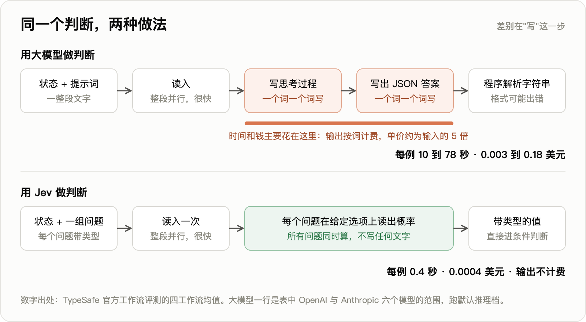
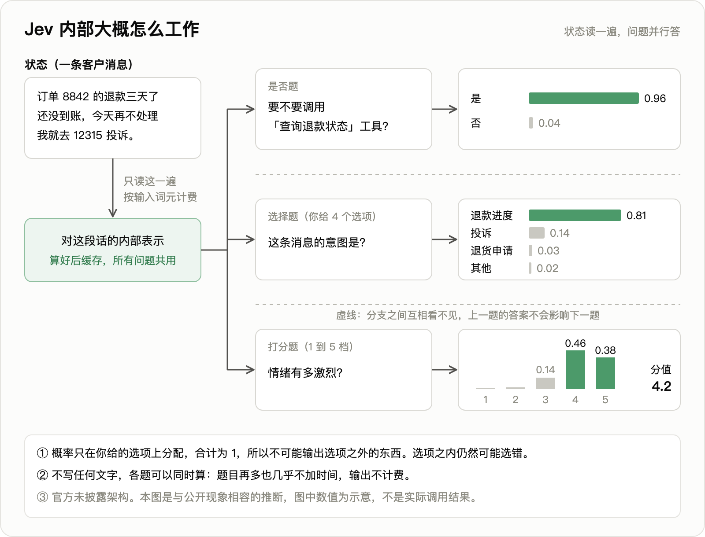
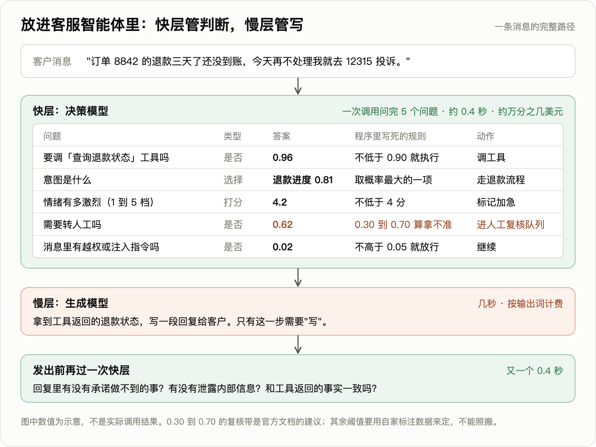

# Jev 与"决策模型"品类：技术报告、商业评估与未来三年影响

研究日期：2026-09-21，Jev 发布后第六天。方法：三路并行检索（技术原理、第三方实测与质疑、公司与商业），一手资料优先：官方博客、官方文档、官方评测站原始数据、创始人在黑客新闻（Hacker News）讨论帖里的亲自回复、GitHub 上带原始数据的独立实测仓库。
凡标"自报""二手""未核实"的数字，引用前需自行复核。标"估算"的是本报告自己的计算，给出算式。标"判断"的是本报告的主观结论。

## 一、五个问题的直接回答

1. **Jev 是什么？** TypeSafe AI 于 2026-09-15 发布的闭源模型。不生成文本。输入一段程序状态加一组带类型的问题，一次前向返回每个问题的答案：是或否的概率、多选一（最多 255 个选项）、量表打分（2 到 10 档）。创始人自己认可的准确描述是"零样本分类器"，运行时用问题文本定义任务，不需要训练。
2. **官方宣称哪些是真的？** 价格（每百万输入词元 0.042 美元、输出免费）、单次几百毫秒的延迟、输出格式零错误、结果可重复，这四条被多个独立实测用账单和原始数据验证。"快 40 到 200 倍、便宜 444 倍"没有任何第三方复现，同档对手下实测是快 3 到 5 倍、便宜 4 到 27 倍。"概率已校准"只在分布内成立。"不会幻觉"只约束输出类型，不约束判断对错。
3. **技术上新在哪？** 单个组件都不新：一次预填充后读有限标签的概率、多问题共享前缀、用适当评分规则训练校准，都有先例。新的是把"通用零样本判别"做成独立的模型品类和接口合约，彻底放弃生成换来输出免费的定价结构，并把校准当第一训练目标。发布两天内出现 6 个开源仿制品，说明接口好抄；仿制品的通用零样本质量还差一截，说明底座规模和合成数据不好抄。
4. **商业上站得住吗？** 品类站得住，公司未必。按现价做到 1 亿美元年收入需要约 2.4 千万亿词元的年调用量，是 2025 年中 OpenRouter 全平台年化量的 24 倍。零具名客户、零收入披露、不开放权重、不支持微调、没有服务等级协议。目前的资产是创始人声誉、品类心智和合成数据流程，没有数据飞轮和成本结构上的硬护城河。
5. **未来三年影响什么？** 最大的影响不在 TypeSafe 这家公司，在"判别式调用"从生成模型里分拆出来、单价下降一到两个数量级这件事本身。智能体会变成快慢两层：慢的生成模型负责想和写，快的决策模型负责每一步的门控、路由、校验、护栏。对业务团队，判别变便宜之后，稀缺的是自己手里带标注的结果数据和阈值，因为所有实测都指向同一条：这类模型的概率必须用自家数据重新校准才能用。

## 二、Jev 是什么：已披露与未披露

### 2.1 公司

- TypeSafe AI，2024 年成立于旧金山，隐身约两年。种子轮 4000 万美元，DCVC 领投，跟投方未披露。估值约 2 亿美元一说出自《福布斯》引"知情人士"，公司未确认，单一匿名信源。
  https://www.dcvc.com/news-insights/typesafe-emerges-from-stealth-with-a-new-way-of-doing-ai/
  https://siliconangle.com/2026/09/16/typesafe-ai-exits-stealth-with-40m-to-build-ai-for-use-by-software/
- 三位联合创始人：首席执行官 Diogo Almeida，前 OpenAI 后训练与对齐团队成员，更早在谷歌大脑，InstructGPT 论文第四作者；首席运营官 Sasha Sheng，前 Meta 人工智能研究院研究工程师；首席技术官 Erik Gafni，连续创业者，做过基因测序机器学习。团队规模官方未披露，二手数据为 25 人。
  https://typesafe.ai/team
- 名字来历："第一系统"（System One）取自卡尼曼《思考，快与慢》里的快思考；Jev 纪念经济学家杰文斯，寓意效率提升带来需求爆炸。公司的整个商业赌注就压在这个寓意上，见第六节。

### 2.2 接口

端点 `POST https://api.typesafe.ai/v1/systemone`。请求由三部分组成：状态（字符串、JSON 对象或文本数组）、模型名、一组问题。每个问题有类型、指令和可选的判据。

```json
{"state":"Help! My payouts have been failing for 3 days.","model":"jev-latest",
 "questions":{"is_urgent":{"type":"noul","instructions":"Does this convey urgency?",
   "criteria":{"true":"Explicitly time-sensitive","false":"No urgency expressed"}}}}
```

```json
{"model":"jev-1.13.0","answers":{"is_urgent":{"type":"noul","noul":0.95}},
 "usage":{"input_tokens":296,"output_tokens":20}}
```

三种问题类型对应程序里的三种控制流：

| 类型 | 对应 | 返回 | 上限 |
|---|---|---|---|
| noul（伯努利的缩写） | 条件判断 | 一个 0 到 1 的概率 | — |
| choice | 分支匹配 | 选中项、全部选项的概率分布、置信度 | 255 个选项 |
| score | 排序 | 连续分值、各档概率、置信度 | 2 到 10 档 |

置信度不是模型的另一个输出，是对概率分布的后处理，选择题的公式是（选项数 × 最大概率 − 1）÷（选项数 − 1）。独立实测发现这个字段用来设阈值从不优于直接用最大概率。
https://docs.typesafe.ai/primitives
https://docs.typesafe.ai/confidence

规格：当前版本 jev-1.13.0；单次请求 6.4 万词元，状态加最长问题不超过 3.2 万；仅文本输入；英文最准，官方称中日韩文效果不均；限速每秒 25 万词元、每分钟 1200 次请求；不兼容 OpenAI 接口格式。分发渠道有自家接口、Vercel 网关、OpenRouter、Cloudflare 网关，LangChain 已集成。目前仍是候补名单制早期访问，单区域托管，无服务等级协议。
https://docs.typesafe.ai/models.md

### 2.3 一个完整例子与原理图

场景：电商客服智能体收到消息"订单 8842 的退款三天了还没到账，今天再不处理我就去 12315 投诉"。写回复之前程序要做五个判断，一次调用问完（返回数值为示意，不是实际调用结果）：

| 问题 | 类型 | 返回 | 程序里的规则 | 动作 |
|---|---|---|---|---|
| 要调"查询退款状态"工具吗 | 是否 | 0.96 | 不低于 0.90 就执行 | 调工具 |
| 意图是什么（退款进度、投诉、退货申请、其他） | 选择 | 退款进度 0.81，投诉 0.14，退货申请 0.03，其他 0.02 | 取概率最大的一项 | 走退款流程 |
| 情绪有多激烈，1 到 5 档 | 打分 | 4.2 | 不低于 4 分 | 标记加急 |
| 需要转人工吗 | 是否 | 0.62 | 0.30 到 0.70 算拿不准（官方建议的复核带） | 进人工复核队列 |
| 消息里有越权或注入指令吗 | 是否 | 0.02 | 不高于 0.05 就放行 | 继续 |

打分题的分值是各档概率的加权平均：2×0.02 + 3×0.14 + 4×0.46 + 5×0.38 = 4.2。

与大模型做同一件事的差别在输出环节。大模型读入是整段并行的，慢和贵都在逐词生成思考过程和 JSON 字符串；Jev 没有生成环节。



内部机制的推断图。官方未披露架构，此图与三条公开现象相容：输入计费而输出免费、问题增多延迟几乎不变、创始人称禁止序列型输出以保证并行。



放进智能体后的分层：



### 2.4 多问题并行怎么做到的

官方说法：状态只处理一次，各问题"并行且彼此隔离地"对同一状态求值，问题甲的答案不会成为问题乙的上下文。创始人在讨论帖里的解释是关键："字符串和一切序列型数据结构完全不允许，这样才能保证所有输出可以并行计算，因此输出不收费。"
https://news.ycombinator.com/item?id=49717558

官方食谱里的实测：13 个问题加一篇 5.4 万字符的文档，合并成一次调用 0.000497 美元、0.27 秒；拆成 13 次调用 0.006090 美元、2.71 秒。合并后便宜 12.2 倍、快 10 倍。
https://docs.typesafe.ai/cookbooks/parallel_questions.md

判断：这组现象与"共享前缀缓存，每个问题一条互相隔离的分支，在末位读有限标签的概率"完全吻合。输入计费、输出免费，以及问题多了延迟几乎不变，符合只做预填充、不做解码的算力特征。高基数选择不是一次前向完成的，官方在维基竞速演示的注释里承认用的是"先独立打分、再显式选择"的两段式。

### 2.5 训练：只知道名字

- 训练方法官方叫"面向校准决策的强化学习"。优化目标是"在快思考型任务上给出认知上诚实的概率"。官方对照：基于人类反馈的强化学习优化的是评分人偏好的文本，对自动化是错的任务；可验证奖励的强化学习只适用于能用程序验证的任务，多数现实判断任务不是这个形状。
- 数据：官方称全部自造合成数据，公司"首先是一个数据研究实验室"。创始人说这是他"这辈子最好的赌注之一，比发布好，比基于人类反馈的强化学习好"。承诺不拿客户数据训练。
  https://techcrunch.com/2026/09/18/a-new-kind-of-ai-model-from-a-chatgpt-inventor-is-thrilling-developers/
- 官网的谱系图：预训练大模型之后分三支，人类反馈强化学习出聊天模型，可验证奖励强化学习出推理模型，校准决策强化学习出 Jev。编码器分类器被单独标为"低智能"的另一支。判断：这张图基本等于自认 Jev 是施加在预训练语言模型基座上的后训练，不是编码器路线。官方还说"Jev 既不小，也不是大语言模型"。

### 2.6 未披露清单

编码器还是解码器、参数量、基座模型、预训练数据、奖励函数、校准评估指标、服务成本与是否补贴（官方原话"无法证明没有补贴"）、开放权重计划、微调、知识截止日期、负载下的延迟分位数、论文时间表（创始人只说"聊过写论文"）。官方刻意不发布公共基准成绩，理由是各实验室会刷榜。

有人用约 1 万次接口调用反推，猜测是约 100 亿激活参数的稀疏专家混合因果变换器。二手，未核实。

## 三、官方数字的口径

### 3.1 工作流评测

官方评测站给了四个工作流（安全事件、智能体轨迹观测、发票处理、客服）的原始数据。本报告直接读取核对过。
https://evals.typesafe.ai/

| 模型 | 四工作流平均准确率 | 每例成本（美元） | 每例耗时（秒） |
|---|---|---|---|
| GPT-5.6 Sol | 74.1% | 0.0836 | 23.3 |
| Opus 5 | 73.1% | 0.1761 | 37.8 |
| GPT-5.6 Terra | 67.9% | 0.0304 | 10.1 |
| **Jev** | **67.8%** | **0.0004** | **0.4** |
| Sonnet 5 | 67.8% | 0.1174 | 78.1 |
| GPT-5.6 Luna | 66.8% | 0.0033 | 12.9 |
| DeepSeek v4 pro | 65.5% | 0.0413 | 86.5 |
| DeepSeek v4 flash | 64.4% | 0.0059 | 51.9 |
| Haiku 4.5 | 53.6% | 0.0195 | 12.5 |

分工作流：

| 工作流 | Jev | Opus 5 | GPT-5.6 Sol |
|---|---|---|---|
| 安全事件 | 61.7% | 66.2% | 62.5% |
| 智能体轨迹观测 | 71.6% | 75.2% | 76.6% |
| 发票处理 | 61.8% | 78.4% | 79.1% |
| 客服 | 76.0% | 72.4% | 78.3% |

读这张表要注意四件事：

1. **准确率的参考答案不是人工标注**，是 GPT-6 Astra 与 Claude Fable 5.1 在高思考模式下回答的平均。67.8% 衡量的是"与两个前沿模型的一致率"。
2. **Jev 的水平是中档**，与 Terra、Sonnet 5 持平，比最强模型低约 6 个百分点。涉及数字核对的发票处理落后 17 个百分点，与官方自认的算术弱一致。
3. **193.6 倍和 444.6 倍是两个不同对手的峰值**。估算：Sonnet 5 的 78.1 秒 ÷ Jev 的 0.4 秒 ≈ 195 倍；Opus 5 的 0.1761 美元 ÷ Jev 的 0.0004 美元 ≈ 440 倍。对手跑在默认推理档，会输出长思考链。若对手换成 Luna，同一张表里是便宜约 8 倍、快约 32 倍。
4. **官方自己做了保留**：倍数"处在实际收益的高端"，工作流由自家能力团队编写"可能存在偏差"，参考答案偏向 OpenAI 和 Anthropic。

### 3.2 其他官方数字

- 官网首页并排演示：Jev 0.000081 美元、0.114 秒，对照的 GPT-5.6 Terra 0.013880 美元、8.566 秒，约快 75 倍、便宜 171 倍。官方自注"输入较短，对我们有利"。
- "幻觉率 0%、类型错误率 0%"：官方原话"这个数字不是实测的，模式匹配由构造保证，所以我们可以放心地把 0% 画进图里"。对照的大模型错误率 0.58% 到 45.5% 取自 OpenRouter，官方自注"几乎肯定有偏差"。
- 打《毁灭战士》演示：每秒 10 次查询，约每小时 7 美元。输入是结构化的游戏状态加文本，不是画面。官方自注"不用人工智能的脚本机器人能打得更好"。估算：7 美元 ÷ 3.6 万次 ≈ 每次 0.00019 美元，约合每次 4600 个输入词元。社区复现版 2642 次调用的模型延迟 212 毫秒，20 局平均击杀数与手写瞄准脚本持平。它证明的是百毫秒级、每小时几美元就能把模型判断放进实时控制循环，以及改一句自然语言指令就能改行为；不证明视觉能力和博弈能力。
  https://github.com/tirukovelamanoj/jev-plays-doom

## 四、第三方实测：发布六天内的独立证据

截至 2026-09-21，无人在官方四个工作流上做独立复现，第三方都是自选任务。以下仓库的说明文件和原始数据均可下载核对。

### 4.1 准确率、延迟、成本

| 测试者与任务 | 样本 | 准确率 | 延迟 | 成本 |
|---|---|---|---|---|
| 旅拍咨询分流，四语种 | 60 条 × 3 轮 | Jev 96.1%，gpt-4o-mini 93.9%；同轮对 Sonnet 4.5 为 95.5% 对 94.4% | 中位 380 毫秒，对 1209 和 1910 毫秒 | 每千条 0.032 美元，对 0.122 和 3.41 美元 |
| 钓鱼邮件判定 | 2000 封 | Jev 62.6%，Haiku 4.5 为 81.3% | 239 对 687 毫秒 | 每千封 0.038 对 0.462 美元 |
| 智能体工具调用风险四分类 | 60 条手工标注 | 总体 91.7%；清晰类 100%，模糊类 71.4%，对抗类 91.7% | 中位 422 毫秒 | 每次约 0.0000173 美元 |
| 挪威语政府听证文件立场判断 | 24 份 | Jev 20/24，DeepSeek 开推理 22/24 | 中位 0.32 秒，对 2.7 秒和 26 秒 | 每千份 0.22 美元，对 1.31 和 3.08 美元 |
| 重排序，8 个英文数据集 | 1617 题 | 与 Cohere Rerank 4 Pro 打平（0.692 对 0.691） | 422 对 844 毫秒 | 每千次 0.45 对 2.51 美元 |
| 邮件三分类 | 5733 封 | 零样本 98.64%；4600 条标注训练的逻辑回归 98.87% | — | — |
| 智能体评测裁判（LangChain，集成方非中立） | 5 个样例 × 100 次 | Jev 100%，Terra 99.8%，Sonnet 4.6 为 80.0% | 0.44 秒 | 总计 0.34 美元，对 Claude 28.17 美元 |

https://github.com/Shogo-nfrealmusic/jev-eval
https://github.com/anisselbd/jev-phishing-bench
https://github.com/themsquared/jev-benchmark
https://lindfors.no/blog/a-first-look-at-typesafes-jev/
https://github.com/anessbelbati/jev-rerank-bench
https://github.com/bitnovus/jev-spam-eval
https://www.langchain.com/blog/jev-agent-evals-langsmith

归纳：对便宜的小模型（gpt-4o-mini、Haiku、Flash-Lite 一级），速度快 3 到 5 倍，成本便宜 4 到 27 倍；只有对 Sonnet、Opus 一级，成本才到百倍量级。旅拍分流的测试者原话是"两种对手下都没复现出官方倍数"。

### 4.2 明显翻车的任务

1. **需要文本外知识或组织规则的判断**。900 条合成工单里，"优先级"取决于一条文本里没有的客户等级政策。Jev 准确率 44.7%（随机水平 25%），平均自报概率却有 0.74。同一作者用 Qwen3-4B 加 LoRA 在本任务数据上训练后，工单准确率 91.1% 对 Jev 的 75.1%。作者声明这是专用训练对零样本，不是同档比较。
   https://github.com/scienthoon/jev-ood-calibration
2. **对抗性内容**。钓鱼单问题 62.6%，召回率 43.2%，换四种问法准确率在 58.4% 到 63.2% 之间摆动。拆成五个信号再合成能到 95.0%，但两行正则就有 91.8%。
3. **细粒度相关性**。亚马逊电商数据集 306 对人工分级商品，期望校准误差 0.242，逆序率 0.255；同义改写使答案平均移动 0.164；概率只有两位小数，360 行里 53 行并列 0.99。
   https://github.com/yodablocks/jev-orderby-bench
4. **多步策略**。扑克求解器对照，30 个牌局匹配率 63%。手握最大牌应该过牌诱敌时，Jev 反复全押。
   https://backnotprop.com/blog/jev-poker/
5. **多维打分做护栏**。把一个直接问题拆成 12 个维度后，对"困难但良性"文档的误报率从 1.5% 升到 37.2%；300 行里 126 行自报置信度不低于 0.9，实际准确率 72.2%。
   https://agentjournal.dev/blog/llm-judge-vs-feature-extraction/

官方文档自己列的失效模式：不会可靠地计数；不会做日期先后和区间比较；对否定、间接指代和隐含条件敏感；无关长上下文拖累准确率；参考信息放在开头或中间时准确率 50%、放最后 88%；同一问题与其否定问法的概率相加等于 1.19；同一问题用是否题问得到 0.22，用二选一问得到 0.99 的"否"；状态里换一个无关字段，同一问题的概率在 0.43 到 0.53 之间跨过 0.5。官方建议把 0.30 到 0.70 设为人工复核带。
https://docs.typesafe.ai/model-jaggedness/jev-1.13.md
https://docs.typesafe.ai/cookbooks/consistency_noul_cookbook.md

### 4.3 校准：核心卖点的独立证据

官方没有发布任何期望校准误差或可靠性曲线。独立实测里这一块最有价值：

| 测试 | 分布 | 期望校准误差 | 结论 |
|---|---|---|---|
| 公开常识基准 3721 条 | 很可能在训练分布内 | 0.024 到 0.032 | 几乎不用校正，重拟合温度约等于 1 |
| 没见过的合成工单 900 条 | 分布外 | 0.107，噪声地板的 4.4 倍 | 过度自信，重拟合温度 2.74；选择题和打分题过度自信，是否题反而信心不足 |
| 钓鱼邮件 2000 封 | 对抗 | 0.154，Haiku 4.5 为 0.097 | 校准比大模型还差 |
| 自建 800 条难度梯度集 | 混合 | 各档均为噪声地板的 2.1 到 2.5 倍 | 向中间压缩；概率不低于 0.9 时命中率 1.000，覆盖率 21.5% 到 32.5% |
| 电商相关性 | 分布外 | 0.242 到 0.279 | 六项预注册门槛四项不过 |

https://github.com/scienthoon/jev-ood-calibration
https://github.com/SamuelSacco/jev-exploration

三条值得记住的细节：公开基准里出现过给正确答案 0.00、给错误答案 1.00 的样本；被广泛引用的 60 条样本基准测不了校准，因为完美模型在该样本量下的期望校准误差也有约 0.045；网关不暴露模型版本号，阈值会与某个版本的概率分布耦合，版本悄悄变动就失效。

多位实测者的共识用法：把输出当单调分数，不当概率；用几百条自己的标注在本地做校准映射；按问题分别设阈值；模型版本变动后重测。

可重复性是实测确认的优点：两轮之间标签翻转 2.2%，概率平均绝对差 0.017；LangChain 测得评分方差比各家大模型裁判低 92 到 913 倍。

## 五、与既有技术的关系

有人在讨论帖里说它"基本就是零样本分类器"，创始人回复"完全正确"。另一位说它是"大型分类模型，把词表替换成运行时给定的决策集，并直接暴露概率"，创始人回复"非常准确"。

| 既有技术 | 相同 | Jev 的差别 |
|---|---|---|
| 编码器分类器（BERT 类） | 有限类别加归一化概率 | 任务在运行时用文字定义，不用一个任务训一个模型；上下文 3.2 万对 512；底座大得多 |
| 零样本分类（自然语言推理类、GLiClass） | 概念上最近的前身 | 规模、长上下文、结构化状态理解、专门的校准训练 |
| 受限解码、结构化输出 | 同样保证格式 | 创始人的反驳："单纯掩码对数几率不够，模型只要给非法词元分了概率，按定义它就是困惑的。"有道理，但格式保证上两者等价 |
| 读大模型首词对数概率做分类 | 机制几乎同构：一次预填充，读有限标签的概率 | 面向校准训练过（人类反馈强化学习后的模型对数概率普遍校准差）；多问题共享前缀；闭源大模型接口多半不给完整对数概率 |
| 奖励模型、验证器、大模型裁判 | 读完上下文输出标量 | 通用化、零样本、量表可自定义 |
| 小模型路由器 | 意图路由是主打场景 | 不用为每个路由任务单独训练 |

判断：

- **旧东西换包装的部分**："不可能幻觉"等于"分类器不会输出标签集之外的值"；"类型错误率 0%"任何受限解码都能做到；"40 到 200 倍"很大程度来自"只预填充"对比"带思考链的自回归"的口径选择，官方在维基竞速注释里也承认对非推理模式的加速"小得多"。
- **真正新的部分**：把通用零样本判别做成独立品类和接口合约，三种类型直接映射程序控制流；放弃生成换来输出免费；把校准当第一训练目标（若属实是实质差异，但官方零证据，第三方结果好坏参半）；合成数据体系。
- **好抄与不好抄**：一周内出现十多个开源复刻，自带测试集上 Jev 93.21%、最好的仿制品 90.12%、未微调基座 66.36%。反方数据：照开源配方训练的 Qwen2.5-1.5B 在重排序上连传统关键词检索都不如。接口和机制好抄，通用零样本质量要靠大底座和数据。
  https://lilting.ch/en/articles/jev-clones-architecture-comparison

## 六、商业评估

### 6.1 单位经济：这个价格养不活公司

估算：年收入 1 亿美元需要多大调用量。

| 项目 | 算式 | 结果 |
|---|---|---|
| 年输入词元 | 1 亿美元 ÷ 0.042 美元 × 100 万 | 约 2.38 千万亿 |
| 每天 | ÷ 365 | 约 6.5 万亿 |
| 每秒 | ÷ 86400 | 约 7550 万词元 |
| 相当于顶格账户数 | ÷ 单账户限速 25 万每秒 | 约 302 个账户全年不间断跑满 |
| 决策次数（按官方评测每例 0.0004 美元） | 1 亿 ÷ 0.0004 | 2500 亿次每年 |

对照：

- OpenRouter 全平台全部模型的年化量在 2025 年中为"超过 100 万亿词元"，1 亿美元收入约等于这个量的 24 倍。
  https://arxiv.org/html/2601.10088v1
- OpenRouter 页面显示 Jev 上线约三天处理了 3900 亿词元，对应收入约 3900 亿 ÷ 10 亿 × 42 = 1.64 万美元。按每天 1300 亿线性外推，年化约 200 万美元，而这是尝鲜期峰值。统计区间未核实。
- 一位早期用户称自家全量业务跑 Jev 约每月 70 美元。凑 1 亿美元需要约 11.9 万家这样的客户。

判断：按现价纯靠调用量，两三年内到不了 1 亿美元。要成立得靠三种情形之一：成为智能体每一步都调用的默认门控与校验层，调用量跟着智能体总量指数增长；企业版另收平台费、服务等级费、私有部署费；推出更大更贵的型号。这个价格是获客武器，利润来源还没出现。

### 6.2 市场：替代成功会把市场压小

- 企业大模型接口支出 2025 年中为 84 亿美元（Menlo）。决策类调用（分类、抽取、路由、校验）在其中的占比，没有找到任何公开的直接估计。
  https://menlovc.com/perspective/2025-mid-year-llm-market-update/
- 估算：假设 2026 年接口支出约 250 亿美元，其中 10% 到 20% 是本不需要生成文本的决策类调用（该比例是本报告的假设，无公开出处），对应 25 到 50 亿美元现有支出。单价压低 10 到 100 倍后，同等工作量只对应 0.25 到 5 亿美元收入。价值大部分让渡给了客户，收入只能靠调用量的增量来补。
- 相邻赛道的价格锚：护栏与安全类创业公司近两年被收购的价格在 1.8 亿到 7 亿美元之间（Robust Intelligence 约 4 亿、Protect AI 约 5 到 7 亿、Lakera 约 3 亿、CalypsoAI 约 1.8 亿）；自动化内容审核市场约 14.8 亿美元；模型路由创业公司 Martian 累计融资 3200 万美元。
  https://devidevs.com/blog/2026-03-19-ai-security-acquisition-wave

### 6.3 竞争：窗口期来自大厂意愿不足，不来自技术壁垒

- 前沿实验室小模型现价：GPT-5.6 Luna 输入 0.20 美元、输出 1.20 美元；Gemini 2.5 Flash-Lite 输入 0.10 美元、输出 0.40 美元。Jev 的输入价是它们的二分之一到五分之一，加上输出免费。
- 截至 2026-09-21 未查到 OpenAI、Anthropic、谷歌的任何公开回应。
- 判断：技术上大厂 3 到 6 个月可以上线一个"打分端点"，对数概率、结构化输出、奖励模型这些组件都是现成的。阻力在商业上：0.042 美元的价位会蚕食自家小模型收入，这块单价太低排不上优先级。更直接的威胁是开源仿制品加自托管，以及推理云把仿制品做成同价接口。
- 自托管编码器单次推理是个位数毫秒、成本可忽略，真实成本在标注、工程周、运维和类目变化后的重训。Jev 的优势区间是没有标注数据、类目常变、一次要问多个不相关问题。高量、稳定、有标注的任务，微调小模型仍然更准更便宜：早期用户称 Jev 零样本的召回率离自家微调模型差约 5 个点，微调 Qwen 的延迟仍快 3 倍。

### 6.4 护城河记分

| 维度 | 现状 | 评价 |
|---|---|---|
| 数据 | 全合成数据；承诺不用客户数据训练 | 有技术秘密，无客户数据飞轮 |
| 技术 | 无论文、无校准证据；仿制品准确率已接近 | 校准是唯一没被追平的指标，官方自己也没拿出证据 |
| 生态 | 讨论帖 1924 分、506 条评论；Vercel 网关 24 小时内近 13% 付费团队使用，此前模型首日最高不到 7%；GitHub 一周 3000 多个相关仓库 | 冷启动很强，但严肃评测仓库只有 0 到 8 颗星，热度集中在演示 |
| 价格战承受力 | 账上约 4000 万美元，单价接近成本地板，不否认补贴 | 一边是现金流远大于它的大厂，一边是边际成本近零的自托管，两头承压 |
| 企业采纳 | 单区域、无服务等级协议、只给概率不给理由 | 受监管行业采纳会慢 |

https://vercel.com/blog/ai-gateway-jev-model-launch

截至 2026-09-21，未见任何有规模、有时长的生产环境案例，正面案例几乎全是发布一周内的实验或影子测试。

## 七、未来三年影响

以下是判断，概率为主观估计。

### 7.1 对智能体架构：快慢两层成为默认

今天的智能体把"想""写""判断"都交给同一个生成模型。判断类调用（这一步该不该调工具、调哪个、结果对不对、要不要转人工、有没有越权）用生成模型做，每次几秒、几美分，所以工程上只能少做。

估算：生成模型每步成本按 0.01 到 0.10 美元计，旁边挂 10 个决策调用、每个按官方评测的 0.0004 美元，合计 0.004 美元，给每一步加十道检查的成本是这一步本身的 4% 到 40%，延迟加不到半秒（可并行）。"每一步都验"第一次在经济上可行。

这对可靠性的意义大于对成本的意义。智能体长任务的瓶颈是错误累积，便宜的逐步校验是已知解法里最直接的一种。但有一个前提没有满足：第 4.3 节的证据表明，分布外的概率不可信，相关性错误在多步组合里不会互相抵消。所以三年内成熟的形态不会是"直接信模型给的 0.95"，而是决策模型出分数，业务方用自家标注和无分布假设的风险控制方法定阈值。

三年判断：到 2029 年，主流智能体框架里"生成模型加决策模型"的双层结构成为默认写法的概率约 70%。决策层由谁提供是另一个问题，见 7.3。

### 7.2 对大模型接口的收入结构

- 决策类调用从生成模型里迁出，单价下降一到两个数量级。受冲击最大的是各家最便宜那档小模型（Luna、Haiku、Flash-Lite 一级）的分类、路由、抽取类流量。
- 杰文斯效应是否成立决定净影响。官方赌的是：单价降 100 倍，调用量涨不止 100 倍，出现今天因为太贵太慢而不存在的用法，比如对全量数据做语义筛选（每十亿词元 42 美元）、实时应用里每秒十次的判断、每个智能体步骤的十道检查。
- 判断：生成类收入基本不受影响，前沿模型的定价权在推理、编程和长任务上，不在分类上。小模型的低端流量会被重新定价，大厂的应对会是给现有小模型加一个只预填充的打分端点，而不是另训一个模型。

### 7.3 三种情景

| 情景 | 概率 | 内容 |
|---|---|---|
| 一、成为标配端点，TypeSafe 被收购或边缘化 | 约 55% | 大厂、推理云、开源在 12 到 18 个月内提供同类接口；品类成立，先行者拿不到品类的大部分价值。参照护栏创业公司 2 到 7 亿美元的收购价区间 |
| 二、TypeSafe 独立做大 | 约 15% | 年收入过 1 亿美元，成为智能体决策层的基础设施。前提是校准质量确有别人抄不走的优势，并推出企业版和多模态 |
| 三、热度退潮 | 约 30% | 回到"好用的零样本分类器"这个小众位置，多数生产场景继续用微调小模型或大模型的结构化输出。触发条件是分布外校准问题迟迟不解决，或生成模型本身快到差距不再重要 |

三种情景下有一件事相同：带类型、带概率的判别式调用这个接口形态会留下来。

### 7.4 对传统机器学习与相关创业公司

- **冷启动分类器被吃掉**。没有标注数据、类目常变的场景，零样本决策模型已经追平用几千条标注训练的传统分类器（邮件分类 98.64% 对 98.87%），而且对新型样本的适应更好（新钓鱼样本召回率 95.31% 对旧数据训练模型的 75.26%）。"先攒几千条标注再训一个分类器"这一步，在多数团队会消失。
- **高量、稳定、有标注的核心任务不受影响**。微调小模型和编码器仍然更准、更快、可自托管。
- **护栏、路由、评测打分类创业公司的功能被商品化**。它们的产品核心就是一个判别调用，单价被压到每次万分之几美元之后，能留下的是工作流、审计、合规这些外围。
- **评测与奖励信号变便宜**。大模型裁判的成本降两个数量级、方差降两个数量级，对做智能体强化学习的团队是好消息。但同一份证据也说明它不能直接当奖励用：分布外过度自信，对措辞敏感，会被对抗内容骗过。

### 7.5 对国内

- 官方称中日韩文效果不均，服务单区域托管在美国西海岸，数据出境和延迟两头都不适合国内生产环境直接用。
- 机制已被开源社区一周内复刻，基座可用 Qwen。判断：国内大厂和开源社区在 6 个月内推出中文同类模型或端点的概率高于 70%。
- 对国内做业务智能体的团队，值得抄的是接口形态和工程分层，不是这家公司的接口。

### 7.6 对业务算法团队的含义

1. **判别变便宜了，标注过的结果数据更值钱了**。所有独立实测指向同一个用法：几百条自家标注做本地校准，按问题设阈值，版本变了重测。通用模型给分数，业务方给真值和阈值。这和此前"业务后训练只剩结果信号、评测与奖励资产"的结论同向。
2. **门控、路由、转人工、质检这类小模型，立项前先拿零样本决策模型跑基线**。同口径对比下，零样本如果已经到 90%，自训的理由只剩三个：要读文本之外的组织规则（4.2 节第一条，零样本 44.7% 对专用训练 91.1%）、调用量大到自托管更省、数据不能出域。
3. **别信单个概率，管住总体错误率**。把输出当分数，用留出集加统计保证的方法控制误判率上限，比信任模型自报的校准可靠。
4. **流程拆解比模型选择重要**。钓鱼任务上单问题 62.6%、拆成五个信号后 95.0%；反过来拆成 12 个维度又把误报率推高 25 倍。问题怎么问、拆几个、怎么合成，是新的工程手艺。

## 八、检验点

| 时间 | 看什么 | 指向 |
|---|---|---|
| 2026 年内 | 官方是否发布论文或校准曲线 | 不发则"校准是核心壁垒"的说法继续无证据 |
| 2026 年内 | OpenRouter 和 Vercel 上的词元量在免费期（至 9 月 25 日）结束后的留存 | 区分尝鲜和真实采用 |
| 2027 年一季度前 | OpenAI、Anthropic、谷歌或主要推理云是否推出打分端点 | 出现则走向情景一 |
| 2027 年上半年 | 是否出现具名的、有规模的生产客户；是否推出企业版定价 | 出现则情景二概率上调 |
| 2027 年内 | 多模态版本、中文质量、多区域部署 | 决定能否进入实时应用和非英语市场 |
| 持续 | 0.042 美元的价格是否维持 | 涨价说明此前是补贴；继续降说明成本结构确有优势 |

## 九、信息局限

- 发布仅六天，全部第三方实测样本小、时间早、多为单人项目。
- 知乎问题页、《福布斯》原文、部分 X 帖子无法直接抓取，相关内容来自转述，已标"二手"。
- 估值、团队人数为单一或二手信源。
- "决策类调用占接口支出 10% 到 20%"是本报告的假设，没有公开数据支持。
- 三种情景的概率是主观估计。
- 本报告正文涉及的被测模型之一（Claude Fable 5.1）与撰写本报告所用的模型同源，官方评测的参考答案也部分来自它。相关数字均照录官方与第三方原始数据，未作调整。
