# 大模型请了更强的老师，成功率从 78% 掉到 63%

一个 300 亿参数（每次激活 30 亿）的开源模型，在七项企业任务上的平均成功率是 78.0%。

研究者找来一位更强的老师：同样的任务、同样的外部配置，老师的成功率是 93.6%。让学生做监督微调，也就是把老师的成功轨迹当标准答案、训练学生逐字复现。这是业内最标准的做法。

训练完，学生的成功率是 63.1%。七项任务全部退步，最多的一项掉了 29.9 分。

这是 Salesforce 2026 年 9 月 8 日挂出的论文（arXiv 2609.09134）的核心结果。论文给的原因是：学生学到了老师的知识，却丢了自己原来的做事方式；而包在模型外面的那层文字，是围着它原来的做事方式调出来的。开头那个 78.0%，本身就是调这层文字调出来的，调之前只有 29.2%。

这层文字怎么调、调完还能不能接着动权重，两年里有四篇论文在同一条线上：TextGrad、GEPA、SkillOpt 和这一篇。它们回答的是同一个问题：**不改模型权重，只改模型外面那层文字，能不能也算"训练"。**

先说明一个词。下文的"轨迹"，指智能体完成一个任务的完整过程记录：每一轮想了什么、调了哪个工具、工具返回了什么。

---

## 一、模型外面那层文字

一个大模型应用的表现由两样东西决定。一是权重。二是包在模型外面的一切：系统提示词、技能文档、工具说明、执行钩子（每步前后自动运行的检查程序）、上下文管理（哪些内容留在模型的输入里）。

后者现在有个统一的名字，叫运行框架。Claude Code、Codex 这类产品，就是"模型加一套运行框架"。

| | 改权重 | 改文字 |
|---|---|---|
| 被更新的对象 | 数十亿个浮点数 | 一段人能读的文本 |
| 更新信号 | 数值梯度 | 大模型读完轨迹后写的批评与修改建议 |
| 需要的条件 | 权重可访问、显卡 | 能调接口就行，闭源模型也可以 |
| 产物 | 不可读 | 可审计、可手改、可搬到别的模型上 |
| 主要风险 | 过拟合、遗忘 | 越改越长、越改越空、改完不如不改 |

这层文字的分量有多重？Salesforce 论文里，同一个模型、权重一个字节没动，只是自动调整了运行框架，七项任务平均成功率从 29.2% 到 78.0%，**多了 48.8 分**。

命令行任务基准 Terminal-Bench 2.0 的官方榜上，同一个 Claude Opus 4.6 换不同的运行框架，成绩相差 18.4 分；Gemini 3.1 Pro 相差 20.8 分（据综述 2606.20683 整理，属于观察性比较）。

---

## 二、2024 年 6 月：TextGrad，把批评当梯度

斯坦福的 TextGrad（arXiv 2406.07496，后发表于《自然》）是这条线的起点。

说成人话：让执行模型做题，让另一个更强的大模型读它的回答、写批评，再按批评改提示词，循环十几次。

论文的讲法更形式化。把系统里每一步的输入输出连成一张有向图，图上的变量是文本。正着执行一遍之后，反着沿图走：每条边多调用一次大模型，把下游收到的批评翻译成"上游这个变量该怎么改"。论文把这段话叫文本梯度，接口也照搬 PyTorch：`loss.backward()`，`optimizer.step()`。

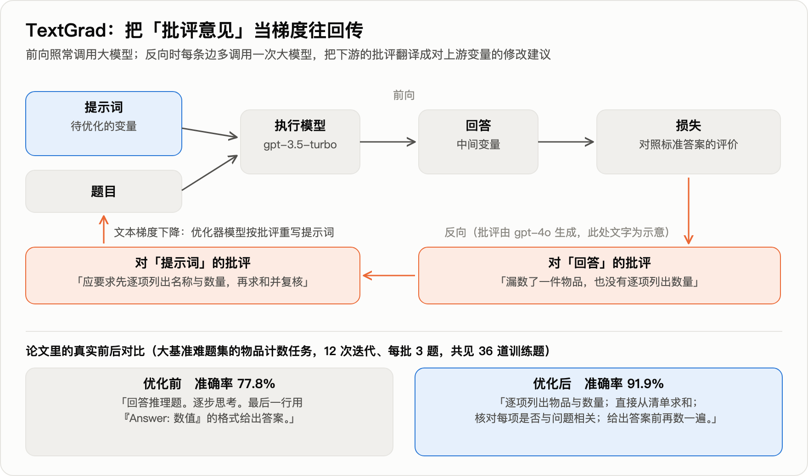

图的下半部分是论文里的真实例子，物品计数任务。执行模型 gpt-3.5，批评由 gpt-4o 写，12 次迭代，总共只看了 36 道训练题。

- 优化前："回答推理题，逐步思考，最后一行按固定格式给出数值。"准确率 77.8%。
- 优化后："逐项列出物品与数量；直接从清单求和；核对每项是否与问题相关；给出答案前再数一遍。"准确率 91.9%。

| 任务 | 基线 | TextGrad |
|---|---|---|
| LeetCode 难题完成率（gpt-4o） | 26%；带 1 个示例的自我反思法 31% | 36% |
| GPQA 钻石集（gpt-4o） | 51.0% | 55.0% |
| 物品计数（gpt-3.5 执行） | 77.8%；DSPy 带 8 个示例 84.9% | 91.9% |
| GSM8k 数学（gpt-3.5 执行） | 72.9%；DSPy 带 8 个示例 81.1% | 81.1% |

注意优化出来的那段提示词：里面没有任何一道具体题目的信息，全是通用的做题纪律。

一年半后，这一点成了质疑的入口。2025 年 12 月的一篇论文（arXiv 2512.13598）专门检验"梯度"这个类比，三个结果：

- 沿图逐层反传，相对"让大模型一步直接改写"，多数设置下无显著差异；
- **用错误的标签去训练，准确率也不显著下降；**
- 训练十轮，没有出现过拟合的形态。

真梯度不会这样。合理的解释是：这类方法提分，靠的是发现通用的格式与纪律，而不是从样本里吸收信息。需要说明，这篇质疑论文用的是 Claude 3.5 Sonnet 和三个百题级数据集，结论能否外推到弱模型和程序性任务，尚无证据。

同台对比也不利于 TextGrad。2025 年 7 月的 GEPA 不做反向传播，GPT-4.1 mini 上六项任务合计提升 12.19%，同一张表里 TextGrad 是 6.11%。下一节讲它。

梯度这个类比被放弃了，留下来的是一个判断：**一段文字反馈，比一个分数信息量大。**

---

## 三、2025 年 7 月：GEPA，不做反传，做反思加进化

伯克利与斯坦福等的 GEPA（arXiv 2507.19457，ICLR 2026 口头报告）是上面那个同台对比里的赢家。它保留了"文字反馈信息量大"这个判断，丢掉了反向传播，换成三个部件。

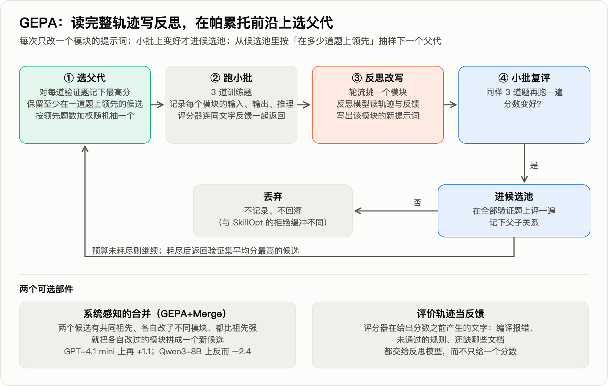

- **读完整轨迹写反思。** 每次在 3 道题上跑一遍，把每个模块的输入、输出、推理链，连同评分器在给分之前产生的文字（编译报错、没通过的规则、还缺哪些文档）一起交给反思模型，让它改写一个模块的提示词。
- **小批复评。** 同样 3 道题再跑一遍，变好才进候选池。
- **在帕累托前沿上选父代。** 对每道验证题记下所有候选的最高分，凡是至少在一道题上领先的候选都留着，下一次按"领先几道题"加权随机抽一个来改。目的是不被第一个不错的策略困住。

第三条是它与 TextGrad 最实质的区别。TextGrad 每次从总分最高的候选出发。GEPA 的消融里，这样做四项任务合计 +6.05，束搜索 +5.11，帕累托选择 +12.44。

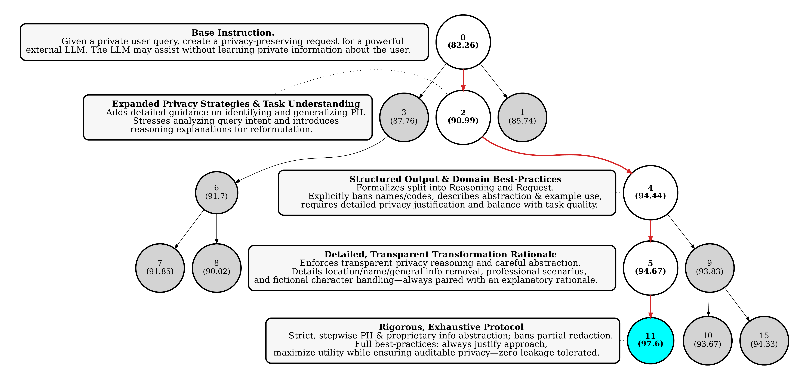

上图是论文原图 5，一条真实的进化路径。任务是把用户的私密问题改写后交给外部大模型，既要答得好又不能泄露个人信息。括号里是验证集分数。从一句话的初始指令（82.26）到最优候选（97.6），红色路径走了四步：加上识别个人信息的指导；把输出拆成"推理"与"请求"两段，明令禁止出现姓名与编号；要求对每处删改给出理由；禁止部分遮盖。灰色节点是没走通的分支。

主结果（Qwen3-8B，测试集 %；GRPO 是改权重的强化学习，用 LoRA、固定 24,000 次采样）：

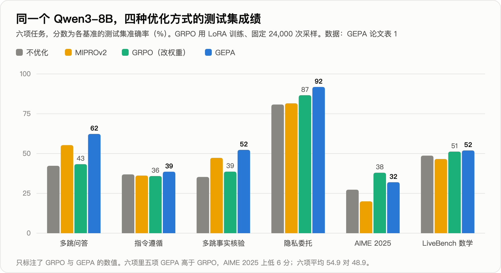

| 方法 | 多跳问答 | 指令遵循 | 隐私委托 | AIME 2025 | 六项平均 |
|---|---|---|---|---|---|
| 不优化 | 42.3 | 36.9 | 80.8 | 27.3 | 45.2 |
| MIPROv2（此前最强的提示词优化器） | 55.3 | 36.2 | 81.6 | 20.0 | 47.8 |
| GRPO（改权重） | 43.3 | 35.9 | 86.7 | 38.0 | 48.9 |
| GEPA | 62.3 | 38.6 | 91.9 | 32.0 | 54.9 |

六项里五项 GEPA 高于 GRPO，AIME 上低 6 分。换到闭源的 GPT-4.1 mini 上，六项平均：不优化 53.0，Trace 56.3，MIPROv2 58.7，TextGrad 59.1，GEPA 65.2。六项全部跑完，GEPA 花了 86 美元。

在 Qwen3-8B 上优化出的提示词直接搬到 GPT-4.1 mini 上，仍有 +9.0，高于直接在 GPT-4.1 mini 上优化的 TextGrad 和 MIPROv2。

### 这篇论文要打的折

标题说"提示词进化胜过强化学习"，摘要说"采样少 35 倍"。两处都要看口径。

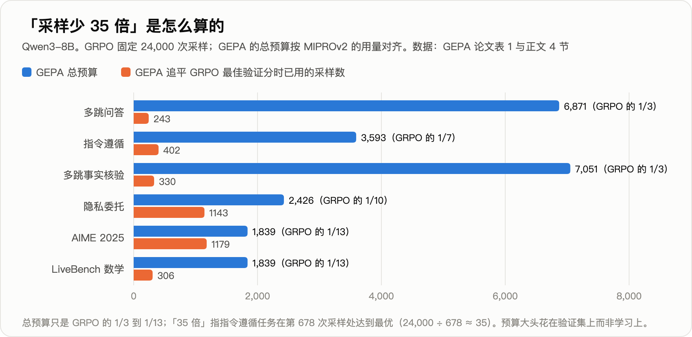

- **35 倍是单任务峰值。** GEPA 各任务的总预算是 1,839 到 7,051 次采样，GRPO 是 24,000 次，比值 3 到 13。"35 倍"来自指令遵循任务：GEPA 在第 678 次采样处找到最优，24,000 ÷ 678 ≈ 35。
- **对面的强化学习配置偏弱。** 用 LoRA、24,000 次采样；论文自己在引言里说同期工作"通常用到数十万次"。结论的适用范围是"小预算、小模型、有文字反馈"。
- **合并部件不稳。** 加上"合并"后 GPT-4.1 mini 上再 +1.1，Qwen3-8B 上反而 −2.4，指令遵循从 38.6 掉到 28.2，比不优化还低。

反过来说，"反思比反传有效、多样性比贪心有效"这两条是同预算下比出来的，换模型不变，可以采信。

GEPA 现在是 DSPy、MLflow、谷歌智能体开发套件的内置优化器。也正因为用的人多，它的毛病在一年里被摸清了：越改越长，以及对训练题过拟合。这就是下一篇论文的起点。

---

## 四、2026 年 5 月：SkillOpt，给文字更新装上学习率

GEPA 之后，让大模型反复改一段文字这件事本身，被发现有三种毛病。

- **越改越长**。客服公司 Decagon 在生产环境里用 GEPA，提示词被改到 5,000 字符以上，训练集涨、泛化跌；压回约 1,000 字符几乎无损。另一篇论文（ESPO，2609.04197）的说法是"提示词变长 3 倍却不更准"。
- **越改越空**。ACE 论文（arXiv 2510.04618）记录过一次：18,282 词元（token）的上下文被一步重写成 122 词元，准确率从 66.7 掉到 57.1。
- **改完不如不改**。一项评测（arXiv 2604.14585）做了 72 次提示词优化，49% 的结果低于不优化。

微软与上海交大等的 SkillOpt（arXiv 2605.23904）针对的就是这个。被训练的对象是一份技能文档，也就是 Anthropic 在 2025 年 10 月发布、如今 Codex 与 Claude Code 都在读的那种 `SKILL.md`。执行任务的模型全程冻结。

数据分三份，后文都用这三个词：**训练集**产生经验，**选择集**决定接不接受一次改动，**测试集**只在最后报一次成绩。

它把深度学习的训练纪律逐条搬了过来：

| 深度学习 | SkillOpt 的对应物 |
|---|---|
| 一个批次 | 带着当前技能跑 40 个训练任务 |
| 反向 | 失败、成功轨迹分开，每 8 条一组交给优化器模型（另一个更强的大模型，只在训练时出现），各提"增、删、改" |
| 学习率 | 每步最多采纳 4 条编辑，逐渐衰减到 2 条 |
| 验证门 | 候选技能在选择集上分数严格更高才接受，打平也拒绝 |
| 负样本 | 被拒的编辑连同造成的掉分记下来，后面的反思都能看到 |
| 动量 | 每轮结束，同一批 20 个任务用新旧技能各跑一遍，总结成一段受保护的长期指引 |

流程如下图：

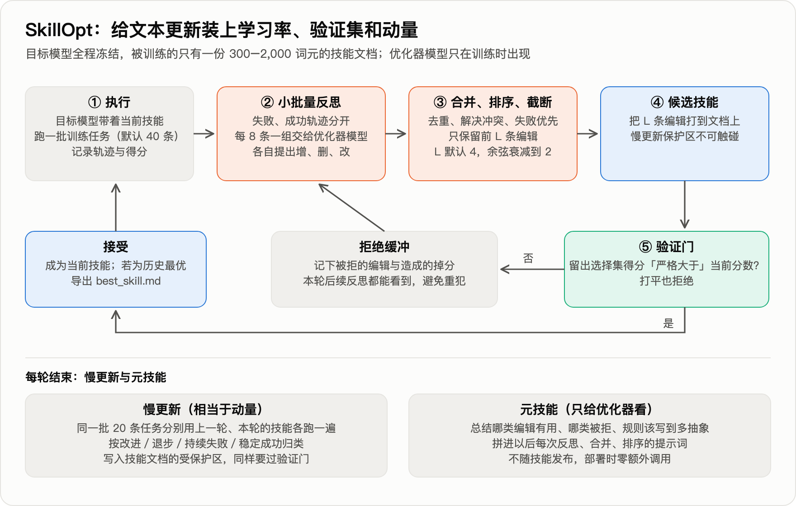

结果（GPT-5.5，直接对话，测试集准确率 %）：

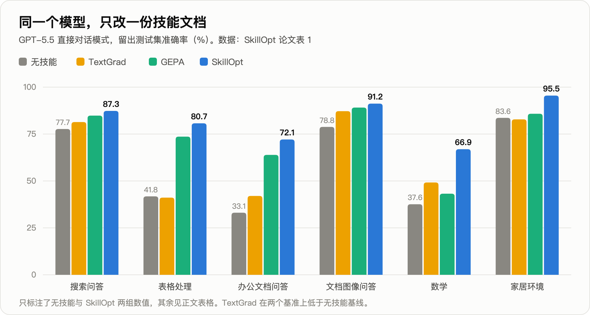

| 技能来源 | 表格处理 | 办公文档问答 | 数学 | 家居环境 | 六项平均 |
|---|---|---|---|---|---|
| 无技能 | 41.8 | 33.1 | 37.6 | 83.6 | 58.8 |
| 人写技能 | 72.9 | 66.9 | 38.4 | 91.8 | 73.7 |
| TextGrad | 41.1 | 42.0 | 49.2 | 82.8 | 64.0 |
| GEPA | 73.6 | 63.9 | 43.2 | 85.8 | 73.4 |
| SkillOpt | 80.7 | 72.1 | 66.9 | 95.5 | 82.3 |

（表内列了增益最大的四项，另两项搜索问答、文档图像问答见图；平均值含全部六项。）

六个基准、七个模型、三种运行框架，共 52 组对比，SkillOpt 全部最优或并列。

**学到的东西长什么样？** 表格处理任务，初始技能只有一句"用 Python 表格库，保留无关内容"。被采纳的编辑依次加上了：

- 打开真实工作簿，不要只看预览；
- 跨表定位表头与目标区域；
- 查找之前先规范化键与单元格类型；
- **题目里提到查找类公式时，仍然写入算好的静态数值**（评分程序读的是单元格的值，不会替你重算公式）；
- 填满整个目标区域，包括现在是空白的格子；
- 保存后重新打开，核对边界行。

这一次运行，测试集从 40.4 到 78.9（与主表不是同一次运行）。

最终写进技能的编辑极少：六个基准上只有 **1 到 4 次**。数学基准 +29.3 分来自 1 次被采纳的编辑，办公文档 +39.0 分也是 1 次。优化器提出的编辑绝大多数被验证门挡在了外面。

代价不小：单个任务的训练消耗约 2,100 万到 2.14 亿词元。

### 这篇论文要打的折

先说结论：SkillOpt 相对"无技能"的两位数增益远大于噪声，可信；要打折的是"比 GEPA 高出多少"，以及验证门到底有多可靠。

**对实践最有用的一条：论文自己的训练曲线显示，验证门在小数据上会失灵。**

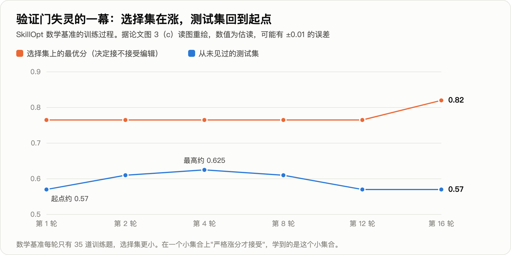

数学基准上，选择集的最优分从 0.765 升到 0.82；测试集先升到约 0.625，随后回落到约 0.57，回到了起点（据论文图 3 估读）。

原因不难猜：数学基准每轮只有 35 道训练题，选择集更小。在一个小集合上"严格涨分才接受"，学到的是这个小集合本身。

**另外两条是数字口径。** 论文声明使用默认配置，默认配置在消融表（逐个更换部件、看成绩变化的对照表）里的成绩是 87.1／77.5／61.3（搜索问答／表格／数学）。主表对应的是 87.3／80.7／66.9，恰好等于消融表里另外两种配置各自的最好成绩。消融表报的是测试集成绩，也就是说，主表这三个数相当于在测试集上挑过配置，比默认配置分别高 0.2、3.2、5.6 分。

全文没有重复实验。同一个配置，论文两处报告的数学成绩是 56.5 和 61.3，差 4.8 分。数学测试集约 125 题（由分数粒度反推的估计），一道题 0.8 分，4.8 分就是 6 道题。

---

## 五、2026 年 9 月：文字调好了，还能接着调权重吗

回到开头那个实验。学生是 Qwen3-Coder-30B-A3B，老师是 Gemini-3.1-Pro，七项任务是考勤薪资审计、预算审批、库存预警、物联网异常检测、浏览器自动化、网站后台管理、代码重构。

第一步，用 GEPA 式的搜索给学生进化运行框架，每个任务每次搜索的预算是 20 美元。改动都很具体：薪资审计写明了汇总与加班规则；库存预警加了一个"枚举全部商品"的工具；网站管理补了一个结构化的"完成"工具，并写明后台要"先筛选再读总数"。学生从 29.2 到 78.0。

第二步，把这个为学生进化的框架拿给老师用，老师也从 84.4 涨到 93.6。学生和老师之间还差 15.6 分，于是自然想到：让学生模仿老师在这个框架下的成功轨迹。

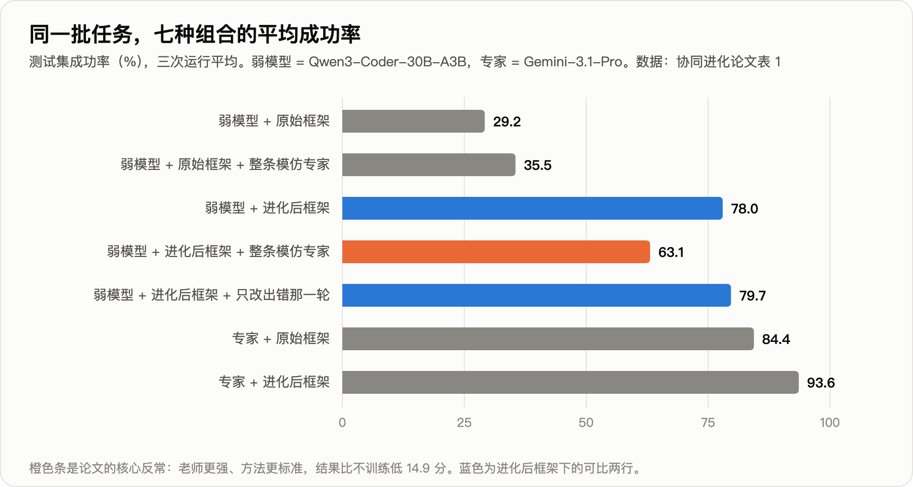

结果是橙色那一条。对照组说明问题不在模仿本身：**同样的模仿，放在没进化过的原始框架下是 +6.3 分；放在进化后的框架下是 −14.9 分。**

换一个学生（Gemma-4-26B）复现：46.7 → 进化框架后 55.6 → 模仿后 41.1，比什么都不做还低。

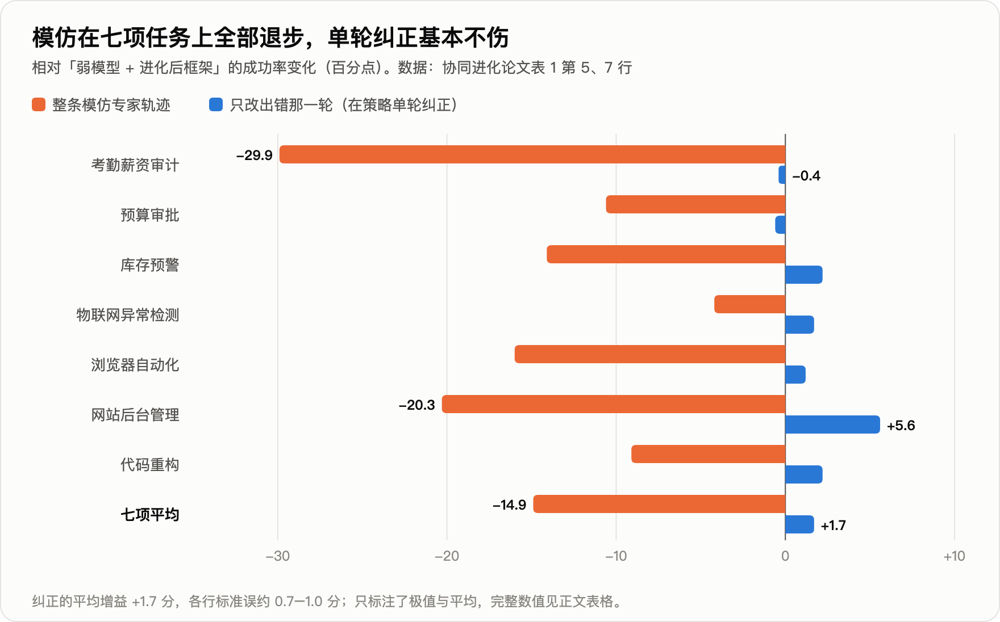

### 学到了知识，丢了节奏

论文给每条失败轨迹归了类：

| | 进化框架 | 进化框架＋整条模仿 |
|---|---|---|
| 平均成功率 | 78.0 | 63.1 |
| 框架里"领域计算规则"这条修改被用到的轨迹比例 | 30.8% | 76.1% |
| 失败中"规划缺陷"的占比 | 1.1% | 14.6% |

模仿之后，学生确实学到了老师的知识，框架用得也更多了。坏掉的是规划。这里的节奏就是指规划方式：每一步做多少事，什么时候核对，什么时候提交。

薪资审计的案例最直观。进化后的框架给了计算规则，和一句"输出前核对一次列名再保存"。原模型 14 到 20 步完成，三次全对。

模仿之后的模型算出了正确的部门汇总，却把"核对一次"变成了停不下来的循环：同一个查看命令发了 29 次，题目重读了约 20 次，78 步没有发出完成指令，得 0 分。

另一个案例方向相反。问后台"已通过的评论共多少条"，正确答案 346。框架里写了先筛选再计数。模仿后的 Gemma 学到了老师简短、早下结论的风格，进了评论列表没有筛选，直接读了未筛选的总数 351 交卷。

一个停不下来，一个停得太早，共同点是换了节奏。框架是围着学生原来一步一步的节奏进化出来的；整条模仿让它换上了老师的节奏，它撑不起，框架也不再合身。

### 解法：只改出错的那一轮

论文把它叫在策略单轮纠正。"在策略"的意思是：训练数据来自学生自己走到的状态，而不是老师走到的状态。

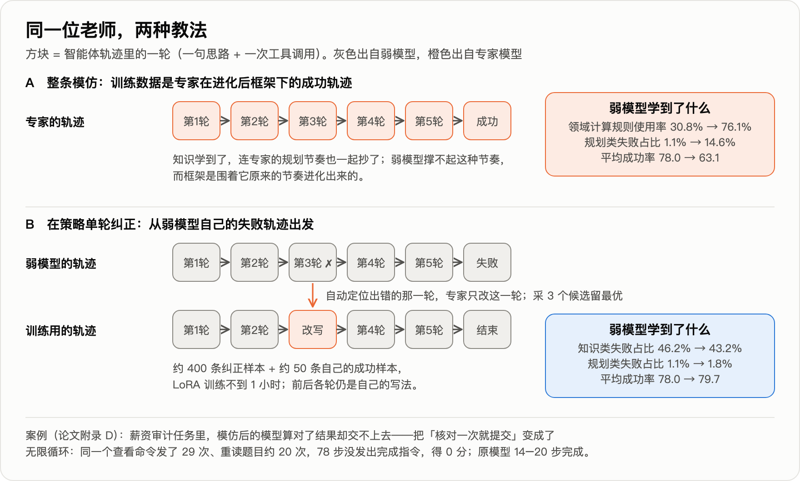

1. 取学生自己在进化框架下的失败轨迹；
2. 由一个大模型自动定位出错的那一轮；
3. 让老师只改写这一轮：一句纠正思路，加一次正确的工具调用，前后各轮原样保留；
4. 每处采 3 个候选留最好的；
5. 约 400 条纠正样本加约 50 条自己的成功样本，做 LoRA 微调（只训练一小组附加参数的低成本微调），不到 1 小时。

结果：78.0 → 79.7。五项上升，两项微降（−0.4、−0.6，在噪声内），规划类失败占比停在 1.8%。

### 这篇论文要打的折

标题写的是弱模型"追上"。数字说的是另一回事。

- **+1.7 分约为 1.4 个标准误**（两行的标准误分别是 0.97 和 0.67）。严格的说法是"单轮纠正不破坏模型与框架的匹配"，增益本身还没证实。离老师的 93.6 仍差 13.9 分。
- **"知识学到了"用的是占比**。换成绝对量（按平均成功率折算，方向性估计）：模仿后总失败率从约 22% 升到约 37%，知识类失败占全部轨迹的比例从约 10% 升到约 16%，也是上升的。规划类只解释了 14.9 分里的约 5 分，其余分散在知识类和其他类别里，论文没有解释。
- **缺一个关键对照**：只用学生自己的成功轨迹微调会怎样？训练集里混了 50 条这样的样本，+1.7 分来自哪一部分无从区分。
- 标题里的"协同进化循环"只跑了一轮，没有把更新后的模型放回去再进化框架。

反过来说，"模仿导致退步"这一半很硬：七项任务方向一致，幅度是标准误的十几倍，两个模型家族复现，还有原始框架下的反向对照。

---

## 六、同行的证据指向同一处

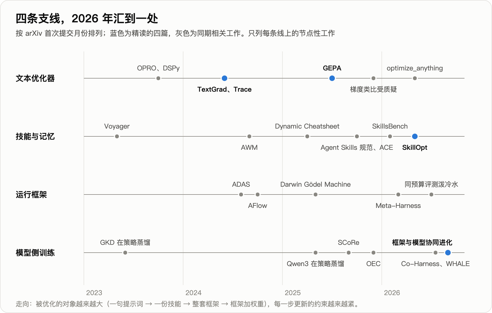

上图蓝点是本文讲的四篇，灰点是同期的相关工作。前三条线都在改文字，第四条线改权重；2026 年下半年，四条线汇到"文字和权重一起调"这个问题上。

"别整条模仿，只在学生自己走到的地方给局部纠正"，在不涉及运行框架的设定下，此前一年多已被四篇独立工作验证过：

| 工作 | 做法 | 结果 |
|---|---|---|
| STeP（2505.20023） | 学生先跑，教师在错步插入纠正 | 相对只学专家轨迹平均 +9.2%，只用 708 条 |
| SCoRe（2509.14257） | 教师只替换最早偏离的一步 | 12 个基准平均：整条模仿 43.0，该法 52.3，教师自己 51.1 |
| OEC（2512.14895） | 学生起头，专家中途接手 | 代码修复基准：20.8% 对纯模仿 15.2% |
| Revisiting DAgger（2605.12913） | 按轮混合学生与教师动作 | 监督微调 22.9，强化学习 11.6，该法 27.3 |

（表内数字取自各论文正文，经工具转述，未逐一对照原表。）

机制上的解释来自 RL's Razor（2509.04259）：微调造成的遗忘量，由微调前后模型输出分布变了多少决定。整条模仿变得多，只改一轮变得少。

同期还有三篇做"框架与权重交替优化"的论文：Co-Harness（2607.22688）、WHALE（2609.00196）、HarnessForge（2606.01779）。它们的权重更新只用模型自己通过验证的轨迹，改动天然小，都没有报告失配，增益也大得多。

WHALE 在搜索问答上 48.34，只调框架 38.29，只调权重 38.27。Co-Harness 让 Qwen3-8B 在 AIME24 上从只进化框架的 63.3 到两轮交替后的 84.7。

代价有两个：引不进比自己强的外部知识；OEC 还指出，纯自己的轨迹会把坏习惯一并固化。

把这些放在一起，可以归纳出一条关于"匹配"的判断（本文的归纳，尚无论文直接检验）：

| 证据 | 说明什么 | 出处 |
|---|---|---|
| 冻结的框架搬到另外三个模型家族，+5.1 到 +10.1 分 | 工具、校验、记忆结构搬得动 | AHE（2604.25850） |
| 同一实验里，**只换系统提示词，−2.3 分** | 策略性的文字搬不动 | AHE |
| 为 GPT-5.2-Codex 调好的框架 66.5%，换 Opus 4.6 只有 59.6% | 框架会对模型过拟合 | LangChain 工程博客 |
| 技能从 GPT-5.4 搬到 mini 保留 82% 增益，搬到 nano 只保留 16% | 模型差得越远，保留越少 | SkillOpt 表 4 |
| 学生进化出的框架，老师拿去用 +9.2 分 | 向更强的模型搬，问题不大 | Salesforce 论文 |

框架和技能里有两种内容。

一种是关于环境的事实：评分程序读的是数值，后台要先筛选再计数。这种换模型照样有效。

另一种是关于"这个模型该怎么走"的节奏安排：核对一次就提交，每步只做一件事。这种只对它适配的那个模型、那个版本有效。Anthropic 的工程博客说过同一件事：框架里每个组件都编码了一条"模型自己做不到什么"的假设，这些假设会过时。

反面证据也要记下。艾伦研究所与华盛顿大学的评测（arXiv 2607.12227）把框架进化和"同样的预算多采样几次"放在一起比：有单元测试反馈时，初始 72.9%，框架进化 75.8%，并行采样 86.0%；进化出的框架搬到没见过的任务上，平均只涨 0.6 分。

已发表的增益里，有多少来自"多搜了几次"和对公开任务集的过拟合，目前没有定论。Salesforce 论文的 +48.8 分有独立的测试划分，但训练、选择、测试来自同一批任务类型，同样没有回答跨任务的问题。它的原始框架是通用模板，异常检测一项从 0.6 到 89.4 只靠一次把流程写清楚的改写；另一篇论文（RLMOpt，2608.10471）的结论是，收益主要由初始版本的提升空间决定。已经人工调过很多轮的线上提示词，空间会小得多。

---

## 七、落到手上怎么做

1. **先备一批能自动判分的任务，切出一部分只用来验收。** 没有这一步，后面所有方法都没有证据表明有效。SkillsBench（2602.12670）的结论是：没有外部反馈时，模型自己写的技能平均没有收益。
2. **先动工具和校验，后动提示词里的策略文字。** AHE 的逐项消融：记忆 +5.6，工具 +3.3，中间件 +2.2，系统提示词 −2.3。
3. **自动优化技能或提示词，带上三样**：每步改动有上限；选择集上严格涨分才接受；被拒的改动留记录。选择集要够大，上面那张数学曲线就是反例。先拿"多采样几次"当对照，确认优化比它划算。
4. **要微调小模型，别直接拿强模型的整条轨迹来教。** 按证据强度排：用自己通过验证的轨迹；学生轨迹加老师的局部纠正；在策略蒸馏（学生自己生成，老师逐词元打分）。
5. **模型或框架任何一边换了版本，重跑验收集。** 只调闭源接口、从不微调的团队，这一条最相关：模型一升级，提示词里那些节奏类的安排可能就不合身了。
6. **技能文件按代码管。** 技能一旦由轨迹自动改写，被污染的轨迹就可能写进技能。一项对 31,132 个市场技能的普查发现 26.1% 至少含一类漏洞；针对技能的注入攻击在前沿模型上成功率最高 80%。

不适用的场景：没有办法自动判分的开放式任务（客服话术、文案），目前只有初步尝试，纯靠模型自评会逐轮漂移；一次性任务，优化成本摊不开；任务变化快于优化周期的场景。

---

开头那个学生掉的 14.9 分，是一次改得太大的代价：整条轨迹都换成了老师的。只改出错的那一轮，它至少没有退步。

两年下来，这条线上站得住的工作，做对的是同两件事：**每次改得足够小，每次验得足够硬。**

框架里关于环境的事实可以带走，关于节奏的安排跟着模型走。

---

**完整技术报告**（约 90 篇相关工作、逐篇编号与数字口径）：
https://github.com/xbtlin/ai-berkshire/blob/main/reports/AI产业研究/文本空间优化-从TextGrad到技能与运行框架协同进化-技术报告-20260922.md

**论文原文：**
- TextGrad：arXiv 2406.07496
- GEPA：arXiv 2507.19457
- SkillOpt：arXiv 2605.23904
- Co-Evolving Harnesses and Models：arXiv 2609.09134
