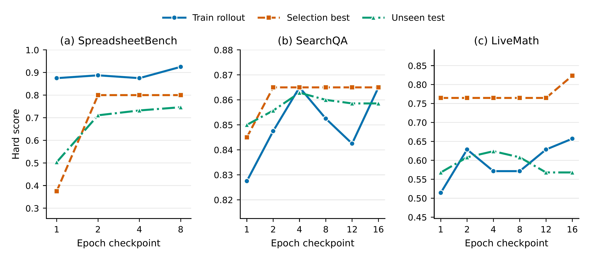
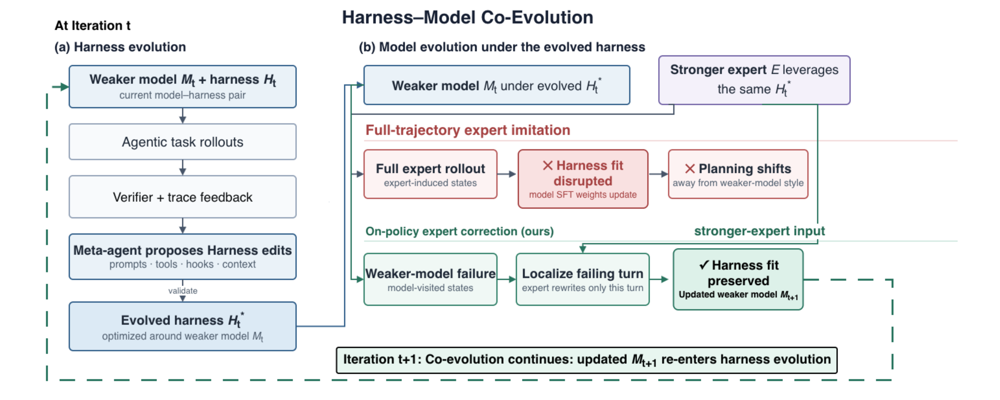

# 不动权重的训练：文本空间优化两年演进——从 TextGrad 到技能自进化，再到运行框架与模型协同进化

> 日期：2026-09-22
> 范围：精读四篇论文（TextGrad，arXiv 2406.07496；GEPA，arXiv 2507.19457；SkillOpt，arXiv 2605.23904；Co-Evolving Harnesses and Models，arXiv 2609.09134），并召回 2024-09 至 2026-09 同领域约 90 篇相关工作，分四条支线梳理。
> 方法：四篇主论文由本报告通读原文（含附录）；相关工作由四路并行检索，逐篇打开 arXiv 摘要页或官方博客核对编号、日期与数字。凡未能在原文核对的内容标注"未核实"。文中"本报告核对"一类段落是对原文表格的二次计算，属于分析而非原文结论，均已标明。
> 术语约定：harness 译作"运行框架"（包在模型外面的系统提示词、工具集、执行钩子、上下文管理）；skill 译作"技能"；on-policy 译作"在策略"（训练数据来自被训练模型自己访问到的状态）；论文与系统名保留原文。

---

## 一、核心结论

1. **四篇论文是同一条线上的四个站点。** 2024 年的 TextGrad 提出"用大模型写的批评当梯度"，优化对象是任意一段文本；2025 年 7 月的 GEPA 丢掉反向传播，换成读完整轨迹做反思、在帕累托前沿上选父代，同预算下提升约为 TextGrad 的两倍；2026 年 5 月的 SkillOpt 把对象收窄成一份技能文档，把功夫花在"怎么更新才稳"；2026 年 9 月的协同进化论文再往前一步，问"文本侧调好以后，权重还能不能接着调"。对象从单个变量走到技能文档，再走到"运行框架加权重"这一整套。

2. **"梯度"这层类比已经被放弃，"语言反馈比一个分数信息量大"这个内核留了下来。** GEPA（2507.19457）的同台对比里，GEPA 聚合提升 +12.19%，TextGrad +6.11%；GEPA 没有链式法则，靠的是反思、进化和帕累托选择。专门检验梯度类比的论文（2512.13598）发现：链式分解相对一步改写无显著差异，用错误标签训练准确率也不显著下降。SkillOpt 自己的主表里，TextGrad 在 42 个直接对话格子中有 14 个低于无技能基线。

3. **2026 年的共识是"有界更新加验证门"。** 无约束的文本自我改写会出三种病：提示词膨胀（GEPA 在生产环境膨胀到 5,000 字符以上而泛化下降）、上下文坍塌（反复重写磨掉细节）、优化结果不如不优化（一项 72 次运行的评测里 49% 低于零样本基线）。SkillOpt 的每步最多 L 条编辑、留出集严格提升才接受、被拒编辑回灌，ESPO 的自举稳定选择，ACE 的增量更新，都指向同一个修法。

4. **协同进化论文最硬的发现是"模仿会破坏匹配"，不是标题里的"追上"。** 在进化后的运行框架下，让弱模型整条模仿专家轨迹，七项任务全部退步，平均 −14.9 分；同一做法在未进化的框架下是 +6.3 分。改成只让专家改写弱模型自己轨迹里出错的那一轮，平均 +1.7 分。+1.7 分约为 1.4 个标准误（本报告核对），与专家仍差 13.9 分。结论应表述为"单轮纠正不伤害匹配、模仿严重伤害匹配"。

5. **这个发现在"不带运行框架"的设定下早有先行证据。** STeP（2505.20023）、SCoRe（2509.14257）、OEC（2512.14895）、Revisiting DAgger（2605.12913）在不同基准上得到同一条配方：学生自己的状态，加专家的局部动作。协同进化论文的新增量是把它推到"模型与运行框架已经互相适配"这一维度，并给出失败机理（规划风格漂移）。

6. **文本侧的产物是和具体模型绑定的。** SkillOpt 的跨模型迁移里，GPT-5.4 上训练的表格技能搬到 nano 只保留约 16% 的增益（+3.0 对 +19.0）；协同进化论文里，框架围绕弱模型的规划节奏进化，权重一变框架就失配。同期的 WHALE（2609.00196）、Co-Harness（2607.22688）、HarnessForge（2606.01779）权重更新都只用模型自己的轨迹，所以没撞上这个冲突，代价是引不进比自己强的外部知识。

7. **三篇新论文的实验都有需要打折的地方。** GEPA"采样少 35 倍"是单任务峰值口径，总预算口径是 3 到 13 倍，且对照的强化学习用 LoRA 和很小的预算；SkillOpt 主表的 GPT-5.5 数字与消融表里"各自最优的超参数配置"逐一对上，而不是声明的默认配置，全文没有随机种子和误差线，数学基准的训练曲线上选择集涨分而测试集回落；协同进化论文没有跑完整的多轮循环，也缺"只用自己成功轨迹微调"这一关键对照。详见第四、五、六章的核对小节。

---

## 二、这个领域在解决什么问题

### 2.1 一句话定义

大模型应用的行为由两样东西决定：模型权重，和包在模型外面的一切文本（系统提示词、技能文档、工具说明、工作流代码、记忆条目）。权重不能改或改不起的时候，能不能像训练权重那样"训练"外面这层文本？这就是文本空间优化。

与权重训练的对照：

| | 权重空间 | 文本空间 |
|---|---|---|
| 被更新的对象 | 数十亿个浮点数 | 一段人能读的文本 |
| 更新信号 | 损失函数的数值梯度 | 大模型读完轨迹写出的批评与修改建议 |
| 更新方式 | 参数减去学习率乘梯度 | 另一个大模型按建议改写文本 |
| 需要的条件 | 权重可访问、显卡、训练框架 | 只要能调用接口；闭源模型也行 |
| 产物 | 一份新权重，不可读 | 一份新文档，可审计、可手改、可迁移 |
| 主要风险 | 过拟合、遗忘 | 膨胀、坍塌、随机游走、对评测集作弊 |
| 典型成本 | 显卡小时 | 词元（SkillOpt 单任务 2,000 万至 2 亿词元） |

### 2.2 为什么 2026 年这个方向变热

三个背景同时成立。

其一，运行框架对结果的影响被反复量化。协同进化论文里，同一个 Qwen3-Coder-30B 模型，换框架后七项任务平均成功率从 29.2% 到 78.0%（+48.8 分）。它所依据的前作（2607.08938）报告：调好框架的小模型能恢复大模型 89.7% 的表现，成本为 4%。

其二，Anthropic 在 2025 年 10 月发布 Agent Skills 规范后，"技能文档"成了跨产品的通用载体，Codex 与 Claude Code 都读同一种 `SKILL.md`。有了统一载体，才谈得上"训练这份文档"。

其三，前沿模型大多闭源，权重动不了；而开源小模型可以动权重，于是"文本侧先调、权重侧再调"的组合问题自然出现。

### 2.3 时间线

### 2.4 贯穿全文的一个例子

设想一个处理报销表格的智能体：读取员工上传的电子表格，按公司规则核对金额，把结果写回指定单元格。上线后发现三类错误反复出现：写回的是公式而评分程序读的是数值；只填了前几行；部门均值算成了全员均值。

- 按 TextGrad 的做法：把系统提示词设为变量，让一个更强的模型读错例、写批评、改提示词，循环十几次。
- 按 SkillOpt 的做法：维护一份表格处理技能文档，每轮跑 40 个任务，把失败分组交给优化器模型，让它提"增、删、改"，每步最多采纳 4 条，在留出集上严格涨分才接受。
- 按协同进化论文的做法：先用上面的办法把提示词、工具、钩子调到位；再想微调模型时，不能直接拿强模型的整条轨迹来教，而是在弱模型自己的失败轨迹里找到出错那一轮，让强模型只改那一轮。

下面三章分别拆这三种做法。SkillOpt 在 SpreadsheetBench 上学到的真实规则、协同进化论文里薪资审计任务的真实失败案例，与这个设想的例子高度同构，后文会直接引用。

---

## 三、论文一：TextGrad——把批评当梯度

**基本信息。** arXiv 2406.07496，2024-06-11 提交；斯坦福大学（Yuksekgonul、Bianchi、Boen、Liu、Huang、Guestrin、Zou）；正式版 2025 年 3 月发表于《自然》第 639 卷，题为 Optimizing generative AI by backpropagating language model feedback；开源仓库约 3.7k 星。

### 3.1 机制

把一个由多次大模型调用、工具调用组成的系统看成计算图。图上的变量是文本（提示词、回答、代码、分子式）。前向照常执行；反向时，对图上每条边多做一次大模型调用，输入是"这个变量、它产生的下游输出、下游已经收到的批评"，输出是"这个变量该怎么改"。论文把这段输出叫文本梯度。一个变量被用在多处时，把各处的批评拼接起来，对应数值梯度里的求和。

更新步叫文本梯度下降：再调用一次大模型，输入当前变量与收到的批评，输出新版本。接口刻意照搬 PyTorch：`tg.Variable`、`loss.backward()`、`optimizer.step()`。

论文区分两类问题：

- **实例优化**：变量就是这道题的答案本身（一段代码、一个解答、一个分子），在测试时反复改。
- **提示词优化**：变量是系统提示词，目标是在一批题上泛化。

论文同时移植了小批量、约束（用自然语言写格式要求）、动量（让优化器看到变量的历史版本）。

### 3.2 实验数字

| 任务 | 设定 | 基线 | TextGrad |
|---|---|---|---|
| LeetCode 难题，完成率 | gpt-4o，5 次迭代，5 个种子 | 零样本 26%；Reflexion（带 1 个示例）31% | 36% |
| GPQA 钻石集 | gpt-4o，测试时改 3 次再多数投票 | 思维链 51.0%；官方报告 53.6% | 55.0% |
| MMLU 机器学习／大学物理 | 同上 | 85.7%／91.2% | 88.4%／95.1% |
| 物品计数（大基准难题集） | gpt-3.5 执行，gpt-4o 写批评 | 零样本 77.8%；DSPy 带 8 个示例 84.9% | 91.9% |
| 词语排序 | 同上 | 76.7%；DSPy 79.8% | 79.8% |
| GSM8k | 同上 | 72.9%；DSPy 81.1% | 81.1% |

提示词优化只用了 36 道训练题（每批 3 题、12 次迭代），每次迭代后在验证集上比较，变差就回退。另有两个科学应用：以对接打分和类药性为目标优化分子结构；以剂量指标为目标优化前列腺癌放疗计划的权重。

### 3.3 一个真实的前后对比

GSM8k 上，初始提示词是"回答数学推理题，逐步思考，最后一行按固定格式给出数值"，准确率 72.9%。12 次迭代后变成：先用自己的话复述题目；拆成小步并写出每步计算；逐步核对；保持数学记号一致；按固定格式给出答案。准确率 81.1%。

这个例子同时暴露了这类方法的性质：优化出来的内容是"通用的做题纪律"，并不含任何具体题目的信息。这一点在一年半后被质疑论文抓住（见 7.1）。

### 3.4 后来被证实的局限

- **批评者必须强于执行者。** 论文的提示词优化全部是 gpt-4o 教 gpt-3.5。GReaTer（2412.09722）指出小模型当批评者时文本梯度失效。
- **验证集回退其实已经在里面了。** 论文正文写明"验证集表现更好才更新提示词"，这正是后来 SkillOpt 验证门的雏形，只是没有被当作核心机制强调。
- **深图上信用分配不可靠。** TextResNet（2602.08306）把失败归因于"语义纠缠"，在 HotpotQA 多跳链路上把 F1 从 24.86 提到 46.23。
- **每次更新是整段重写，没有步幅控制。** 这是 SkillOpt 的直接靶子。
- **评测规模小。** 物品计数测试集 100 题，一道题就是 1 个百分点。

---

## 四、论文二：GEPA——不做反向传播，做反思加进化

**基本信息。** arXiv 2507.19457，2025-07-25 提交，2026-02 修订版；伯克利、斯坦福、Databricks、圣母大学、麻省理工（Agrawal、Tan、Soylu 等，通讯 Khattab）；ICLR 2026 口头报告；开源仓库约 6.7k 星，已内置于 DSPy、MLflow、谷歌智能体开发套件、Pydantic AI。它是 SkillOpt 的直接基线，也是协同进化论文进化运行框架时所用的搜索方法，因此放在两者之间讲。

### 4.1 问题设定与主张

GEPA 优化的对象是一个"复合系统"里所有模块的提示词：系统由一个或多个大模型调用组成，中间可以穿插检索、工具调用，控制流任意。权重冻结。论文的核心主张写在标题里：在同一个模型、同一批任务上，用自然语言反思去改提示词，可以比用强化学习改权重更好、更省样本。理由是，一条轨迹序列化以后就是一段文字（各模块的指令、推理链、工具调用、评分器算出分数之前产生的报错与说明），大模型读得懂这段文字，而强化学习把它压成了一个标量奖励。

### 4.2 机制

三个部件：

**反思式改写。** 每次迭代从候选池里选一个父代，在 3 道训练题上跑一遍，记录每个模块的输入、输出、推理链，连同评分器返回的分数与文字反馈一起交给反思模型。反思模型按轮转挑一个模块，写出该模块的新提示词。附录里的元提示词只有一段，要求反思模型做两件事：从输入里推断任务的详细描述；把反馈里"未来可能拿不到的领域事实"和"可泛化的策略"写进新指令。改完在同一批 3 道题上复评，变好才进候选池，并在全部验证题上打分。

**帕累托前沿选父代。** 这是论文与 TextGrad、ProTeGi 最实质的区别。TextGrad 每次从当前总分最高的候选出发；ProTeGi 用束搜索保留前 N 名。GEPA 对每道验证题记下所有候选的最高分，凡是至少在一道题上拿到最高分的候选都保留，被完全支配的剔除，再按"领先的题数"加权随机抽一个当父代。目的是避免"找到一个不错的策略后反复微调它、预算耗尽也出不来"的局部最优。

**评价轨迹当反馈。** 论文把奖励函数扩展成反馈函数：评分器在给出分数之前产生的文字（编译报错、未通过的约束、还缺哪些文档）一并返回。多跳检索任务里，反馈可以细到"每一跳之后还剩哪些文档没找到"。

可选的第四个部件是"系统感知的合并"：两个候选有共同祖先、各自改了不同的模块、都比祖先强，就把各自改过的模块拼成一个新候选。触发条件严格，整个优化过程最多合并 5 次。

### 4.3 一条真实的进化路径

上图是论文原图 5，隐私委托任务（把用户的私密问题改写后交给外部大模型，既要答得好又不能泄露个人信息）上的搜索树片段，括号内是验证集分数。从初始一句话指令（82.26）到最优候选（97.6），红色路径经过四步：加上识别与泛化个人信息的指导（90.99）；把输出拆成"推理"与"请求"两段、明令禁止出现姓名与编号（94.44）；要求对每处删改给出理由（94.67）；禁止部分遮盖、要求逐步抽象（97.6）。灰色节点是同期被探索但没走通的分支，帕累托选择让它们有机会被再次抽中。

论文图 2 给了另一个例子。多跳问答系统第二跳查询模块的初始提示词只有一句"给定问题与第一跳摘要，生成查询"。优化后的提示词包含四段：理解输入、目的与背景、关键观察与教训、如何构造查询。其中"关键观察"一段写的是这类内容：第一跳文档往往只覆盖一个实体；剩下的相关文档常涉及摘要里提到但问题里没问的更高层概念；不要改写原问题、不要复述已知事实。这些是任务规律，不是题目答案。

### 4.4 主要结果

Qwen3-8B（测试集，%；GRPO 用 LoRA、24,000 次采样）：

| 方法 | 多跳问答 | 指令遵循 | 多跳事实核验 | 隐私委托 | AIME 2025 | LiveBench 数学 | 六项平均 |
|---|---|---|---|---|---|---|---|
| 不优化 | 42.33 | 36.90 | 35.33 | 80.82 | 27.33 | 48.70 | 45.23 |
| GRPO | 43.33 | 35.88 | 38.67 | 86.66 | 38.00 | 51.26 | 48.91 |
| MIPROv2 | 55.33 | 36.22 | 47.33 | 81.55 | 20.00 | 46.60 | 47.84 |
| **GEPA** | **62.33** | **38.61** | **52.33** | **91.85** | 32.00 | **51.95** | **54.85** |
| GEPA+合并 | 64.33 | 28.23 | 51.67 | 86.26 | 32.00 | 51.95 | 52.40 |
| GEPA 采样预算 | 6,871 | 3,593 | 7,051 | 2,426 | 1,839 | 1,839 | — |

GPT-4.1 mini（测试集，%；所有优化器采样预算按 MIPROv2 对齐，误差在 10.15% 内）：

| 方法 | 多跳问答 | 指令遵循 | 多跳事实核验 | 隐私委托 | AIME 2025 | LiveBench 数学 | 六项平均 | 相对不优化 |
|---|---|---|---|---|---|---|---|---|
| 不优化 | 38.00 | 47.79 | 46.33 | 78.57 | 49.33 | 58.20 | 53.03 | — |
| Trace | 60.33 | 51.19 | 46.00 | 74.18 | 45.33 | 60.74 | 56.30 | +3.27 |
| MIPROv2 | 58.00 | 49.15 | 48.33 | 83.37 | 51.33 | 61.84 | 58.67 | +5.64 |
| TextGrad | 62.33 | 48.64 | 47.67 | 85.68 | 46.67 | 63.84 | 59.14 | +6.11 |
| **GEPA** | 69.00 | 52.72 | 51.67 | 94.47 | 59.33 | 64.13 | 65.22 | +12.19 |
| GEPA+合并 | 65.67 | 55.95 | 56.67 | 96.46 | 59.33 | 64.13 | 66.36 | +13.33 |
| 用 Qwen3-8B 优化后直接搬来 | 65.67 | 49.83 | 54.67 | 90.05 | 52.67 | 59.31 | 62.03 | +9.00 |

其他要点：

- 六项里五项 GEPA 高于 GRPO，AIME 2025 上低 6 分；六项平均高 5.9 分。
- 选父代策略的消融（Qwen3-8B，四项任务）：总选最高分的候选 +6.05，束搜索 +5.11，帕累托选择 +12.44。
- 优化出的提示词比 MIPROv2 的短，论文正文称最多短 9.2 倍，附录称"约为其三分之一"；MIPROv2 的词元大多是少样本示例，GEPA 的大多是指令。
- 跨模型迁移：在 Qwen3-8B 上优化的提示词直接用在 GPT-4.1 mini 上仍有 +9.00，高于直接在 GPT-4.1 mini 上优化的 MIPROv2、TextGrad、Trace。
- 成本：GPT-4.1 mini 上全部六项任务，GEPA 共 86 美元，GEPA+合并 67 美元，MIPROv2 76 美元，Trace 与 TextGrad 合计 172 美元。反思模型的调用次数每个任务只有 17 至 92 次。
- 两个附带实验：当作推理时搜索用（把待解的题全部放进训练集），GPT-4o 写 AMD NPU 内核的平均向量利用率从 4.25% 提到 30.52%，单条最高 70%；反向使用（把奖励取负）能搜出一段"加几条无关冷知识"的对抗提示词，让 GPT-5 mini 在 AIME 2025 上从 76% 掉到 10%。

### 4.5 本报告核对：三处需要打折

**第一，"采样少 35 倍"是峰值口径，总预算口径是 3 到 13 倍。** GEPA 各任务的总预算是 1,839 至 7,051 次，GRPO 是 24,000 次，比值 3.4 至 13.1。"35 倍"来自指令遵循任务：GEPA 在第 678 次采样处找到最优提示词，24,000 ÷ 678 ≈ 35。论文正文自己写明，GEPA 的预算大头花在验证集上，若只算训练题上的采样，达到最优只需 79 至 737 次；这个口径下的差距更大，但那是"学习效率"而非"总花费"。

**第二，GRPO 这一侧的配置偏弱。** 复合系统上的 GRPO 用的是 LoRA（秩 16），24,000 次采样在强化学习里是很小的预算，论文自己在引言里说同期工作"通常用到数十万次"。论文补了一个单模块任务上全参数微调的对照（附录图 11），称差距形态相似，但没有给出数字表。"提示词进化胜过强化学习"这一标题结论的适用范围，是"小预算、小模型、有文字反馈可用"的场景。

**第三，合并部件不稳。** GEPA+合并在 GPT-4.1 mini 上再 +1.1，在 Qwen3-8B 上反而 −2.4，其中指令遵循从 38.61 掉到 28.23，比不优化还低。论文归因于两个模型共用了同一组超参数，合并触发的时机不对。

另外两点：全文没有随机种子与误差线，验证集与测试集各 300 题左右，AIME 只有 30 题各跑 5 次；六项任务里三项来自同一团队此前的工作（Tan 等 2025），反馈函数是配套设计的，普通任务未必有这么细的文字反馈。

**反面论据。** 与 TextGrad、Trace、MIPROv2 的同台比较是在同预算下做的，且换到闭源模型上结论不变，帕累托选择的消融幅度（+12.44 对 +6.05）也远大于噪声。"反思比反传有效、多样性比贪心有效"这两条可以采信；要打折的是与强化学习比较时的口径。

### 4.6 之后一年：GEPA 成了被修补的对象

GEPA 发布后一年里，围绕它的工作分两类。

一类是推广：optimize_anything（2605.19633，同一团队）把它从提示词推广到任意文本工件，包括技能文件，报告有诊断性旁路信息时约 100 次采样达到的验证分，只给分数要约 600 次。协同进化论文用"GEPA 式搜索"进化运行框架，每任务 20 美元预算。

另一类是修补，集中在两个问题上。**膨胀**：Decagon 的工程博客报告，生产环境里 GEPA 把提示词改到 5,000 字符以上，训练集涨而泛化跌；他们加了长度约束，压到约 1,000 字符只损失 0.8%。ESPO（2609.04197）报告进化式优化"提示词变长 3 倍却不更准"，用自举稳定选择后比 GEPA 高 3.76 分、提示词短 47%。**过拟合**：p1（2604.08801）比较两者的产物，称 GEPA 的提示词含更多领域与样例特定内容，在推理任务上偏记忆；同一篇里 GEPA 在 AIME 25 上 46.87，与不优化的 47.03 持平。

这两类修补正是 SkillOpt 的起点。SkillOpt 对 GEPA 的诊断是一句话：没有有界更新、没有验证门（GEPA 的验收是"小批上变好"，不是留出集上严格提升），坏编辑会累积。下一章讲它怎么改。

---

## 五、论文三：SkillOpt——给文本更新装上学习率、验证集和动量

**基本信息。** arXiv 2605.23904，2026-05-22 提交；微软、上海交通大学、同济大学、复旦大学；代码 aka.ms/SkillOpt。

### 5.1 问题设定

目标模型 M 冻结，运行框架 h 固定，被训练的只有一份技能文档 s。直接对话模式下 s 拼在系统提示词前面；在 Codex 与 Claude Code 里 s 被写成任务目录下的 `SKILL.md`。对任务 x 执行一次得到轨迹与分数。数据分训练、选择、测试三份：训练集产生经验，选择集决定接不接受一次更新，测试集只在最后报告时用一次。

### 5.2 训练循环

论文把每个部件都对到了深度学习里的一个概念上：

| 深度学习 | SkillOpt 里的对应物 | 默认值 |
|---|---|---|
| 参数 | 技能文档 | 最终 300–2,000 词元 |
| 前向一个批次 | 目标模型带当前技能跑一批任务 | 40 条 |
| 反向 | 优化器模型分组读失败与成功轨迹，各提增删改 | 每组 8 条，最多反思 3 轮 |
| 学习率 | 每步最多采纳的编辑条数 L | 4，余弦衰减到 2 |
| 验证 | 候选技能在选择集上严格高于当前分数才接受，打平也拒 | — |
| 负样本记忆 | 被拒编辑连同造成的掉分进缓冲，本轮后续反思可见 | — |
| 动量 | 每轮结束，同一批 20 条任务分别用上轮与本轮技能跑，归为改进、退步、持续失败、稳定成功四类，写进文档的受保护区 | 20 条 |
| 优化器状态 | 元技能：哪类编辑有用、规则该写到多抽象，只拼进优化器的提示词，不随技能发布 | — |

编辑只有四种原子操作：末尾追加、在某处之后插入、替换、删除。附录给出了全部八份优化器提示词（失败分析、成功分析、两级合并、排序、慢更新、元技能），失败分析提示词里明确要求"只针对一批轨迹的共性问题、不得写入具体题目的数值、不得重复已有内容"。

### 5.3 主要结果

GPT-5.5 直接对话模式（测试集准确率，%）：

| 技能来源 | SearchQA | SpreadsheetBench | OfficeQA | DocVQA | LiveMath | ALFWorld | 平均 |
|---|---|---|---|---|---|---|---|
| 无技能 | 77.7 | 41.8 | 33.1 | 78.8 | 37.6 | 83.6 | 58.8 |
| 人写技能 | 81.8 | 72.9 | 66.9 | 90.1 | 38.4 | 91.8 | 73.7 |
| 大模型一次生成 | 80.9 | 43.2 | 51.7 | 89.6 | 40.0 | 93.3 | 66.5 |
| Trace2Skill | 82.4 | 49.6 | 65.7 | 90.6 | 52.0 | 87.3 | 71.3 |
| TextGrad | 81.4 | 41.1 | 42.0 | 87.2 | 49.2 | 82.8 | 64.0 |
| GEPA | 84.8 | 73.6 | 63.9 | 89.1 | 43.2 | 85.8 | 73.4 |
| **SkillOpt** | **87.3** | **80.7** | **72.1** | **91.2** | **66.9** | **95.5** | **82.3** |

（平均列除无技能与 SkillOpt 两行来自原文外，其余为本报告按表内数字计算。）

其他要点：

- 六个基准、七个目标模型、三种运行框架共 52 个格子，SkillOpt 全部最优或并列。
- 七个模型上相对无技能的平均增益：GPT-5.5 +23.5，GPT-5.4 +12.7，GPT-5.4-mini +15.4，GPT-5.4-nano +26.7，GPT-5.2 +16.6，Qwen3.5-4B +19.2，Qwen3.6-35B-A3B +9.1。
- 在 Codex 里 +24.8，比 EvoSkill 高 14.0；在 Claude Code 里 +19.1，比 EvoSkill 高 3.2。
- 增益最大的是"程序性"任务：表格 41.8 → 80.7，办公文档问答 33.1 → 72.1。

### 5.4 学到的东西长什么样

论文给出了每个基准最终技能里的一条原文规则。与第二章的报销表格例子直接对应的是 SpreadsheetBench 这一条：

> 先检查工作簿的结构与公式，然后把**计算好的静态数值**写满整个目标区域，不要依赖表格软件重新计算。

论文的定性分析补充了演化过程：初始技能只说"用 Python 表格库、保留无关内容"；被采纳的编辑依次加上了——打开真实工作簿而不是只看预览、跨表定位表头与目标区域、查找前先规范化键与单元格类型、题目提到查找类公式时仍写入静态数值（因为评分程序读的是单元格的值）、填满整个目标区域包括当前空白的格子、保存后重新打开核对边界行。该次运行测试集从 40.4 提到 78.9。

ALFWorld（家居环境里找东西、处理、放到指定位置）的技能从"找到、拿起、处理、放下"演化为：物品名称严格匹配（杯子与马克杯不能互换）、记录已查看的位置、优先去没看过的容器、一旦能执行下一个子目标就立刻执行而不是再检查一遍。该次运行从 49.3 到 74.6。

两个数字值得单独记：

- **被采纳的编辑极少。** 六个基准上最终写进技能的编辑只有 1 至 4 次。LiveMath 的 +29.3 分和 OfficeQA 的 +39.0 分各来自 1 次被采纳的编辑。优化器提出的绝大多数编辑都被验证门挡掉了。
- **成本以词元计并不低。** 训练消耗：SearchQA 2.138 亿词元（每提升 1 分 3,790 万），DocVQA 1.882 亿，ALFWorld 5,930 万，表格、办公文档、数学约 2,100–2,300 万。

### 5.5 消融与迁移

| 去掉的部件 | SearchQA | SpreadsheetBench | LiveMath |
|---|---|---|---|
| 默认配置 | 87.1 | 77.5 | 61.3 |
| 去掉编辑条数上限 | 84.6 | 75.7 | 57.3 |
| 去掉拒绝缓冲 | 85.5 | 72.9 | 58.9 |
| 去掉元技能 | 85.1 | 75.7 | 58.1 |
| 同时去掉元技能与慢更新 | 86.3 | 55.0 | 59.7 |

训练数据量：只给 1 道训练题时表格任务 47.5，给满时 78.0；搜索问答给 20% 数据就饱和。

优化器强度：用与目标模型同档的模型当优化器，能拿回用 GPT-5.5 当优化器时 56%–74% 的增益（四个格子：62%、63%、56%、74%，本报告按表 5 计算）。

迁移：

| 迁移方向 | 基准 | 目标基线 | 就地训练 | 迁移过去 |
|---|---|---|---|---|
| GPT-5.4 → mini | 表格 | 36.1 | 47.5 | 45.5 |
| GPT-5.4 → nano | 表格 | 23.5 | 42.5 | 26.5 |
| Codex → Claude Code | 表格 | 22.1 | 80.4 | 81.8 |
| Claude Code → Codex | 表格 | 27.5 | 85.0 | 71.1 |
| Codex → Claude Code | 数学 | 40.8 | 56.5 | 42.4 |
| 奥赛题 → Omni-MATH | GPT-5.4 | 56.6 | — | 60.3 |

### 5.6 本报告核对：五处需要打折

**第一，主表数字与"默认配置"对不上，却与消融表里各自最优的配置逐一对上。** 论文声明"除非另有说明，使用默认配置（L=4、余弦衰减）"。默认配置在消融表里的成绩是 87.1／77.5／61.3（SearchQA／表格／数学）。主表 GPT-5.5 的对应数字是 87.3／80.7／66.9。87.3 与 80.7 恰好是调度器消融里"常数学习率"一行的成绩；66.9 恰好是学习率消融里"L=8"一行的成绩。消融表的成绩是在测试集上报的。这意味着主表至少这三个格子是"在测试集上挑过超参数"的结果，差额分别为 0.2、3.2、5.6 分。论文声称比"逐格取最强基线"高 5.4 分，这一差距里有一部分来自这里。

**第二，同一配置两处成绩不同，且全文无随机种子与误差线。** 学习率消融里 L=4 一行是 86.5／78.2／56.5，组件消融里"默认 L=4"一行是 87.1／77.5／61.3。数学基准上同名配置相差 4.8 分。数学测试集约 125 题（由分数粒度 0.8 分反推，本报告估计），60% 准确率处的标准误约 4.4 分。消融表里小于 5 分的差异，包括"去掉编辑上限掉 4.0 分"，在这个噪声水平下难以定论。"同时去掉元技能与慢更新"在 SearchQA 上反而比"只去掉元技能"高 1.2 分，也说明部分消融差异在噪声范围内。表格任务上 −22.5 分这一条幅度足够大，可信度高于其余几条。

**第三，数据划分口径前后不一。** 表 2 的图注写训练、选择、测试为 4:1:5，附录写默认 2:1:7，训练量消融一段又写"固定为 2:1:7"。

**第四，"技能可迁移"的证据是选择性呈现的。** 论文强调"迁移到 mini 保留 82% 增益"，同一张表里迁移到 nano 只保留 16%（+3.0 对 +19.0）；Codex 到 Claude Code 的数学技能只保留 10%（+1.6 对 +15.7）。更准确的读法是：程序性强、与模型能力关系小的规则（写静态数值、填满区域）能迁移；与模型自身推理方式相关的规则迁移性差。这一点与第六章"文本侧产物和具体模型绑定"的结论一致。

**第五，论文自己的训练曲线显示验证门在小数据上会失灵。**

上图为论文原图 3。论文据此称"验证集选出的检查点与测试集表现一致"。表格与搜索问答两幅大体如此；数学一幅相反：选择集最优分从 0.765 升到约 0.82（第 16 轮），测试集先从约 0.57 升到约 0.625（第 4 轮），随后回落到约 0.57，回到起点。选择集分数比测试集高约 20 分，也说明选择集很小（数学基准每轮只有 35 道训练题）。这是"在选择集上严格提升才接受"这一机制对选择集过拟合的直接证据。此外，三幅图里测试曲线的最高点（约 0.75、0.863、0.625，读图估计）都低于主表对应数字（80.7、87.3、66.9），论文未说明两者是否为同一次运行。

另外两点不属于瑕疵但需要知道：基线的搜索预算论文没有给出，无法判断 TextGrad 与 GEPA 是否拿到了同等的词元预算；EvoSkill 在 Codex 的 SearchQA 上从 81.8 掉到 61.4，这种幅度的负值通常意味着基线配置有问题。

**反面论据。** 即使把上述折扣全部计入，SkillOpt 相对无技能的增益（多数格子两位数）和相对 TextGrad 的优势仍然远大于噪声；"验证门是关键部件"这一点也被其他工作独立支持（见 7.1）。需要打折的是"相对 GEPA 的领先幅度"和"各部件各自贡献多少"。

---

## 六、论文四：运行框架与模型协同进化——模仿失败，单轮纠正不伤

**基本信息。** arXiv 2609.09134，2026-09-08 提交；Salesforce AI（Zhou Yu 等 11 人）；正文 7 页加附录。实验平台沿用卡内基梅隆大学的前作 Better Harnesses, Smaller Models（2607.08938）。

### 6.1 设定

七项可客观判分的企业任务：考勤薪资审计、预算审批、库存预警、物联网异常检测、浏览器自动化测试、网站后台管理、代码重构。弱模型为 Qwen3-Coder-30B-A3B（总参数 300 亿、激活 30 亿），专家为 Gemini-3.1-Pro。

运行框架进化用 GEPA 式搜索：专家模型当反思者，读一小批失败，提出对系统提示词、工具、钩子的修改，小批上变好才保留，进入帕累托池；每任务三个种子、20 美元预算，按验证集选最优。模型侧用 LoRA 监督微调（秩 16 或 64，2 轮，学习率 1e-4，序列长度约 4.9 万词元），单次训练不到 1 小时。

框架进化具体改了什么（论文表 4）：薪资审计写明了汇总与加班规则；异常检测一次改写就把"查询、检测、报告、上传"全流程写清，验证集直接饱和；库存预警加了一个枚举全部商品的工具；网站管理补了一个结构化的"完成"工具并写明后台的操作惯例；预算审批加了显式的有序计划和状态访问保护；代码重构加了全局搜索工具。

### 6.2 结果

| 行 | 模型 | 框架 | 薪资 | 预算 | 库存 | 异常 | 浏览器 | 网站 | 重构 | 平均 |
|---|---|---|---|---|---|---|---|---|---|---|
| 1 | 弱模型 | 原始 | 13.9 | 67.5 | 16.7 | 0.6 | 38.4 | 0.0 | 67.2 | 29.2 |
| 2 | 弱模型 | 进化后 | 81.7 | 87.6 | 76.7 | 89.4 | 97.3 | 43.3 | 70.0 | 78.0 |
| 3 | 专家 | 原始 | 97.4 | 97.2 | 51.7 | 100.0 | 88.7 | 71.1 | 85.0 | 84.4 |
| 4 | 专家 | 进化后 | 97.0 | 93.2 | 94.4 | 100.0 | 100.0 | 85.6 | 85.0 | 93.6 |
| 5 | 弱模型，整条模仿 | 进化后 | 51.9 | 77.0 | 62.6 | 85.2 | 81.3 | 23.0 | 60.9 | 63.1 |
| 6 | 弱模型，整条模仿 | 原始 | 27.8 | 69.5 | 28.3 | 21.1 | 36.8 | 0.0 | 65.0 | 35.5 |
| 7 | 弱模型，单轮纠正 | 进化后 | 81.3 | 87.0 | 78.9 | 91.1 | 98.5 | 48.9 | 72.2 | 79.7 |

三步推理：

1. 框架是给弱模型进化的，专家拿来用反而更好（84.4 → 93.6），几乎每条框架修改在专家 93.6%–100% 的轨迹里被触发。框架向上可迁移，且弱模型与专家之间还有 15.6 分空间。
2. 于是自然想到让弱模型模仿专家在这个框架下的成功轨迹。结果七项全退（第 5 行）。换一个弱模型家族（Gemma-4-26B，网站任务）同样复现：46.7 → 进化后 55.6 → 模仿后 41.1，比原始框架下还低。
3. 同样的模仿放在原始框架下是有帮助的（第 6 行，+6.3）。所以问题不在模仿本身，在模仿与"已进化的框架"之间的相互作用。

### 6.3 机理：学到了知识，丢了节奏

论文用大模型评判给每条失败轨迹归类（工具使用、指令遵循、隐性知识、长上下文、规划、其他），并统计每条框架修改被触发的比例。

| | 原始框架 | 原始框架＋模仿 | 进化框架 | 进化框架＋模仿 | 进化框架＋纠正 |
|---|---|---|---|---|---|
| 失败中"缺知识"占比 | 61.0% | 54.4% | 46.2% | 44.5% | 43.2% |
| 失败中"规划缺陷"占比 | 0.9% | 11.5% | 1.1% | 14.6% | 1.8% |

模仿之后，框架里"领域计算规则"这一条的使用率从 30.8% 升到 76.1%，弱模型确实学到了专家的知识，也更多地使用框架。坏掉的是规划：规划类失败从几乎没有变成失败里的七分之一。论文的解释是，弱模型抄了专家的规划方式，却没有执行这种方式的能力；而框架是围着它原来一步一步的节奏进化出来的。在原始框架下同样出现规划失败（0.9% → 11.5%），但那里本来就没有"匹配"可丢，知识增益占了上风。

两个案例：

- **薪资审计（Qwen）。** 进化后的框架给了明确的计算规则和"输出前核对一次列名再保存"的步骤。原模型 14–20 步完成，三次全对。模仿后的模型算出了正确的部门汇总，但把"核对一次"变成了无限循环：同一个查看命令发了 29 次，题目重读约 20 次，78 步没有发出完成指令，得 0 分。
- **后台评论计数（Gemma）。** 框架里写了"先定位状态列、加筛选、再读筛选后的总数"。问"已通过的评论共多少条"，正确答案 346。模仿后的模型学到了专家简短、早下结论的风格，进了评论列表却没形成"先筛选再计数"的子目标，直接读了未筛选的总数 351 交卷。

### 6.4 解法：在策略单轮纠正

上图为论文原图 1，下图为本报告按论文附录 B 重画的数据构造流程。

流程由一个自主的机器学习工程智能体端到端执行：

1. 取弱模型在进化后框架下自己跑出的失败轨迹；
2. 自动定位出错的那一轮；
3. 把任务说明、到该轮为止的轨迹、未通过的检查点交给专家，要求只改写这一轮：一句纠正后的思路，加纠正后的工具调用，前后各轮原样保留；
4. 每轮采 3 个候选，用质量评判留最好的一个；
5. 约 400 条纠正样本，加约 50 条弱模型自己的成功样本（优先取"有时过有时不过"的边界题），LoRA 微调。

结果见上表第 7 行：五项上升，两项在噪声内，平均 78.0 → 79.7；规划类失败占比 1.1% → 1.8%，知识类 46.2% → 43.2%。

### 6.5 本报告核对：五处需要打折

**第一，+1.7 分的统计强度不足以支撑标题里的"追上"。** 第 2 行与第 7 行的标准误分别为 0.97 与 0.67，差值的标准误约 1.18，+1.7 约为 1.4 个标准误。与专家的 93.6 仍差 13.9 分，作者归因于 LoRA 的上限，但没有做全参数或更大秩的对照。稳妥的表述是"单轮纠正不破坏匹配"，增益本身尚未证实。整个故事里的大头（+48.8 分）来自框架进化。

**第二，"知识学到了"的论据用的是失败构成的占比，换成绝对比例结论相反。** 模仿后失败率从约 22.0% 升到约 36.9%（按平均成功率折算）。知识类失败占全部轨迹的比例，模仿前约 22.0% × 46.2% ≈ 10.2%，模仿后约 36.9% × 44.5% ≈ 16.4%，是上升的；规划类从约 0.2% 升到约 5.4%。也就是说 14.9 分的退步里，规划类只解释了约 5 分，知识类失败的绝对量也增加了约 6 分。"规划风格漂移"是失败的一部分原因，未必是全部。此估算有口径误差：论文正文给出的总失败率是 28.9% 与 26.8%，与按表 1 成功率折算的 22.0% 与 20.3% 不一致，论文未解释差异来源。

**第三，缺一个关键对照：只用弱模型自己的成功轨迹微调。** 训练集里混了约 50 条自己的成功样本。同期的 Co-Harness、WHALE 只用自己的成功轨迹就拿到了明显增益。没有这一行对照，无法区分 +1.7 分来自"专家的单轮纠正"还是来自"在策略的自我蒸馏"。

**第四，标题里的"协同进化循环"没有实际跑。** 论文只做了"进化框架 → 更新模型"一轮，没有把更新后的模型再放回去进化框架，"可以纳入循环"是主张而非实验结果。

**第五，若干实现细节会抬高报告值。** LoRA 秩"16 或 64，报告较好者"；失败轮定位、失败归类、候选质量评判都由大模型完成，没有人工真值校验；同一个 Gemini 模型既是框架进化的反思者，又是专家教师，又是纠正者。

**反面论据。** 模仿导致退步这一条证据很强：七项任务方向一致、幅度是标准误的十几倍、两个模型家族复现、且有原始框架下的反向对照。第 7.4 节列出的四篇独立工作也在不带框架的设定下得到同方向结论。需要打折的只是"纠正带来提升"这一半。

---

## 七、同领域近两年热点论文：四条支线

本章数字优先取自 arXiv 摘要页。标 † 的数字取自论文正文表格，经网页抓取工具转述，未逐一对照原表，引用前需复核。GitHub 星数为 2026-09-22 读数。

### 7.1 支线一：文本优化器——从"类比"到"搜索"，再到"清算"

| 工作 | 编号与时间 | 机制 | 关键数字 | 与 TextGrad 的关系 |
|---|---|---|---|---|
| ProTeGi | 2305.03495，2023-05 | 用错例让大模型写批评，反方向改提示词，加束搜索 | 初始提示词最多 +31% | "文本梯度"一词的源头 |
| OPRO | 2309.03409，2023-09 | 把历史解与分数放进提示词，让大模型提下一个解 | GSM8K 比人写最多 +8% | 只看分数、不写批评的对照路线 |
| DSPy／MIPROv2 | 2310.03714／2406.11695 | 声明式模块加编译器；指令与示例联合搜索 | MIPROv2 七个程序赢五个，最高 +13%；DSPy 约 38k 星 | 复合系统优化的另一主线，后来长出 GEPA |
| Trace／OptoPrime | 2406.16218，2024-06，NeurIPS 2024 | 传回整张子图的执行轨迹，一次性改参数 | GEPA 同台 +3.27%† | 同期竞品，不逐节点反传 |
| REVOLVE | 2412.03092，ICML 2025 | 跟踪回答随迭代的变化，模拟二阶方法 | 提示词 +7.8%，代码 +29.17%（相对 TextGrad 等） | 直系改进 |
| LLM-AutoDiff | 2501.16673 | 支持循环、函数节点，提示词拆成子参数 | 物品计数 93.75% 对 TextGrad 84.5%† | 直系改进；约 4.2k 星 |
| metaTextGrad | 2505.18524，NeurIPS 2025 | 再加一层，优化优化器自己 | 相对最佳基线最高 +6% | 原班人马的官方后续 |
| 带动量的文本梯度 | 2506.00400 | 按验证成绩对历史提示词加权采样 | 六个基准 +1 至 +4 分† | 直系改进；增益有限 |
| **GEPA** | 2507.19457，2025-07，ICLR 2026 口头报告 | 读完整轨迹做反思，按样本级胜负在帕累托前沿上选父代 | 六个任务平均胜 GRPO 6%、最高 20%，采样次数最多少 35 倍；GPT-4.1 mini 上 GEPA +12.19%、TextGrad +6.11%† | 路线替代；详见第四章 |
| Feedback Descent | 2511.07919 | 成对比较加文字理由，攒成反馈缓冲 | 分子设计超过 26 万化合物库的 99.9 百分位† | TextGrad 作者之一参与；批评其"只看最新一例" |
| **梯度类比受质疑** | 2512.13598，2025-12 | 用对照实验检验类比的可证伪推论 | 链式分解无显著差异；错误标签不显著掉分；十轮训练无过拟合形态† | 正面反驳类比，不否认能提分 |
| TextResNet | 2602.08306，ICML 2026 | 前向保留恒等通路，反向分解并路由批评 | HotpotQA F1 24.86 → 46.23† | 直系改进里幅度最大 |
| 提示词优化像抛硬币 | 2604.14585，2026-04 | 1.8 万次网格评测加 144 次优化运行 | 72 次运行中 49% 低于零样本；组件间交互从不显著 | 间接反驳"端到端联合优化"；受测方法不含 TextGrad、GEPA |
| optimize_anything | 2605.19633，2026-05 | 把 GEPA 推广到任意文本工件，含技能文件 | ARC-AGI 上 32.5% → 89.5%；技能优化让 Haiku 4.5 通过率 79.3% → 98.3%† | 直接进入 SkillOpt 所在的问题 |
| ESPO | 2609.04197，2026-09 | 错误聚类、多策略提议、自举稳定选择 | 比 GEPA 高 3.76 分，提示词短 47% | 给更新加稳定性约束 |
| RLMOpt | 2608.10471，2026-08 | 优化器做成智能体，加确定性选择护栏 | 从不产出比种子差的提示词；缩短 27%–79% | 同上 |

三点观察。

**其一，链式法则没有留下来。** 照搬数值优化技巧的直系改进（动量、二阶）只带来个位数提升；换掉骨架的 GEPA 在同台对比里约为 TextGrad 的两倍。质疑论文的三个负结果（链式分解无用、错标签无害、不过拟合）共同指向一个解释：这类方法提分主要靠"发现通用的任务格式与做题纪律"，而不是像梯度那样吸收样本级信息。第三章的 GSM8k 前后对比与此吻合。

**其二，"看到的反馈越原始越好"。** GEPA 读完整轨迹；optimize_anything 报告有诊断性旁路信息时约 100 次采样达到的水平，只给分数要约 600 次†；支线三的 Meta-Harness 消融更直接（只给分数 34.6，给完整轨迹 50.0†）。TextGrad 把反馈逐层压缩成一句批评，方向与此相反。

**其三，该压缩还是该积累，仍有分歧。** Decagon 的工程博客报告 GEPA 在生产中把提示词膨胀到 5,000 字符以上、泛化下降，压到约 1,000 字符几乎无损；ESPO 报告"变长 3 倍却不更准"。ACE 的立场相反：优化器有"简短偏置"，会把领域知识压没，应当长而结构化、只做增量。SkillOpt 的位置居中：文档保持 2,000 词元以内，但只许小步增删改。

**反面论据。** 质疑论文用的是 Claude 3.5 Sonnet 与三个百题级数据集；"抛硬币"一文的执行模型是已经很强的小模型。结论能否外推到弱模型与程序性任务，尚无证据。SkillOpt 的结果恰好显示，在程序性强的任务上，文本侧优化的增益可以是几十分。

### 7.2 支线二：技能、记忆与上下文的自我进化

| 工作 | 编号与时间 | 被更新的外部状态 | 关键数字 | 更新有无约束 |
|---|---|---|---|---|
| Voyager | 2305.16291 | 可执行代码技能库 | 独特物品 3.3 倍（未重新核实） | 自我验证后入库，只增不改 |
| AWM | 2409.07429，2024-09 | 从轨迹归纳的工作流 | WebArena 35.5% 对 23.5%；Mind2Web 步级相对 +24.6% | 模型自评，只追加 |
| Dynamic Cheatsheet | 2504.07952，2025-04 | 一份备忘单，整份重写 | GPT-4o 的 24 点 10% → 99% | 无；后被指为坍塌来源 |
| ReasoningBank | 2509.25140，ICLR 2026 | 成败轨迹蒸馏的策略条目 | WebArena 40.5 → 48.8，加测试时扩展 51.8† | 只追加、不剪枝，靠模型自评 |
| **ACE** | 2510.04618，ICLR 2026 | 系统提示词里的条目化手册 | 智能体基准 +10.6%，金融 +8.6%；坍塌实例：18,282 词元一步被重写成 122 词元，准确率 66.7 → 57.1† | 增量编辑加去重，防坍塌；无验证门，不防退化 |
| Training-Free GRPO | 2510.08191 | 经验条目库 | AIME24 80.0 → 82.7；100 条样本约 18 美元† | 增删改留；无验证门 |
| **Agent Skills 规范** | Anthropic 博客 2025-10-16；2025-12 成为开放标准（据媒体报道） | 文件夹加 `SKILL.md`，三层按需加载 | 官方仓库约 17.7 万星 | 博客末尾预告"让智能体自行创建、编辑、评估技能" |
| **SkillsBench** | 2602.12670，2026-02 | 评测基准 | 人工精选技能 +16.2 分；84 个任务里 16 个负增益；**模型自己生成的技能平均无收益** | 2026 年技能进化论文集中出现的起点 |
| SkillRL | 2602.08234 | 技能库与权重同时更新 | ALFWorld 89.9% 对 GRPO 77.6%† | 技能只增 |
| EvoSkill | 2603.02766，SkillOpt 基线 | 技能文件夹 | OfficeQA 60.6% → 67.9% | 留出集加帕累托前沿；无编辑预算 |
| Trace2Skill | 2603.25158，SkillOpt 基线 | 单个技能目录 | 表格基准验证集 +21.5 分 | 并行提补丁后一次合并；无留出门 |
| Memento-Skills | 2603.18743 | 技能文档库加路由器 | GAIA 52.3% → 66.0% | 改动须过合成的单元测试 |
| CoEvoSkills | 2604.01687 | 多文件技能包 | SkillsBench 71.1% 对人工精选 53.5%、自生成 32.0%† | 与生成器隔离的代理验证器 |
| SkillLearnBench | 2604.20087 | 评测基准 | 最好的方法 31.08%，人写技能 74.50%；**纯自我反馈会逐轮漂移**† | — |
| SkillClaw | 2604.08377 | 跨用户共享技能池 | 真实交互基准上搜索检索 22.73 → 34.55† | 夜间验证通过才合入 |
| SkillOS | 2605.06614 | 技能库，由强化学习训练的"整理者"编辑 | ALFWorld 61.2% 对 ReasoningBank 55.7%† | 用学出来的编辑策略代替逐次验证 |
| **SkillOpt** | 2605.23904 | 单个技能文档 | 见第五章；仓库约 1.7 万星 | 严格提升才接受、编辑预算、拒绝缓冲、慢更新 |
| SkillAudit | 2606.14239 | 技能文档 | 无标准答案设定下 73.9% 对静态专家技能 56.7% | 带与不带技能的成对轨迹审计 |
| MetaSkill-Evolve | 2607.05297 | 技能加"改进流程"本身 | OfficeQA +23.54 | 快慢两个时间尺度 |

三点观察。

**其一，两年的主线是更新约束逐步收紧**：整份重写（易坍塌）→ 条目级增量（防坍塌）→ 留出集准入（防退化）→ 严格提升加编辑预算加负反馈记忆。SkillOpt 是目前约束最完整的一篇。

**其二，没有外部反馈的技能自写基本无效。** SkillsBench、SkillLearnBench、以及 2606.08755（前沿模型生成的技能效用也参差不齐）三处独立证据方向一致。带验证闭环后情况反转：CoEvoSkills 反超人工精选技能，并发现人写技能在部分领域会拉低表现；SkillOpt 主表里人写技能在 ALFWorld 上让 GPT-5.4-mini 掉 16.4 分。

**其三，安全是共同盲区。** 技能规范发布两周后即有注入攻击论文（2510.26328）；Skill-Inject（2602.20156）报告前沿模型上攻击成功率最高 80%；对 31,132 个市场技能的普查（2601.10338）发现 26.1% 至少含一类漏洞。技能一旦由轨迹自动改写，被污染的轨迹就可能写进技能。本次检索没有找到专门研究这一攻击面的论文。

### 7.3 支线三：运行框架的自动设计与自我改进

| 工作 | 编号与时间 | 进化对象 | 关键数字 |
|---|---|---|---|
| ADAS | 2408.08435，ICLR 2025 | 元智能体写智能体代码 | DROP 79.4 对最强手工基线 65.8 |
| AFlow | 2410.10762，ICLR 2025 口头报告 | 蒙特卡洛树搜索改工作流代码 | 六个基准平均 +5.7%；小模型以 GPT-4o 4.55% 的成本胜之 |
| SICA | 2504.15228 | 编码智能体改自己的代码库 | SWE-bench 验证集 50 题子集 17% → 53%；整轮约 7,000 美元 |
| Darwin Gödel Machine | 2505.22954，ICLR 2026 | 同上，加存档式开放搜索 | SWE-bench 20.0% → 50.0%；换 Claude 3.7 后 19.0% → 59.5% |
| AlphaEvolve | 2506.13131 | 被标记的算法代码段 | 回收谷歌全球算力 0.7%；4×4 复矩阵乘法 48 次标量乘法 |
| Huxley-Gödel Machine | 2510.21614，ICLR 2026 口头报告 | 按整个后代分支的表现选父代 | SWE-bench 验证集 60 题 56.7%、517 CPU 小时，对 DGM 53.3%、1,231 小时 |
| **Meta-Harness** | 2603.28052，2026-03 | 编码智能体读全部历史候选的源码与原始轨迹，改框架代码 | TerminalBench-2 76.4%，超过手工框架 74.7%；**消融：只给分数 34.6，给完整轨迹 50.0**† |
| AHE | 2604.25850，2026-04 | 提示词、工具、中间件、长期记忆，每次修改附可检验的预测 | Terminal-Bench 2 69.7% → 77.0%；只换记忆 +5.6、**只换系统提示词 −2.3**；冻结后迁到三个模型家族 +5.1 至 +10.1† |
| 披露框架的立场论文 | 2605.23950 | — | 框架引起的方差是模型的 7.8 倍；9 组比较 6 组排名翻转† |
| 更新力与受益力 | 2605.30621 | — | 写更新的能力对模型强弱几乎不敏感；吃到收益的能力中档模型最多 |
| Self-Harness | 2606.09498 | 模型自己改自己的框架，回归测试通过才接受 | 九组留出集全部提升，最大 +40.6 分† |
| Better Harnesses, Smaller Models | 2607.08938，协同进化论文的平台 | 失败模式到框架修改策略的映射加自动搜索 | 最好的小模型智能体恢复大模型 89.7% 的表现，成本 4% |
| **同预算评测** | 2607.12227，2026-07 | — | 有单元测试反馈时：初始 72.9%，并行采样 86.0%，框架进化 75.8%；**留出任务上进化后框架平均只 +0.6**† |

同一模型换框架的榜单分差（综述 2606.20683 整理自 Terminal-Bench 2.0 官方榜，观察性比较）：Claude Opus 4.6 为 18.4 分，Gemini 3.1 Pro 为 20.8 分，GPT-5.3-Codex 为 13.7 分；有三个以上框架成绩的 20 个模型里，极差中位数 13.6 分†。

**框架与模型的匹配度，证据可以归成一条规律：记录环境事实的部分可迁移，记录"怎么想、怎么规划"的部分与模型绑定。**

| 证据 | 方向 | 出处 |
|---|---|---|
| 冻结框架跨三个模型家族 +5.1 至 +10.1 | 结构可迁移 | AHE |
| 只换系统提示词 −2.3 | 策略文字不可迁移 | AHE |
| 为 GPT-5.2-Codex 调好的框架 66.5%，换 Opus 4.6 只有 59.6% | 对模型过拟合 | LangChain 博客 2026-02 |
| 弱模型进化出的框架给专家用 +9.2 | 向上可迁移 | 协同进化论文 |
| 模仿微调后在"为它进化的框架"下 −14.9 | 改模型会破坏匹配 | 协同进化论文 |
| 技能跨模型迁移保留 16%–82%，跨框架保留 10% 至超过 100% | 视规则性质而定 | SkillOpt 表 4 |
| "框架里每个组件都编码了一条'模型自己做不到什么'的假设，这些假设会过时" | 模型升级使框架失效 | Anthropic 工程博客 2026-03 |

**反面论据。** 同预算评测是对这条线最硬的质疑：框架进化本身是迭代搜索，和"同样的钱多采样几次"相比并不占优，且搜索与评测共用同一任务集。已发表的增益里可能有相当部分来自"多搜了几次"和对公开任务集的过拟合。协同进化论文的 +48.8 分虽然有独立测试划分，但七项任务的训练、验证、测试来自同一分布，同样没有回答跨任务泛化的问题。

### 7.4 支线四：模型侧——监督信号加在谁的状态上

| 工作 | 编号与时间 | 机制 | 关键数字 | 与"模仿失败、在策略成功"的关系 |
|---|---|---|---|---|
| DAgger | Ross 等，2011 | 学生自己跑，专家在学生到达的状态上打标签 | — | 理论源头：只学专家走过的状态，误差随步数累积 |
| GKD | 2306.13649，ICLR 2024 | 学生在自己生成的序列上接受教师逐词元反馈 | — | 把分布不匹配定为蒸馏的核心问题 |
| Qwen3 技术报告 | 2505.09388 | 先离策略蒸馏，再在策略蒸馏 | Qwen3-8B 在 AIME'24：55.0 → 加强化学习 67.6 → 加在策略蒸馏 74.4；显卡小时 17,920 对 1,800† | 同起点下更好且约十分之一算力 |
| 在策略蒸馏博客 | Thinking Machines，2025-10 | 学生采样，教师逐词元打分，反向 KL | AIME'24 70% 对强化学习 68%，算力降 9–30 倍；中训后指令遵循 85% → 79%，再蒸馏修回 83% | 离策略微调破坏旧行为、在策略修回，与本文同构 |
| 小模型学不动强教师 | 2502.12143 | 提出可学习性缺口 | 15 亿参数模型在 MATH 上学长推理链 27.0，学短链 34.2† | "学了专家的风格却执行不了"在推理领域的先例 |
| RL's Razor | 2509.04259 | 遗忘量由新旧策略的 KL 位移决定 | 玩具设定拟合 R² 0.96† | 机制解释：整条模仿是大位移，只改一轮是小位移 |
| AgentRefine | 2501.01702，ICLR 2025 | 训练数据保留错误动作与修正 | 扰动后整条模仿类方法掉 25–30 分，该法只变 3.7 分† | 整条模仿等于背映射 |
| Agent-R | 2501.11425 | 找到失败轨迹的第一个错步，拼接正确轨迹 | 三环境平均 70.71 对 65.12† | 失败轮定位的前身 |
| STeP | 2505.20023 | 学生先跑，教师在错步插入纠正，错步损失掩掉 | 相对只学专家轨迹平均 +9.2%，仅 708 条† | 几乎是本文配方的 2025 年版本 |
| **SCoRe** | 2509.14257，ICML 2026 | 教师只替换最早偏离的一步，再从该处做短程强化学习 | 12 个基准平均：整条模仿 43.0，加 GRPO 48.2，SCoRe 52.3，720 亿参数教师本身 51.1† | 最强的先行证据，只差"运行框架"一维 |
| **OEC** | 2512.14895 | 学生起头、专家中途接手，只在专家段计损失 | SWE-bench 验证集 70 亿参数模型 20.8% 对纯模仿 15.2%；相对提升 14% 与 13%；纯自己跑的轨迹在 320 亿参数模型上严重掉分† | 纯模仿不够，纯自己跑也不行 |
| Revisiting DAgger | 2605.12913 | 按轮混合学生与教师动作 | 40 亿参数模型：监督微调 22.9，GRPO 11.6，DAgger 式 27.3† | 稀疏奖励的强化学习在长程任务上反而最差 |
| SDFT／OPSD／SDPO | 2601.19897／2601.18734／2601.20802 | 让"看过示范或反馈的自己"当教师 | SDFT：新任务 70.2 对监督微调 66.2，旧能力 64.5 对 53.4† | 不要外部教师的在策略学习 |
| 教师信号的局限 | 2604.13016、2605.13643、2606.15912 等 | — | 学生轨迹越往后，教师信号越不可靠 | 解释为什么"只改一轮"比"全程对齐教师"稳 |
| BetterTogether | 2407.10930，EMNLP 2024 | 提示词优化与权重微调交替 | 比只调权重最多 +60%，比只调提示词最多 +6% | 最早的"两根杠杆交替"；权重侧用自己的轨迹 |
| mmGRPO／P²O | 2508.04660／2603.21877 | 强化学习与提示词优化叠加；用提示词进化给强化学习找难样本上的正例，再蒸馏进权重 | +5%（相对只做提示词优化）；最高 +9.5% | 文本侧负责探索，权重侧负责内化 |
| Co-Harness | 2607.22688 | 框架进化与"用自己高质量轨迹微调"交替 | Qwen3-8B 在 AIME24：人工框架 59.3 → 只进化框架 63.3 → 两轮协同 84.7† | 直接同行；只用自己的轨迹 |
| WHALE | 2609.00196 | 拒绝采样微调与框架搜索交替 | 搜索问答 48.34，对只调框架 38.29、只调权重 38.27† | 同上；搜索问答由框架主导，数学由模型主导 |
| SIA／HarnessForge／HarnessX／HASE／HELIX | 2605.27276 等 | 框架与权重联合 | SIA 三个基准全部优于只迭代框架 | 同上 |

两点观察。

**其一，协同进化论文的定位应是"推广"而非"首次发现"。**"学生的状态加专家的局部动作"在它之前一年内已被至少四篇独立工作验证。它的新增量有两个：证明这一冲突在框架进化之后才出现（原始框架下模仿是有益的，与 FireAct、SWE-smith 等整条模仿的正面结果不矛盾）；给出一个具体的失败机理。

**其二，同期三篇协同进化工作绕开了这个冲突，而不是解决了它。** Co-Harness、WHALE、HarnessForge 的权重更新只用模型自己通过验证的轨迹，天然在策略，所以没有报告失配；它们的增益幅度（Co-Harness 两轮 +21 分）远大于协同进化论文的 +1.7 分。代价是无法注入比自己强的外部知识，且 OEC 指出纯自我轨迹会把坏习惯一并固化。"引入外部专家又保住匹配"的公开配方，目前只有单轮纠正这一种。

---

## 八、把四条线放在一起看

### 8.1 四篇论文的并排对照

| | TextGrad（2024-06） | GEPA（2025-07） | SkillOpt（2026-05） | 协同进化（2026-09） |
|---|---|---|---|---|
| 被训练的对象 | 任意文本变量 | 复合系统里各模块的提示词 | 一份技能文档 | 运行框架，加 LoRA 权重 |
| 反馈的形态 | 逐层压缩的批评 | 完整轨迹加评分器的文字反馈 | 成败轨迹分组反思 | 框架侧读失败小批；权重侧定位失败轮 |
| 一步改多大 | 整段重写 | 一个模块整段重写 | 最多 L 条增删改 | 框架侧单次修改；权重侧只改一轮 |
| 怎么验收 | 验证集变差就回退（未强调） | 3 题小批变好才进候选池，验证集选最终 | 留出集严格提升才接受 | 小批变好才保留，验证集选最优 |
| 谁当老师 | 更强的模型写批评 | 同一个模型自己反思（Qwen3-8B 上也成立） | 更强的模型当优化器；同档模型也能拿回 56%–74% | 更强的模型既进化框架又改写单轮 |
| 最大单项增益 | 物品计数 +14.1 | 多跳问答 +31.0（GPT-4.1 mini） | 表格任务 +38.9 | 框架进化 +48.8 |
| 主要短板 | 无步幅控制，深图失效 | 无长度约束会膨胀；与强化学习的比较口径偏松 | 依赖可自动判分；主表有选超参嫌疑 | 模型侧增益未证实；循环未实跑 |

### 8.2 一条共同的工程规律

四篇论文，加上四条支线里站得住的工作，做的是同一件事：**让更新足够小，让验收足够硬。**

- TextGrad 的验证集回退，GEPA 的小批复评，SkillOpt 的严格提升门，Self-Harness 的回归测试，SkillClaw 的夜间验证，ESPO 的自举稳定选择，属于"验收"。
- SkillOpt 的编辑预算，ACE 的条目级增量，协同进化论文的只改一轮，RL's Razor 的最小 KL 位移，属于"更新小"。

反过来，出问题的方法缺的也是这两样：Dynamic Cheatsheet 整份重写导致坍塌，GEPA 无长度约束导致膨胀，纯自我反馈的技能生成逐轮漂移，整条模仿带来大位移。

### 8.3 "匹配"是新出现的核心概念

把 7.3 的匹配度证据与 SkillOpt 的迁移表、协同进化论文的机理放在一起，可以得到一个尚未被任何单篇论文完整表述的判断（**观点，非已证事实**）：

> 文本侧的优化产物里有两种成分。一种是关于环境的事实（评分程序读的是数值、后台要先筛选再计数），换模型仍然有效；一种是关于"这个模型该怎么走"的节奏安排（核对一次就提交、每步只做一件事），只对它所适配的那个模型、那个版本有效。

由此有三条推论，现有证据支持但都未被直接检验：

1. 先调框架再动权重时，权重更新应当是小位移的。单轮纠正、自我轨迹微调、在策略蒸馏满足，整条模仿不满足。
2. 模型升级后，框架里的节奏类内容需要重新进化，事实类内容可以保留。Anthropic 的博客描述过同一现象：换到更强的模型后，原先的任务分解步骤成了多余开销。
3. 技能市场上流通的技能，其价值取决于事实类内容的比例。

### 8.4 尚无定论的五个问题

1. **收益真假。** 同预算下框架进化不敌并行采样（2607.12227）；近半数提示词优化运行不如零样本（2604.14585）。需要的是同预算、留出任务、多种子的评测，目前四篇主论文都没有做到。
2. **提升来自哪里。** 样本级信息，还是通用格式与纪律的发现？如果是后者，一份写得好的通用技能可能拿走大部分增益，逐任务优化的必要性下降。
3. **没有可靠判分时怎么办。** SkillOpt 明确把这列为局限；SkillAudit 的成对审计是初步尝试；纯自我反馈已被证明会漂移。
4. **何时该听老师。** 教师在学生的离群状态上并不可靠；失败轮定位靠大模型评判，首个错误与致命错误不一定重合。
5. **交替优化会不会收敛。** 框架追模型、模型追框架，目前没有任何一篇跑过三轮以上并报告稳定性。

---

## 九、对工程实践的含义

以下为基于上述证据的建议，属于观点。以第二章的报销表格智能体为例。

**第一步，先确认有没有可自动判分的评测集，并切出留出部分。** 没有这一步，后面所有方法都没有证据表明有效。四篇主论文与 SkillsBench、SkillLearnBench 在这一点上一致。

**第二步，文本侧先行，且优先动工具与校验，其次才是提示词里的策略文字。** AHE 的逐组件消融里，记忆 +5.6、工具 +3.3、中间件 +2.2，系统提示词 −2.3。协同进化论文里七项任务的制胜修改也多是"补一个枚举工具""补一个结构化的完成工具""把隐含规则写明"。

**第三步，技能或提示词的自动优化要带三样东西**：每步改动的上限、留出集上严格提升才接受、被拒改动的记录。成本量级可参考 SkillOpt：程序性任务约 2,000 万词元、1 至 4 次有效编辑。先用"并行多采样几次"作为对照，确认优化确实比多采样划算。

**第四步，若要微调小模型，不要直接拿强模型在同一框架下的整条轨迹做监督微调**。可选的小位移方案按证据强度排序：用自己通过验证的轨迹做拒绝采样微调（Co-Harness、WHALE，增益幅度最大，但引不进外部知识）；学生轨迹加专家局部纠正（SCoRe、OEC、STeP、协同进化论文）；在策略蒸馏（需要教师的逐词元概率）。

**第五步，模型或框架任何一边换版本后，重跑留出集**。匹配是会丢的。

**第六步，技能文件按代码对待**。来源审查、改动留痕、自动改写的内容进入生产前过一遍人工审计。7.2 的安全数据说明这不是多余的。

**不适用的场景。** 没有自动判分的开放式任务；一次性任务（优化成本摊不开）；任务分布变化快于优化周期的场景。

---

## 十、检验点

| 时间 | 看什么 | 意味着什么 |
|---|---|---|
| 2026 年第四季度 | SkillOpt 是否补充多种子结果与默认配置下的主表 | 决定"相对 GEPA 领先 5 分以上"是否成立 |
| 2026 年第四季度至 2027 年第一季度 | 协同进化论文是否补"只用自己成功轨迹"的对照、全参数微调、两轮以上循环 | 决定单轮纠正是否真有增益 |
| 2027 年上半年 | 是否出现同预算、留出任务、跨模型的统一评测基准 | 决定整条线的增益有多少是真实的 |
| 持续 | 主流编码智能体产品是否内置"技能自动修订" | Anthropic 在技能规范发布时已预告；落地意味着方法走出论文 |
| 持续 | 是否出现"被污染轨迹写进技能"的真实安全事件或专门研究 | 目前是空白 |

---

## 十一、信息局限

- 四篇主论文中，GEPA 已通过 ICLR 2026 评审，另两篇新论文均为预印本，未经同行评审；协同进化论文正文仅 7 页。
- 第七章约 90 篇相关工作中，摘要层面的编号、日期、数字已逐篇核对；标 † 的正文数字经抓取工具转述，未逐一对照原表。本报告在核对 SkillOpt 基线平均值时发现过一处转述错误（已按原表重算），说明这类数字确有出错可能。
- 约 15 篇论文的机构信息未在线核对，本报告正文因此不列机构，只列编号。
- OpenAI 2026-02 的运行框架工程博客与 Anthropic 2025-11 的长程智能体博客只经二手来源核实，本报告未引用其数字。
- 第四、五、六章的"本报告核对"是对原文表格的二次计算；其中"知识类失败的绝对比例"一项依赖用平均成功率折算失败率，与论文自报的失败率口径不一致，只能作为方向性判断。
- 引用次数未查，热度只用了会议录用与仓库星数。
- 第八章的"事实类与节奏类两种成分"是本报告的归纳，尚无论文直接检验。

---

## 参考文献

**精读四篇**
- Yuksekgonul 等，TextGrad: Automatic "Differentiation" via Text，arXiv 2406.07496；《自然》639 卷，2025。
- Agrawal 等，GEPA: Reflective Prompt Evolution Can Outperform Reinforcement Learning，arXiv 2507.19457；ICLR 2026 口头报告。
- Yang 等，SkillOpt: Executive Strategy for Self-Evolving Agent Skills，arXiv 2605.23904。
- Yu 等，Co-Evolving Harnesses and Models: On-Policy Correction Helps Weaker Models Catch Up Where Imitation Fails，arXiv 2609.09134。

**文本优化器**：2211.01910（APE）、2305.03495（ProTeGi）、2309.03409（OPRO）、2310.03714（DSPy）、2406.11695（MIPROv2）、2406.16218（Trace）、2412.03092（REVOLVE）、2412.03624（语义反向传播）、2412.09722（GReaTer）、2501.16673（LLM-AutoDiff）、2505.18524（metaTextGrad）、2506.00400（带动量的文本梯度）、2507.19457（GEPA）、2507.03041（Optimas）、2511.07919（Feedback Descent）、2512.13598（梯度类比质疑）、2602.08306（TextResNet）、2603.23994（迭代生成式优化的挑战）、2604.08801（p1）、2604.14585（抛硬币）、2605.19633（optimize_anything）、2605.26046（多目标文本梯度）、2608.10471（RLMOpt）、2609.04197（ESPO）；Decagon 工程博客 Optimizing GEPA for production（2026-03）。

**技能与记忆**：2303.11366（Reflexion）、2305.16291（Voyager）、2308.10144（ExpeL）、2409.07429（AWM）、2502.12110（A-MEM）、2504.07079（SkillWeaver）、2504.07952（Dynamic Cheatsheet）、2507.06229（Agent KB）、2508.06433（Memp）、2508.16153（Memento）、2509.25140（ReasoningBank）、2510.04618（ACE）、2510.08191（Training-Free GRPO）、2602.08234（SkillRL）、2602.12670（SkillsBench）、2603.01145（AutoSkill）、2603.02766（EvoSkill）、2603.18743（Memento-Skills）、2603.25158（Trace2Skill）、2604.01687（CoEvoSkills）、2604.02268（Skill0）、2604.04804（SkillX）、2604.08377（SkillClaw）、2604.20087（SkillLearnBench）、2605.06614（SkillOS）、2606.01139（SkillRevise）、2606.08755（技能生成与策略共同进化）、2606.14239（SkillAudit）、2607.05297（MetaSkill-Evolve）；安全：2510.26328、2601.10338、2602.20156、2607.03238；Anthropic 工程博客 Equipping agents for the real world with Agent Skills（2025-10-16）。

**运行框架**：2408.08435（ADAS）、2410.04444（Gödel Agent）、2410.10762（AFlow）、2504.15228（SICA）、2505.22954（Darwin Gödel Machine）、2506.13131（AlphaEvolve）、2509.19349（ShinkaEvolve）、2510.21614（Huxley-Gödel Machine）、2603.03329（AutoHarness）、2603.19461（Hyperagents）、2603.28052（Meta-Harness）、2604.25850（AHE）、2605.22166（运行时框架适配）、2605.23950（披露框架）、2605.30621（更新力与受益力）、2606.09498（Self-Harness）、2607.08938（Better Harnesses, Smaller Models）、2607.12227（同预算评测）；综述：2507.21046、2508.07407、2606.20683、2608.03392；博客：LangChain，Improving Deep Agents with harness engineering（2026-02）；Anthropic，Harness design for long-running application development（2026-03）；Lilian Weng，Harness Engineering for Self-Improvement（2026-07）。

**模型侧**：Ross 等 2011（DAgger）、2306.13649（GKD）、2306.08543（MiniLLM）、2407.10930（BetterTogether）、2501.01702（AgentRefine）、2501.11425（Agent-R）、2501.17161（SFT Memorizes, RL Generalizes）、2502.12143（小模型学不动强教师）、2505.09388（Qwen3）、2505.20023（STeP）、2506.10943（SEAL）、2508.04660（mmGRPO）、2509.04259（RL's Razor）、2509.14257（SCoRe）、2510.18874（Retaining by Doing）、2512.14895（OEC）、2601.18734（OPSD）、2601.19897（SDFT）、2601.20802（SDPO）、2603.21877（P²O）、2604.13016（Rethinking OPD）、2605.12913（Revisiting DAgger）、2605.13643（Prefix Teach, Suffix Fade）、2606.15912（Guided-OPD）、2607.04574（少量教师步）；协同进化：2605.27276（SIA）、2606.01779（HarnessForge）、2606.14249（HarnessX）、2607.03935（HASE）、2607.22688（Co-Harness）、2608.13951（HELIX）、2609.00196（WHALE）；Thinking Machines Lab 博客 On-Policy Distillation（2025-10-27）。
