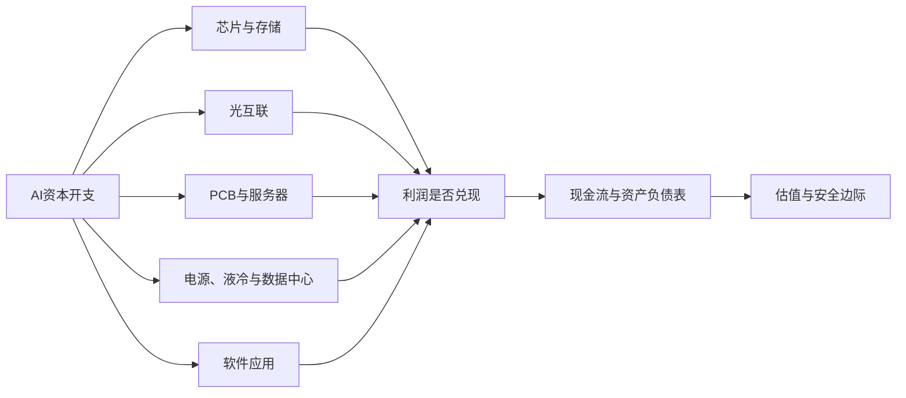

# A股AI产业链重点筛选研究报告

**研究日期：** 2026-07-23
**行情基准：** 2026-07-22收盘至2026-07-23盘前快照
**筛选范围：** A股AI芯片、存储、光通信、PCB、服务器、数据中心、电源液冷与软件应用
**范围边界：** 本轮聚焦数据中心算力链和通用软件应用，明确不纳入人形机器人、智能驾驶、AI终端/眼镜等相邻主题；这些赛道的需求驱动、竞争格局和估值锚不同，应另设候选池筛选。
**召回数量：** 55家公司
**一句话研究结论：** A股AI产业趋势真实、利润兑现集中，但当前优质公司多数已经按高增长持续多年定价；本轮没有发现“质量与价格同时明显低估”的标的。按当前风险收益而非AI纯度排序，沪电股份、金山办公、科士达进入最终重点观察；其中科士达AI收入未单列、纯度较低，新易盛按转增后可比EPS纠偏后降为高弹性跟踪，不宜把历史高增速直接外推为安全边际。

> 本报告用于研究与学习，不构成投资建议。动态PE受行情源、预测利润和非经常性收益影响，本文同时使用2025年静态利润、正常化利润和现金流进行纠偏。

---

## AI研究偏见自觉

| 潜在偏见 | 本轮最容易出现的错误 | 处理方式 |
|---|---|---|
| 趋势替代估值 | AI重要，所以任何价格都能买 | 强制列当前PE、静态PE和三情景目标价 |
| 涨幅后视镜 | 股价上涨后倒推护城河很强 | 先核AI收入和现金流，再讨论股价 |
| 龙头偏好 | 资料多、市值大，就被视为更好 | 对ROE、OCF/净利、负债和自由现金流使用统一门槛 |
| 动态PE幻觉 | 预测利润或一次性收益把PE压低 | 润泽科技、金山办公单独做正常化利润纠偏 |
| 概念污染 | 数据中心、半导体、软件都贴AI标签 | 区分AI高纯度、AI增量、AI间接受益和概念相关 |
| 单年高增长外推 | 把2025年的爆发增速永久化 | 对2027—2028年扩产、降价和资本开支见顶做反向压力测试 |

**信息充分度：** 财务数据A；AI收入拆分B；行业订单与客户集中度B；三年增长假设C。投资确定性低于数据置信度。

---

## 第一步：产业链与召回池

本轮不是从“AI概念板块涨幅榜”直接选股，而是先问三个问题：

1. 公司究竟靠什么AI环节赚钱，AI收入能否识别？
2. 利润是否变成现金，扩产是否吞噬自由现金流？
3. 当前价格需要未来几年兑现多高增长？

### 1.1 芯片、存储与光通信：19家

| 公司 | 代码 | AI位置与纯度 | 当前估值快照 | 初筛结论 | 主要原因 |
|---|---|---|---:|---|---|
| 中际旭创 | 300308 | 800G/1.6T光模块，高 | PE 79.1 / PB 34.2 | 保留 | 2025净利+108.8%，OCF/净利1.01；估值高 |
| 新易盛 | 300502 | 高速光互联，高 | PE 66.1 / PB 36.5 | 高弹性跟踪 | 2025净利+235.9%，但转增后可比EPS口径下估值仍无安全边际 |
| 天孚通信 | 300394 | 光器件/光引擎，高 | PE 109.3 / PB 43.4 | 观察 | 财务质量优秀，价格更贵 |
| 光迅科技 | 002281 | 光芯片+模块，中高 | PE 153.3 / PB 11.5 | 淘汰 | ROE不足10%，估值高于头部 |
| 剑桥科技 | 603083 | 光模块+宽带接入，中 | PE 175.6 / PB 8.2 | 淘汰 | 经营现金流为负、净利率低 |
| 华工科技 | 000988 | 光模块+激光/传感，中低 | PE约67 | 观察 | AI纯度与ROE逊于前三 |
| 寒武纪 | 688256 | 国产AI芯片，高 | PE 302.9 / PB 67.3 | 观察不买 | 首次扭亏但OCF仍负，静态PE约400倍 |
| 海光信息 | 688041 | CPU+DCU，中高 | PE 282.7 / PB 33.3 | 观察 | 商业兑现较好，估值无安全垫 |
| 摩尔线程-U | 688795 | 国产全功能GPU，高 | 623.91元 / PB 25.46 / 亏损 | 淘汰 | 2025营收15.06亿元、同比+243.37%，净亏损约10.24亿元、ROE约-22%，尚不能用盈利支撑估值 |
| 沐曦股份-U | 688802 | 国产通用GPU，高 | 845.00元 / PB 25.81 / 亏损 | 淘汰 | 2025营收16.44亿元、同比+121.26%，净亏损约7.81亿元、ROE约-9.61%，尚不能用盈利支撑估值 |
| 澜起科技 | 688008 | DDR5接口/MRCD/CXL，高 | PE 106.4 / PB 13.2 | 保留 | 负债率6.4%、毛利率62.2%，财务干净但贵 |
| 兆易创新 | 603986 | 存储+MCU，AI中低 | PE 114.7 / PB 13.3 | 淘汰/观察 | 不是HBM核心，ROE与估值不匹配 |
| 德明利 | 001309 | 存储模组，中低 | 动态PE约25 | 淘汰 | 静态PE约151倍、OCF为负、负债率69.9% |
| 江波龙 | 301308 | 企业级/嵌入式存储，中 | 动态PE约30 | 淘汰 | 静态PE约116倍、OCF为负、负债率63.3% |
| 紫光国微 | 002049 | 特种IC，AI低 | PE约34 | 非AI价值观察 | AI直接度低、现金流偏弱 |
| 北方华创 | 002371 | 半导体设备，AI间接受益 | PE 99.4 / PB 14.3 | 观察 | 护城河强，但2025利润下降、累计FCF为负 |
| 中微公司 | 688012 | 刻蚀/薄膜设备，间接受益 | PE 137.9 / PB 13.7 | 观察 | ROE与估值不匹配、五年累计FCF为负 |
| 豪威集团 | 603501 | CIS/边缘视觉，中 | PE约35 / PB约3.9 | 低估值备选 | 估值较低但AI纯度不足 |
| 华虹公司 | 688347 | 特色工艺代工，AI低 | PE >1000 | 淘汰 | ROE不足1%、资本回报低 |

长鑫科技（688825）截至研究日尚无正常连续二级市场行情，只列IPO观察，不进入估值筛选。

### 1.2 PCB、服务器与网络设备：16家

| 公司 | 代码 | AI位置与纯度 | 当前估值快照 | 初筛结论 | 主要原因 |
|---|---|---|---:|---|---|
| 沪电股份 | 002463 | AI服务器/高速交换机PCB，高 | PE 51.1 / PB 13.9 | 保留 | ROE28.6%、OCF/净利1.01、2025 FCF仍为正 |
| 胜宏科技 | 300476 | GPU板/高阶HDI，高 | PE 50.5 / PB 15.1 | 保留 | 净利+273.5%，但扩产后FCF为负 |
| 生益电子 | 688183 | AI服务器高多层板，高 | PE 49.3 / PB 15.0 | 保留 | AI纯度高、收入翻倍，周期与扩产风险高 |
| 深南电路 | 002916 | 高多层PCB+封装基板，中高 | PE 63.3 / PB 14.0 | 观察 | 综合质量好，但价格透支 |
| 生益科技 | 600183 | 高速低损耗覆铜板，中高 | PE 77.9 / PB 19.2 | 观察 | 材料壁垒真实，估值仍高 |
| 广合科技 | 001389 | 服务器PCB，中高 | PE 67.5 / PB 11.4 | 观察 | 应收、存货和资本开支同时增长 |
| 鹏鼎控股 | 002938 | 消费电子PCB为主，中低 | PE 57.1 / PB 6.6 | 淘汰 | AI纯度和利润增长不足 |
| 景旺电子 | 603228 | 汽车/通信PCB转AI，中 | PE 66.0 / PB 5.9 | 淘汰 | ROE和利润增速不足 |
| 工业富联 | 601138 | AI服务器ODM，高 | PE 29.6 / PB 6.8 | 条件观察 | 利润增长52%，但OCF/净利仅0.15、负债率63.4% |
| 浪潮信息 | 000977 | 国内AI服务器，高 | PE 52.0 / PB 6.0 | 淘汰 | 利润增速仅5.2%、负债率73.6% |
| 中科曙光 | 603019 | HPC/算力基础设施，中高 | PE 67.4 / PB 6.8 | 淘汰 | ROE低、现金转化不足 |
| 紫光股份 | 000938 | 服务器/交换机，中高 | PE 60.4 / PB 8.4 | 观察 | H3C壁垒尚可，但低利润、高负债 |
| 神州数码 | 000034 | 分销/集成/自有算力，中低 | PE约30 | 淘汰 | 净利下降30.5%、OCF为负 |
| 菲菱科思 | 301191 | 交换机ODM，中 | PE约146 | 淘汰 | 利润和现金流双弱 |
| 共进股份 | 603118 | 网络设备代工，中低 | PE约132 | 淘汰 | ROE1.6%、毛净利率低 |
| 锐捷网络 | 301165 | 数据中心交换机，中高 | PE 197.1 / PB 29.8 | 淘汰 | 公司不错，价格不可解释 |

服务器整机厂没有一家同时通过盈利质量、负债和估值三关。低毛利并非唯一问题，营运资本和库存才是关键：工业富联2025年经营现金流52.4亿元、资本开支172.3亿元，近似FCF为-119.9亿元，存货同比增加77%。

### 1.3 电源液冷、数据中心与软件应用：20家

| 公司 | 代码 | AI位置与纯度 | 当前估值快照 | 初筛结论 | 主要原因 |
|---|---|---|---:|---|---|
| 英维克 | 002837 | 数据中心温控/液冷，中高 | PE 159.8 / PB 23.4 | 淘汰/观察 | 赛道真实，OCF/净利仅0.29 |
| 申菱环境 | 301018 | 精密空调/液冷，中 | PE 178.6 / PB 12.6 | 淘汰 | ROE低、应收高、估值透支 |
| 科华数据 | 002335 | UPS/IDC/储能，中低 | PE 54.2 / PB 3.6 | 观察 | 现金流好，资本回报偏低 |
| 科士达 | 002518 | UPS/温控/CDU，中 | PE 30.1 / PB 4.1 | 保留 | 十年ROE约14.5%、现金流与负债合格，AI收入未单列 |
| 麦格米特 | 002851 | AI服务器电源新业务，低 | PE >500 | 淘汰 | 净利下降、OCF为负，AI收入不可量化 |
| 数据港 | 603881 | IDC，中低 | PE 165.7 / PB 6.9 | 淘汰 | 零增长、低ROE、高估值 |
| 润泽科技 | 300442 | AIDC，高 | 表面PE 21.6 | 保留/纠偏 | AIDC收入占44.2%；扣非正常化PE约57—60倍 |
| 宝信软件 | 600845 | IDC+工业软件，中低 | PE 42.8 / PB 5.0 | 观察 | 2025收入、利润明显下滑 |
| 奥飞数据 | 300738 | IDC/算力基础设施，中 | PE 130.3 / PB 5.9 | 淘汰 | ROE3.7%、负债率74.3% |
| 金山办公 | 688111 | WPS AI+订阅，中高 | 表面PE 30.7 | 保留/纠偏 | 十年ROE约17.9%、长期毛利率约85.7%；正常化PE约55倍 |
| 科大讯飞 | 002230 | 模型+行业应用，高 | PE 113.7 / PB 4.3 | 淘汰/观察 | 净利率仅3.1%，项目制拖累扩展性 |
| 用友网络 | 600588 | 企业软件/AI，中 | 亏损 | 淘汰 | 持续亏损、收入停滞 |
| 拓尔思 | 300229 | NLP/行业大模型，中高 | 亏损 | 淘汰 | 收入下降、继续亏损 |
| 昆仑万维 | 300418 | 模型/AI搜索/音乐，中高 | 亏损 | 淘汰 | AI投入真实，盈利未验证 |
| 万兴科技 | 300624 | AI创意软件，高 | 亏损 | 期权观察 | 产品真实但盈利转负 |
| 海天瑞声 | 688787 | AI训练数据，高 | PE 264.2 / PB 7.9 | 淘汰 | 利润规模极小、现金转化差 |
| 中恒电气 | 002364 | HVDC/数据中心电源，中 | PE约168 | 淘汰 | ROE低、估值高 |
| 伊戈尔 | 002922 | 数据中心变压器，中 | PE约44 | 淘汰 | 净利下降31.5%，AI收入未量化 |
| 网宿科技 | 300017 | CDN/边缘计算，中低 | PE约50 | 观察 | 资产负债表好，但AI纯度低 |
| 光环新网 | 300383 | IDC/云服务，中 | 亏损 | 淘汰 | 亏损且收入停滞 |

两项必须纠偏的“低PE”：

- 润泽科技2025年50.50亿元归母净利润中，约37.5亿元来自数据中心REIT处置等非经常性收益。按约18.8—19.8亿元扣非利润计算，正常化PE约57—60倍。
- 金山办公2026Q1利润包含大额基金投资收益。剔除后当前正常化TTM PE约55倍，而非行情软件显示的约31倍。

---

## 第二步：财务去劣与淘汰记录

硬门槛使用ROE、累计自由现金流、利息覆盖、毛利率、OCF/净利、净利率和股本稀释。由于部分公司缺少可比的十年与复权股本序列，本轮对缺失项标记为数据不足，不把五年窗口冒充完整十年结论。

### 明确淘汰类型

| 淘汰类型 | 代表公司 | 具体问题 |
|---|---|---|
| 亏损或利润未验证 | 摩尔线程-U、沐曦股份-U、用友网络、拓尔思、昆仑万维、万兴科技、光环新网 | 无法用盈利和现金流支持估值；两家国产GPU公司PB均超过25倍 |
| 现金流/FCF不合格 | 剑桥科技、寒武纪、北方华创、中微公司、德明利、江波龙 | OCF为负或五年累计FCF为负 |
| 高杠杆低利润 | 浪潮信息、神州数码、奥飞数据 | 负债高、净利润率低、营运资本占用大 |
| AI纯度不足 | 紫光国微、豪威集团、鹏鼎控股、网宿科技 | AI只是增量需求，不能按纯AI估值 |
| 质量尚可但估值失真 | 光迅科技、锐捷网络、英维克、申菱环境、海天瑞声 | ROE/现金流不能支撑100倍以上PE |
| 战略资产但非价值买点 | 寒武纪、海光信息 | 国产替代意义高，但约303倍/283倍动态PE无安全垫 |

去劣框架会严格淘汰重资产扩张期企业，这不等于否定产业竞争力；它只说明这些公司当前不能按稳定自由现金流复利资产定价。

---

## 第三步：收敛后的10家公司

| 排名 | 公司 | 产业位置 | 当前价 | 当前估值 | 2025收入/净利增速 | 质量判断 | 当前动作 |
|---:|---|---|---:|---:|---:|---|---|
| 1 | 沪电股份 | 高速PCB | 114.23元 | PE 51.1 | +42.0% / +47.7% | 现金流、ROE与业务纯度最均衡 | 等77—90元或盈利上修 |
| 2 | 金山办公 | AI办公应用 | 239.92元 | 正常化PE约55 | +15.8% / +11.6% | 应用层商业模式最好，AI收入尚未单列 | 等190—210元 |
| 3 | 科士达 | UPS/温控/CDU | 33.00元 | PE 30.1 | +26.7% / +55.0% | 质量与价格最接近合理，但AI收入未单列、纯度较低 | 26—29元观察 |
| 4 | 生益电子 | AI服务器PCB | 101.00元 | PE 49.3 | +102.6% / +343.8% | 高纯度高成长，周期与扩产风险高 | 80—90元重新评估 |
| 5 | 胜宏科技 | 高阶HDI/AI PCB | 240.40元 | PE 50.5 | +79.8% / +273.5% | 高弹性，2025 FCF转负 | 157—184元重新评估 |
| 6 | 中际旭创 | 光模块质量锚 | 1,060.80元 | PE 79.1 | +60.3% / +108.8% | AI利润最真实之一，但估值仍高 | 700—900元或盈利上修 |
| 7 | 新易盛 | 高速光模块 | 508.80元 | PE 66.1 | +187.3% / +235.9% | 增长强但转增后可比EPS纠偏使安全边际明显收窄 | 约320元以下或盈利继续上修再评估 |
| 8 | 澜起科技 | 内存互连 | 223.00元 | PE 106.4 | +49.9% / +58.4% | 资产负债表最干净，价格太满 | 等PE显著收缩 |
| 9 | 润泽科技 | AIDC | 68.58元 | 正常化PE约57—60 | +30.0% / 扣非需重算 | AIDC收入可量化，重资产与高负债 | 50—55元或扣非利润兑现 |
| 10 | 工业富联 | AI服务器ODM | 60.71元 | PE 29.6 | +48.2% / +52.0% | 估值相对低，但现金流与负债不合格 | OCF/净利恢复至0.7后再评估 |

### 为什么不是四家国产AI芯片公司

国产AI芯片是重要战略方向，但重要性不能替代股东回报。寒武纪2025年刚扭亏、经营现金流仍负，静态PE约400倍；海光信息经营更成熟，但当前动态PE约283倍、ROE约11.9%。摩尔线程-U与沐曦股份-U仍分别亏损约10.24亿元、7.81亿元，PB均超过25倍。四家公司都需要“多年高增长+估值长期维持高位”同时成立，当前容错率过低。

### 为什么服务器整机没有进入最终三家

AI服务器收入增长很快，但整机与代工环节的利润率、营运资本和负债结构较弱。工业富联的低PE最具迷惑性：2025年利润352.9亿元，经营现金流仅52.4亿元。若库存不能随交付下降，利润表增长并不等于股东自由现金增长。

---

## 第四步：最终3家重点候选

最终三家不是“今天必须买入”的三只股票，而是当前最值得持续跟踪、等待价格或盈利条件满足的三家公司。

### 1. 沪电股份：质量与估值最均衡的AI硬件候选

**生意本质：** 把全球云厂商和网络设备商对800G/1.6T交换机及AI服务器的升级需求，转化为高层高速PCB订单；客户认证、良率和规模交付决定利润。

| 维度 | 判断 |
|---|---|
| AI纯度 | 高，直接参与AI服务器与高速交换机PCB |
| 2025质量 | ROE28.6%，OCF/净利1.01，近似FCF约+6.7亿元 |
| 护城河 | 客户认证、高层高速板工艺、良率、规模交付 |
| 最大风险 | 存货+74%、同行扩产、2027—2028年高端产能过剩 |
| 当前价格 | 114.23元，动态PE约51倍 |
| 重新评估区 | 77—90元，或盈利上修把前瞻PE压至30—35倍 |

三情景估值，以2025 EPS 1.9875元为基准：

| 情景 | 三年EPS增速 | 目标PE | 三年目标价 | 相对当前 |
|---|---:|---:|---:|---:|
| 乐观 | +30% | 40倍 | 174.7元 | +52.9% |
| 中性 | +20% | 30倍 | 103.0元 | -9.8% |
| 悲观 | +10% | 25倍 | 66.1元 | -42.1% |

中性情景低于当前价，说明当前价格依赖持续超预期，而不是依赖普通增长。

### 2. 金山办公：A股AI应用层最好的商业模式

**生意本质：** 利用数亿WPS用户和文档格式生态，把AI功能嵌入已有办公工作流，通过订阅提价和WPS 365扩张变现，而不必重新购买用户流量。

| 维度 | 判断 |
|---|---|
| AI纯度 | 中高，场景和用户真实，但AI收入没有单独披露 |
| 长期质量 | 十年平均ROE约17.9%，五年OCF/净利约1.5，长期毛利率约85.7% |
| 护城河 | 用户习惯、文档生态、信创渠道、订阅迁移成本 |
| 最大风险 | AI功能无法显著提高ARPU；竞争产品压价；投资收益扭曲利润 |
| 当前价格 | 239.92元；剔除投资收益后正常化PE约55倍 |
| 重新评估区 | 190—210元，或经营利润增速连续两季超过25% |

三情景估值，以2025 EPS 3.97元为基准：

| 情景 | 三年EPS增速 | 目标PE | 三年目标价 | 相对当前 |
|---|---:|---:|---:|---:|
| 乐观 | +25% | 45倍 | 348.9元 | +45.4% |
| 中性 | +15% | 35倍 | 211.3元 | -11.9% |
| 悲观 | +8% | 25倍 | 125.0元 | -47.9% |

最强空头观点是：WPS AI用户增长很快，但如果AI只是提高使用频率而不能提价，55倍正常化PE买到的仍是一家15%左右增长的软件公司。

### 3. 科士达：价格最接近合理，但AI纯度需要打折

**生意本质：** 以UPS、数据中心温控和电源产品承接算力基础设施需求，同时包含光伏逆变器、储能等非AI业务；因此只能按综合电源设备公司估值，不能按纯AI公司估值。

| 维度 | 判断 |
|---|---|
| AI纯度 | 中低，数据中心业务受益，但公司未单列AI收入 |
| 2025质量 | 收入+26.7%、净利+55.0%、基本EPS 1.05元、OCF/净利约1.2 |
| 护城河 | UPS与电源系统渠道、项目交付能力、稳定客户基础 |
| 最大风险 | AI贡献无法量化、光储业务周期波动、市场把间接受益误定价为纯AI增长 |
| 当前价格 | 33.00元，动态PE约30.1倍 |
| 重新评估条件 | 26—29元，或公司披露可验证的AI数据中心收入与订单增量 |

三情景估值以2025年报基本EPS 1.05元为基准，三年盈利增速分别假设20%/12%/3%，期末PE分别取28/24/18倍；乐观情景才假设AI数据中心需求显著抬升增长：

| 情景 | 三年EPS增速 | 目标PE | 三年目标价 | 相对当前 |
|---|---:|---:|---:|---:|
| 乐观 | +20% | 28倍 | 50.8元 | +53.9% |
| 中性 | +12% | 24倍 | 35.4元 | +7.3% |
| 悲观 | +3% | 18倍 | 20.7元 | -37.4% |

科士达进入最终三家是风险收益排序结果，不代表其AI纯度高于光模块公司；当前价的中性三年回报仍不充足，26—29元才有更合理的初始安全垫。

### 高弹性跟踪：新易盛

新易盛AI纯度和2025年增长仍居前列，但估值必须使用转增后可比股本口径。以转增后可比EPS约6.86元、当前价508.80元为基准，三年盈利增速仍取35%/25%/10%，期末PE取45/35/25倍，目标价分别为759.5元、468.9元、228.3元，对应+49.3%、-7.8%、-55.1%。中性情景已经低于当前价，且悲观情景下行更深，因此从最终三家降为第7名高弹性跟踪；约320元以下或后续盈利显著上修时再评估。

---

## 第五步：最强反方论证

一个聪明的空头会这样说：

1. **资本开支不是永续增长。** 当前订单来自全球云厂商集体扩产，历史上通信与电子制造每次高景气最终都会吸引过量产能。
2. **中国供应链的优势也会压低利润。** PCB和光模块厂商扩产速度越快，未来价格竞争越激烈；收入增长不必然等于长期ROIC提高。
3. **客户集中让增长不可独立验证。** 北美少数云厂商一旦下调资本开支，光模块、PCB、服务器和液冷会同时受影响，组合看似分散，实则同一因子。
4. **当前估值提前消费了两到三年增长。** 多数候选在50—150倍PE，正常增长不够，必须持续超预期。
5. **A股AI应用尚未证明独立收入。** 除少数公司外，多数只披露用户、调用量或项目进展，未披露AI ARR、付费率和增量毛利。

**本报告最可能犯的错误：** 低估AI资本开支持续时间。如果全球AI算力需求连续五年以上保持高增长，当前看似昂贵的光模块与PCB公司可能通过盈利快速消化估值；反之，若2027年前后资本开支见顶，当前价格会同时遭遇盈利下修和估值压缩。

---

## 第六步：行动清单

| 投资者状态 | 建议 |
|---|---|
| 空仓者 | 不追当前高估值龙头；建立沪电股份、金山办公、科士达风险收益跟踪表，科士达按综合电源设备估值，不给纯AI溢价 |
| 想研究高弹性标的 | 新易盛使用转增后可比EPS约6.86元核算；中性三年目标价468.9元低于当前价，约320元以下或盈利显著上修后再评估 |
| 已持有沪电股份 | 继续跟踪库存、资本开支和2026Q2-Q3毛利率；估值扩张而盈利未上修时不加仓 |
| 已持有光模块 | 重点跟踪北美云厂商资本开支、1.6T出货、ASP和库存；不要把中际、新易盛、天孚当成三个独立风险因子 |
| 已持有AI芯片 | 寒武纪、海光按高估值战略资产跟踪；摩尔线程-U、沐曦股份-U仍亏损且PB超过25倍，设定收入、扭亏、OCF和估值四重纪律 |
| 已持有液冷/IDC | 用AI收入占比、上架率、扣非利润和自由现金流验证，不看表面动态PE |

### 加仓或重新评估信号

- 全球头部云厂商资本开支维持增长，且供应商库存周转没有恶化。
- 沪电股份高端PCB毛利率稳定，存货增速回落，FCF继续为正。
- 金山办公披露可量化AI收入、付费转化率或AI带来的ARPU提升。
- 新易盛1.6T收入占比提升，同时OCF/净利继续高于0.8。
- 工业富联OCF/净利恢复至0.7以上，库存开始下降。

### 减仓或论文失效信号

- 四大云厂商资本开支指引同比转负。
- PCB、光模块ASP下降快于成本改善，毛利率连续两个季度下滑。
- 客户集中度继续上升，单一客户需求出现延迟或取消。
- 2027—2028年新增产能集中投放，利用率和订单能见度同步下降。
- AI应用用户增长不能转化为收入、续费率或ARPU。

---

## AI分析置信度与投资确定性

| 维度 | 评级 | 说明 |
|---|---|---|
| 2025财务数据 | A | 东方财富/腾讯结构化数据与公司年报、交易所披露交叉核验 |
| 当前行情与市值 | A- | 盘前快照准确，但交易后会变化；不同平台动态PE口径存在差异 |
| AI业务纯度 | B | 光模块、PCB、AIDC较清楚；软件、液冷和服务器电源多数未单列AI收入 |
| 护城河判断 | B | 客户认证与规模有证据，长期技术替代仍不确定 |
| 三年增长假设 | C+ | 属情景分析，不是业绩承诺 |
| 当前投资确定性 | 中低 | 好公司较多，但安全边际普遍不足 |

---

## 数据来源与审计记录

主要一手或高可信来源：

- [中际旭创投资者关系与财务报告](https://www.zj-innolight.com/index/index/inv2.html)
- [澜起科技2025年年度报告摘要](https://static.cninfo.com.cn/finalpage/2026-03-31/1225057721.PDF)
- [海光信息2025年年度报告](https://static.cninfo.com.cn/finalpage/2026-04-08/1225083088.PDF)
- [上交所科创板2025年度业绩综述（含摩尔线程、沐曦营收增速与净利润）](https://www.sse.com.cn/cpc/cpctheme/4th20thcpc/4th20thcpcgcxx/c/c_20260310_10811398.shtml)
- [沪电股份2025年度报告摘要](https://static.cninfo.com.cn/finalpage/2026-03-25/1225027831.PDF)
- [沪电股份2026Q1投资者关系记录](https://static.cninfo.com.cn/finalpage/2026-04-28/1225231506.PDF)
- [胜宏科技2025年度报告](https://static.cninfo.com.cn/finalpage/2026-03-13/1225007455.PDF)
- [生益电子募集说明书](https://static.sse.com.cn/stock/disclosure/announcement/c/202602/688183_20260211_KBL3.pdf)
- [工业富联2025年度报告](https://static.cninfo.com.cn/finalpage/2026-03-11/1225004420.PDF)
- [科士达2025年度报告摘要](https://disc.static.szse.cn/disc/disk03/finalpage/2026-04-27/bb5cb5ea-d6aa-4c2f-99f5-3145401917e0.PDF)
- [润泽科技2025年度报告摘要](https://static.cninfo.com.cn/finalpage/2026-04-10/1225091631.PDF)
- [金山办公2026年第一季度报告](https://stockmc.xueqiu.com/202604/688111_20260424_XYSM.pdf)
- [上交所科创板2025年年报综述](https://www.sse.com.cn/aboutus/mediacenter/hotandd/c/c_20260430_10817331.shtml)

行情来源：腾讯实时行情与东方财富行情交叉；财务主表：东方财富F10，并以年报/交易所披露复核重点公司。三情景估值使用仓库 `financial_rigor.py` 精确十进制计算。

**内部算术检查：** `report_audit.py` 用于抽取报告中的可识别数据点并生成抽样清单；此前的27项检查仅是对录入值与内部校验值的一致性核对，不代表完成了27项外部双源验证，也不作为“审计准出”结论。本文三情景目标价由 `financial_rigor.py` 按所列EPS、增长率与目标PE精确十进制计算；增长率和目标PE属于模型假设，不应误读为业绩承诺。
