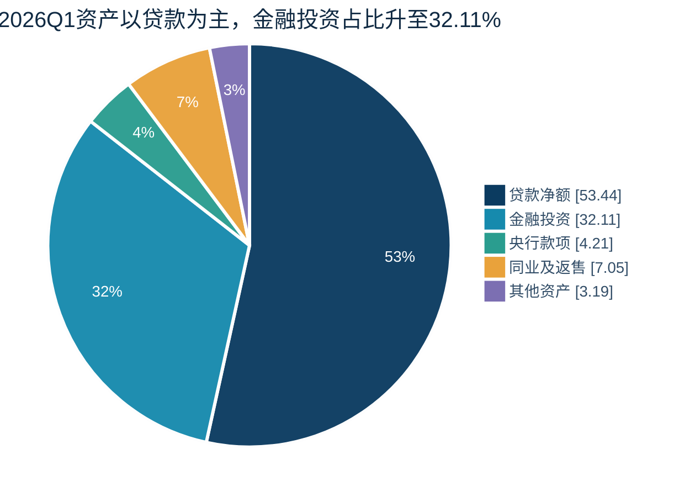
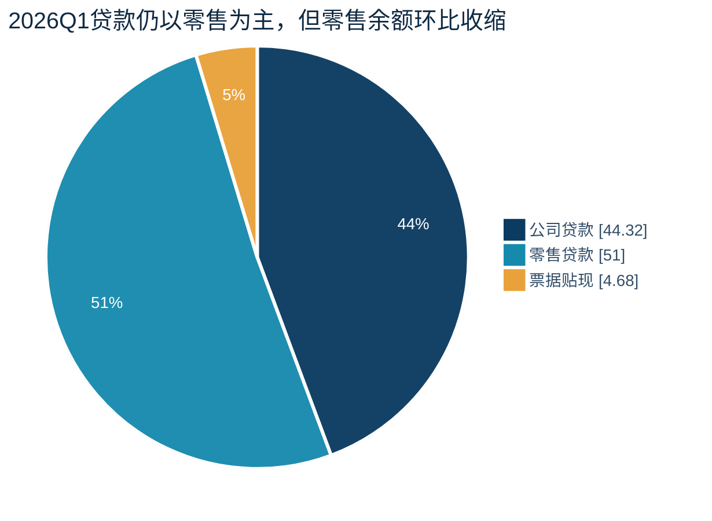
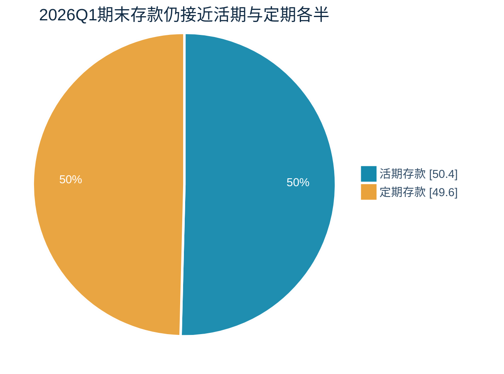
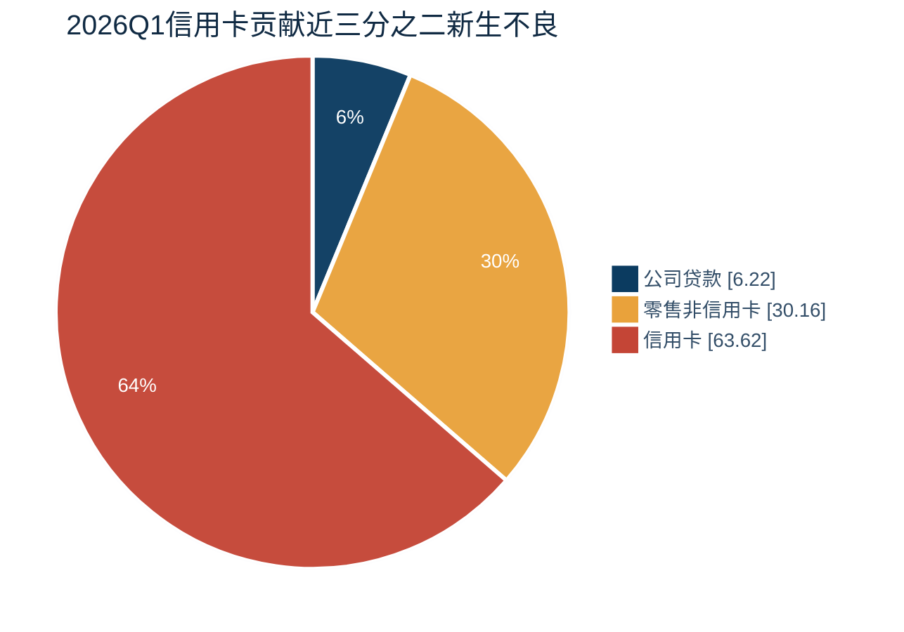

# 招商银行2026Q1财报点评：收入改善，但零售风险与资本效率压制利润弹性

> 研究日期：2026-07-11 14:49 CST（UTC+8）  
> 数据截止：2026-07-11 14:49 CST；截至该时点最新定期报告仍为2026Q1，报告发布日期为2026-04-28  
> 官方报告：[2026Q1巨潮正式报告](https://dataclouds.cninfo.com.cn/shgonggao/hsomarket/2026/20260428/607e5b6e51394725a0671fdb4ef4ee0e.PDF)；[招商银行IR定期报告页（含2025FY、2025Q3及2025Q1）](https://english.cmbchina.com/CmbIR/intro.aspx?type=report)  
> 口径：除特别说明外为集团、中国会计准则、人民币；利润为累计/单季，资产负债为期末，量价为日均；风险生成与处置采用母行口径  
> 记号：N/A（未披露、不适用或不可比）；高（A级）/较高（B级）/中（C级）/低（D级）分别代表财报直接披露/确定公式计算/少量假设/重要数据缺失下的代理估计  
> 交付形式：单一Markdown；144项核心底稿与56项披露及计算扩展明细见附录A

## 一句话判断

**[推断] 这是一份“收入经营改善、但零售信用风险和资本消耗压住利润弹性”的财报，不是靠少提减值释放利润。** 营业收入同比增长3.81%，NII（净利息收入）和手续费分别增长4.99%和4.87%；贷款减值损失增长9.01%，使归母净利润仅增长1.52%。关注率、逾期率较年末分别上升5bp和4bp，信用卡、按揭和消费贷不良率继续抬升。对公投放和金融投资拉动规模，零售贷款收缩；负债降成本仍不足以完全对冲资产收益率下行。评分证据不足，暂不发布。

## 1. 利润表与单季趋势

> 单位：百万元；QoQ（环比）；YoY（同比）；ROAA（平均总资产收益率）；ROAE（平均净资产收益率）。2025Q4金额由2025FY减2025Q3累计数精确重构，日均量价取年报单季表。

| 指标 | 本季 | 上季 | 同期 | QoQ（环比）/YoY（同比） | 累计 | 重构 | 证据 |
|---|---:|---:|---:|---:|---:|---|---|
| NII（净利息收入） | 55,642 | 55,551 | 52,996 | +0.16% / +4.99% | 55,642 | 上季精确 | Q1 p.5/p.17；FY p.18；Q3 p.18 |
| 手续费净收入 | 20,656 | 19,056 | 19,696 | +8.40% / +4.87% | 20,656 | 上季精确 | 同上 |
| 其他非息 | 10,642 | 11,505 | 11,059 | -7.50% / -3.77% | 10,642 | 上季精确 | 同上 |
| 营业收入 | 86,940 | 86,112 | 83,751 | +0.96% / +3.81% | 86,940 | 上季精确 | Q1 p.2/p.17 |
| 税金及附加 | 773 | 851 | 805 | -9.17% / -3.98% | 773 | 上季精确 | Q1 p.17；FY p.18 |
| 业务及管理费 | 24,748 | 32,909 | 23,988 | -24.80% / +3.17% | 24,748 | 上季精确 | Q1 p.6/p.17 |
| 信用减值 | 14,846 | 6,235 | 12,837 | +138.11% / +15.65% | 14,846 | 上季精确 | Q1 p.6/p.17；FY p.24 |
| 其他资产减值 | 2 | 180 | 0 | -98.89% / N/A | 2 | 上季精确 | Q1 p.17；FY p.18 |
| 其他业务成本 | 1,906 | 1,912 | 1,859 | -0.31% / +2.53% | 1,906 | 上季精确 | 同上 |
| 营业外净额 | 12 | -121 | -20 | N/M（变动比例无意义） / N/M（变动比例无意义） | 12 | [计算] | Q1 p.17；FY p.18 |
| 税前利润 | 44,677 | 43,904 | 44,242 | +1.76% / +0.98% | 44,677 | 上季精确 | 同上 |
| 所得税 | 6,629 | 7,315 | 6,729 | -9.38% / -1.49% | 6,629 | 上季精确 | 同上 |
| 净利润 | 38,048 | 36,589 | 37,513 | +3.99% / +1.43% | 38,048 | 上季精确 | 同上 |
| 少数股东损益 | 196 | 180 | 227 | +8.89% / -13.66% | 196 | 上季精确 | Q1 p.17 |
| 归母净利润 | 37,852 | 36,409 | 37,286 | +3.96% / +1.52% | 37,852 | 上季精确 | Q1 p.2/p.17；FY p.18 |

### 利润构成与变动原因

[计算] `55,642+20,656+10,642=86,940`；`86,940-773-24,748-14,846-2-1,906+12=44,677`；`44,677-6,629=38,048`；`38,048-196=37,852`，四层核对差额均为0。

同比收入增加3,189，其中NII（净利息收入）贡献2,646、手续费贡献960、其他非息拖累417；管理费和信用减值增量分别拖累760和2,009，税前利润只增加435。实际税率14.84%，同比下降0.37个百分点，仅贡献约100的税后增量。[推断] 新增收入约63%被信用减值增量吞噬，经营改善与风险成本上升同时存在。

## 2. 资产结构

> 单位：百万元。FVTPL（以公允价值计量且变动计入当期损益）；FVOCI（以公允价值计量且变动计入其他综合收益）；RWA（风险加权资产）。

| 项目 | 本期 | 上期 | 同期 | QoQ（环比）/YoY（同比） | 占比/变化 | 增量贡献 | 证据 |
|---|---:|---:|---:|---:|---:|---:|---|
| 总资产 | 13,484,882 | 13,070,523 | 12,529,792 | +3.17% / +7.62% | 100% | 100% | Q1 p.2/p.13 |
| 生息资产日均 | 12,302,083 | 11,835,865 | 11,264,198 | +3.94% / +9.21% | N/A | N/A | Q1 p.5；FY p.22 |
| 贷款总额 | 7,464,373 | 7,258,058 | 7,125,479 | +2.84% / +4.77% | 55.35% / -0.18pp | 49.79% | Q1 p.5/p.7 |
| 贷款净额 | 7,206,321 | 7,004,238 | 6,864,448 | +2.89% / +4.98% | 53.44% / -0.15pp | 48.77% | Q1 p.13 |
| 金融投资合计 | 4,329,634 | 4,135,121 | 3,848,378 | +4.70% / +12.51% | 32.11% / +0.47pp | 46.94% | Q1 p.13 |
| FVTPL（以公允价值计量且变动计入当期损益） | 737,220 | 647,796 | 628,030 | +13.80% / +17.70% | 5.47% / +0.51pp | 21.58% | Q1 p.13 |
| 摊余成本债权投资 | 2,147,461 | 2,124,951 | 1,990,466 | +1.06% / +7.89% | 15.92% / -0.34pp | 5.43% | Q1 p.13 |
| FVOCI（以公允价值计量且变动计入其他综合收益）债权投资 | 1,420,575 | 1,337,950 | 1,206,757 | +6.18% / +17.72% | 10.53% / +0.29pp | 19.94% | Q1 p.13 |
| 存放央行 | 568,220 | 560,207 | 562,072 | +1.43% / +1.09% | 4.21% / -0.07pp | 1.93% | Q1 p.13 |
| 存拆放同业及买入返售 | 950,934 | 966,546 | 833,709 | -1.62% / +14.06% | 7.05% / -0.34pp | -3.77% | [计算] Q1 p.13 |
| 衍生金融资产 | 20,227 | 18,823 | 25,325 | +7.46% / -20.13% | 0.15% / +0.01pp | 0.34% | Q1 p.13 |
| 其他主要资产 | 409,546 | 385,588 | 395,860 | +6.21% / +3.46% | 3.04% / +0.09pp | 5.78% | [计算] 勾稽余项 |

> 图表口径：集团期末余额占总资产比例；“其他资产”含衍生金融资产和其他主要资产；五项合计100.00%。来源：Q1 p.13及本节计算。

[推断] 新增总资产4,143.59亿元，贷款净额和金融投资分别贡献48.8%和46.9%。贷款占比下降、投资占比上升，部分收入波动从NII（净利息收入）迁移至投资收益、公允价值和OCI（其他综合收益）；本季其他非息同比下降3.77%，尚未体现交易收入增量。RWA（风险加权资产）环比约增长3.59%，快于总资产0.42个百分点，新增资产并非完全低资本消耗。

## 3. 贷款结构

> 单位：百万元。量价总览采用集团日均口径；产品结构和风险采用母行期末口径。季报只披露贷款整体收益率，因此产品表不设置一整列无意义的空收益率。

### 3.1 贷款量价总览

| 指标 | 本期 | 上季 | 同期 | QoQ（环比）/YoY（同比） | 数据范围·口径 | 证据 |
|---|---:|---:|---:|---:|---|---|
| 贷款平均余额 | 7,263,498 | 7,063,820 | 6,914,622 | +2.83% / +5.05% | 集团；单季日均 | Q1 p.5；FY p.22 |
| 贷款利息收入 | 55,986 | 57,138 | 60,152 | -2.02% / -6.93% | 集团；单季 | 同上 |
| 贷款收益率 | 3.13% | 3.21% | 3.53% | -8bp / -40bp | 集团；年化 | 同上 |

[推断] 贷款平均余额同比增长5.05%，但利息收入下降6.93%，量增未能抵消价格下行。贷款收益率同比下降40bp，是NIM（净息差）仍承压的核心；零售贷款收缩又削弱了高收益资产占比。

### 3.2 贷款产品结构与风险

| 类别 | 余额/占比 | QoQ（环比）/YoY（同比） | 不良余额/率 | 关注/逾期 | 新生不良 | 证据 |
|---|---:|---:|---:|---:|---:|---|
| 公司贷款 | 3,142,494 / 44.32% | +7.26% / +13.58% | 24,364 / 0.78% | 21,459 / 26,686 | 1,177 | Q1 p.8-p.10 |
| 零售贷款 | 3,616,106 / 51.00% | -1.06% / +0.71% | 41,329 / 1.14% | 79,379 / 63,602 | 17,750 | Q1 p.9-p.10 |
| 票据贴现 | 331,770 / 4.68% | +3.00% / -19.28% | 0 / 0.00% | 1 / 0 | N/A：未单列 | Q1 p.9 |
| 住房按揭 | 1,393,290 / 19.65% | -1.26% / -1.72% | 8,020 / 0.58% | 23,649 / 13,449 | N/A：未单列 | Q1 p.9 |
| 信用卡 | 900,417 / 12.70% | -4.11% / -1.77% | 17,148 / 1.90% | 46,788 / 30,725 | 12,042 | Q1 p.9-p.10 |
| 消费贷款 | 439,234 / 6.19% | +2.95% / +4.54% | 5,126 / 1.17% | 2,711 / 6,379 | N/A：未单列 | Q1 p.9 |
| 小微/个人经营贷 | 879,207 / 12.40% | +0.65% / +5.89% | 10,129 / 1.15% | 6,189 / 12,139 | N/A：未单列 | Q1 p.9 |
| 其他 | 3,958 / 0.06% | -9.51% / -31.65% | 906 / 22.89% | 42 / 910 | N/A：未单列 | Q1 p.9 |

> 图表口径：母行期末贷款总额；三项合计100.00%。来源：Q1 p.8-p.9。

### 行业、区域和集中度（年报/中报）

[披露] 制造业贷款793,311，占母行贷款11.19%，不良率0.43%；交通运输518,044，占7.31%，不良率0.18%；房地产283,708，占4.00%，不良率4.44%，环比下降20bp。[N/A] 地方政府独立暴露、季度区域分布和前十大集中度未披露；2025年末前十大借款人占集团贷款2.39%，仅作背景。

[推断] 对公增长支持规模并改善公司风险，零售与信用卡收缩压低高收益资产占比；公司不良余额下降而零售上升，风险向零售集中；RWA（风险加权资产）快于资产显示对公/投资扩张仍有资本代价。

## 4. 负债与存款结构

> 单位：百万元。LCR（流动性覆盖率）；NSFR（净稳定资金比例）。

### 4.1 负债与存款期末结构

| 项目 | 本期 | 上期 | 同期 | QoQ（环比）/YoY（同比） | 占比 | 证据 |
|---|---:|---:|---:|---:|---:|---|
| 总负债 | 12,194,297 | 11,789,624 | 11,275,928 | +3.43% / +8.14% | 100% | Q1 p.14 |
| 客户存款 | 9,959,197 | 9,836,130 | 9,319,462 | +1.25% / +6.86% | 81.67%负债 | Q1 p.7/p.14 |
| 公司存款 | 5,369,227 | 5,340,216 | 5,144,916 | +0.54% / +4.36% | 53.91%存款 | Q1 p.7 |
| 零售存款 | 4,589,970 | 4,495,914 | 4,174,546 | +2.09% / +9.95% | 46.09%存款 | Q1 p.7 |
| 活期存款 | 5,019,435 | 4,995,943 | 4,827,881 | +0.47% / +3.97% | 50.40%存款 | [计算] Q1 p.7；FY p.29 |
| 定期存款 | 4,939,762 | 4,840,187 | 4,491,581 | +2.06% / +9.98% | 49.60%存款 | [计算] 同上 |
| 日均活期占比 | 49.51% | 49.40% | 50.46% | +0.11pp / -0.95pp | 日均存款 | Q1 p.7；FY p.29 |
| 同业存拆放及回购 | 1,415,945 | 1,257,810 | 1,153,946 | +12.57% / +22.70% | 11.61%负债 | [计算] Q1 p.14 |
| 向央行借款 | 117,236 | 111,077 | 238,214 | +5.54% / -50.79% | 0.96%负债 | Q1 p.14 |
| 应付债券及同业存单 | 142,484 | 143,487 | 166,843 | -0.70% / -14.60% | 1.17%负债 | Q1 p.14 |

### 4.2 付息负债量价

| 类别 | 平均余额 | 利息支出 | 本期成本率 | 上季/同期成本率 | QoQ（环比）/YoY（同比） | 证据 |
|---|---:|---:|---:|---:|---:|---|
| 客户存款 | 9,809,562 | 23,867 | 0.99% | 1.05% / 1.29% | -6bp / -30bp | Q1 p.6；FY p.22 |
| 同业存拆放及其他 | 1,452,939 | 5,084 | 1.42% | 1.46% / 1.78% | -4bp / -36bp | 同上 |
| 应付债券 | 142,477 | 1,080 | 3.07% | 3.28% / 3.08% | -21bp / -1bp | 同上 |
| 向央行借款 | 112,076 | 435 | 1.57% | 1.72% / 1.82% | -15bp / -25bp | 同上 |
| 计息负债合计 | 11,517,054 | 30,466 | 1.07% | 1.13% / 1.39% | -6bp / -32bp | 同上 |

### 4.3 存款细分量价（最近完整披露期：2025FY）

> 单位：百万元。2026Q1只披露客户存款整体成本率0.99%，未披露公司/零售、活期/定期的当季平均余额、利息支出和成本率；下表采用最近完整披露的2025FY，不能视为2026Q1细分成本率。

| 存款类型 | 平均余额 | 利息支出 | 2025成本率 | 2024成本率 | YoY（同比）变化 | 证据 |
|---|---:|---:|---:|---:|---:|---|
| 公司活期 | 2,552,842 | 13,323 | 0.52% | 0.83% | -31bp | FY p.20 |
| 公司定期 | 2,492,472 | 48,692 | 1.95% | 2.45% | -50bp | FY p.20 |
| 公司存款小计 | 5,045,314 | 62,015 | 1.23% | 1.61% | -38bp | FY p.20 |
| 零售活期 | 1,993,112 | 1,394 | 0.07% | 0.22% | -15bp | FY p.20 |
| 零售定期 | 2,164,074 | 44,460 | 2.05% | 2.58% | -53bp | FY p.20 |
| 零售存款小计 | 4,157,186 | 45,854 | 1.10% | 1.44% | -34bp | FY p.20 |
| 活期存款合计 | 4,545,954[计算] | 14,717[计算] | 0.32%[计算] | 0.58%[计算] | -25bp | FY p.20；公司+零售 |
| 定期存款合计 | 4,656,546[计算] | 93,152[计算] | 2.00%[计算] | 2.51%[计算] | -51bp | FY p.20；公司+零售 |
| 客户存款合计 | 9,202,500 | 107,869 | 1.17% | 1.54% | -37bp | FY p.20-p.21 |

[推断] 2025年存款降成本覆盖公司和零售、活期和定期：公司/零售成本率分别下降38bp/34bp，活期/定期合计成本率约下降25bp/51bp。定期成本约2.00%，比活期约0.32%高168bp，说明期限结构仍是存款成本的主要约束；2026Q1整体存款成本进一步降至0.99%，但缺少当季细分量价，不能判断公司、零售或定期存款各自贡献了多少。

> 图表口径：集团期末客户存款；两项合计100.00%。来源：Q1 p.7及本节计算。日均活期占比49.51%，与图中期末结构不是同一口径。

[推断] 存款仅增1.25%，同业存拆放及回购增12.57%，本季负债增量更依赖批发融资。存款成本环比下降6bp、同比下降30bp，日均活期占比环比仅升11bp且同比仍低95bp，降成本主要来自存量重定价而非显著活期化。LCR（流动性覆盖率）季度均值177.89%、季末187.29%；NSFR（净稳定资金比例）未披露。

## 5. NIM（净息差）与重定价

| 项目 | 本期 | 上季 | 同期 | QoQ（环比）/YoY（同比）变化 | 证据 |
|---|---:|---:|---:|---:|---|
| NIM（净息差） | 1.83% | 1.86% | 1.91% | -3bp / -8bp | Q1 p.5-p.6；FY p.22 |
| 净利差 | 1.77% | 1.79% | 1.82% | -2bp / -5bp | 同上 |
| 生息资产收益率 | 2.84% | 2.92% | 3.21% | -8bp / -37bp | 同上 |
| 贷款收益率 | 3.13% | 3.21% | 3.53% | -8bp / -40bp | 同上 |
| 投资收益率 | 2.68% | 2.73% | 2.93% | -5bp / -25bp | 同上 |
| 同业资产收益率 | 1.95% | 2.06% | 2.53% | -11bp / -58bp | 同上 |
| 计息负债成本率 | 1.07% | 1.13% | 1.39% | -6bp / -32bp | 同上 |
| 存款成本率 | 0.99% | 1.05% | 1.29% | -6bp / -30bp | 同上 |
| 同业负债成本率 | 1.42% | 1.46% | 1.78% | -4bp / -36bp | 同上 |

[计算] 环比简化分解为资产收益率-8bp减去负债成本率-6bp，即-2bp，与NIM（净息差）实际-3bp相差-1bp，为结构、口径和舍入影响。[推断] 贷款重定价、有效需求不足和零售占比下降压资产端；存款重定价继续缓冲。日均生息资产同比增长9.21%，使NII（净利息收入）在NIM（净息差）下降8bp时仍增长4.99%。

## 6. 手续费、其他非息与费用

> 单位：亿元。手续费收入分项以手续费及佣金收入为分母；其他非息合计不扣除列在营业成本中的其他业务成本。

### 6.1 手续费及佣金

| 项目 | 本期 | 同期 | YoY（同比） | 占手续费收入比 | 同比增量 | 证据 |
|---|---:|---:|---:|---:|---:|---|
| 财富管理 | 85.07 | 67.83[计算] | +25.42% | 36.77% | +17.24 | Q1 p.6 |
| 资产管理 | 26.46 | 26.07[计算] | +1.50% | 11.44% | +0.39 | 同上 |
| 托管 | 15.42 | 12.87[计算] | +19.81% | 6.67% | +2.55 | 同上 |
| 银行卡 | 35.75 | 40.74[计算] | -12.25% | 15.45% | -4.99 | 同上 |
| 结算与清算 | 40.36 | 37.60[计算] | +7.34% | 17.45% | +2.76 | 同上 |
| 其他手续费收入 | 28.27[计算] | N/A | N/A | 12.22% | N/A | Q1 p.6；收入合计减已列分项 |
| 手续费及佣金收入 | 231.33 | N/A | N/A | 100.00% | N/A | Q1 p.17 |
| 手续费及佣金支出 | 24.77 | N/A | N/A | 10.71%收入 | N/A | Q1 p.17 |
| 手续费及佣金净收入 | 206.56 | 196.96 | +4.87% | 89.29%收入 | +9.60 | Q1 p.5/p.17 |

[披露] 财富管理手续费增长25.42%，其中基金、信托、证券交易和保险分别增长55.11%、42.67%、28.27%和16.70%；AUM（管理客户总资产）17.86万亿元，较年末增长4.52%。[推断] 财富、托管和结算是主要增长项，银行卡收入下降4.99亿元抵消部分增量，信用卡风险与收入压力同时存在。收入分项合计与净收入不是同一口径，不能直接相加。

### 6.2 其他非息收入

| 项目 | 本期 | 同期 | YoY（同比） | 同比增量 | 核对/说明 | 证据 |
|---|---:|---:|---:|---:|---|---|
| 投资收益 | 39.86 | 117.52 | -66.08% | -77.66 | 债券投资价差减少 | Q1 p.17 |
| 公允价值变动损益 | 20.28 | -53.06 | N/M（正负转换） | +73.34 | 部分对冲投资收益下降 | 同上 |
| 汇兑净收益 | 11.29 | 11.20 | +0.80% | +0.09 | 基本稳定 | 同上 |
| 其他业务收入 | 34.99 | 34.93 | +0.17% | +0.06 | 与配套成本净看 | 同上 |
| 其他业务成本 | 19.06 | 18.59 | +2.53% | +0.47 | 营业成本，不计入下列收入合计 | 同上 |
| OCI（其他综合收益） | N/A | N/A | N/A | N/A | 季报未给可比损益分项 | Q1披露限制 |
| 其他非息收入合计 | 106.42 | 110.59 | -3.77% | -4.17 | 前四项合计，差额0 | Q1 p.5/p.17 |

[推断] 投资收益减少77.66亿元，但公允价值由损失转为收益、同比改善73.34亿元，二者几乎相互抵消；其他非息总额只下降4.17亿元。因此不能只看“投资收益大降”判断交易能力恶化，需把投资收益、公允价值和OCI（其他综合收益）联动观察。

### 6.3 费用与减值

| 项目 | 本期 | 上季 | 同期 | QoQ（环比）/YoY（同比） | 占收入比 | 证据 |
|---|---:|---:|---:|---:|---:|---|
| 业务及管理费 | 247.48 | 329.09 | 239.88 | -24.80% / +3.17% | 28.47% | Q1 p.6/p.17；FY p.18 |
| 员工费用 | 176.94 | N/A | 173.27[计算] | N/A / +2.12% | 20.35% | Q1 p.6 |
| 其他业务费用 | 70.54 | N/A | 66.62[计算] | N/A / +5.88% | 8.11% | Q1 p.6 |
| 成本收入比 | 28.47% | N/A | 28.64% | N/A / -17bp | N/A | Q1 p.6 |
| 信用减值损失 | 148.46 | 62.35 | 128.37 | +138.11% / +15.65% | 17.08% | Q1 p.6/p.17；FY p.24 |
| 贷款减值损失 | 148.58 | N/A | 136.30[计算] | N/A / +9.01% | 17.09% | Q1 p.6 |
| 其他业务成本 | 19.06 | 19.12 | 18.59 | -0.31% / +2.53% | 2.19% | Q1 p.17；FY p.18 |

[计算] 营业收入同比增加31.89亿元，业务及管理费和信用减值分别增加7.60亿元和20.09亿元，合计消耗收入增量86.8%；其中信用减值一项消耗63.0%。管理费增速低于收入、成本收入比下降17bp，但上季比较受Q4季节性影响；利润弹性主要被风险成本而非日常费用压制。

## 7. 风险存量与前瞻信号

| 层级·指标 | 本期 | 上期 | 同期 | 变化 | 可信度·证据 | 判断 |
|---|---:|---:|---:|---:|---|---|
| 前瞻·关注余额/率 | 110,233 / 1.48% | 103,860 / 1.43% | 97,195 / 1.36% | +5bp / +12bp | A·Q1 p.8 | 恶化 |
| 前瞻·逾期余额/率 | 96,060 / 1.29% | 90,646 / 1.25% | 98,325 / 1.38% | QoQ（环比）恶化/YoY（同比）改善 | A·Q1 p.8 | 分化 |
| 前瞻·90+逾期/阶段二/重组 | 约56,337 / N/A / N/A | 约52,066 / N/A / 28,307 | 约52,143 / N/A / N/A | 90+ QoQ（环比）约+8.2% | B/N/A·p.8/FY p.36 | 硬逾期上升 |
| 流量·正常迁徙率 | N/A | N/A | N/A | 未披露 | N/A | 不判断 |
| 流量·新生不良金额/率 | 18,927 / 1.08% | N/A | 16,652 / 1.00% | +13.66% / +8bp | A·Q1 p.10 | 恶化 |
| 流量·新生不良代理值 | N/A | N/A | N/A | 实际值已披露 | N/A | 不使用代理 |
| 存量·不良余额/率 | 69,858 / 0.94% | 68,206 / 0.94% | 66,743 / 0.94% | 余额QoQ（环比）+2.42% | A·Q1 p.5/p.8 | 率稳、额升 |
| 存量·阶段三/不良与90+比 | N/A / 1.24倍 | N/A / 1.31倍 | N/A / 1.28倍 | 比值下降 | A/N/A·p.8 | 认定覆盖收窄 |
| 缓冲·拨备覆盖率 | 387.76% | 391.79% | 410.03% | -4.03pp / -22.27pp | A·Q1 p.5 | 高位下行 |
| 缓冲·拨贷比/信用成本 | 3.63% / 0.82% | 3.68% / 0.63% | 3.84% / 0.78% | 缓冲降、成本升 | A·p.5/p.10 | 承压 |

### 风险结构

| 类别 | 不良率 | 较年末 | 关注率 | 逾期率 | 新生不良 | 判断 |
|---|---:|---:|---:|---:|---:|---|
| 公司 | 0.78% | -6bp | 0.68% | 0.85% | 1,177 | 改善 |
| 零售 | 1.14% | +6bp | 2.20% | 1.76% | 17,750 | 恶化 |
| 小微 | 1.15% | -7bp | 0.70% | 1.38% | N/A | 不良改善、关注升 |
| 按揭 | 0.58% | +7bp | 1.70% | 0.97% | N/A | 三项上升 |
| 信用卡 | 1.90% | +16bp | 5.20% | 3.41% | 12,042 | 最大风险源 |
| 消费贷 | 1.17% | +15bp | 0.62% | 1.45% | N/A | 不良逾期同升 |
| 房地产开发 | 4.44% | -20bp | N/A | N/A | N/A | 改善 |

> 图表口径：母行当期新生不良18,927百万元；公司1,177、零售非信用卡5,708、信用卡12,042；占比合计100.00%。来源：Q1 p.10。

[推断] 对公和房地产改善，零售尤其信用卡、按揭、消费贷恶化；总逾期同比下降，但关注、90+逾期、新生不良和零售细分信号上升。结论只能是**风险分化、零售仍在暴露期**，不能宣布拐点。

## 8. 不良贷款余额变化及核对

`期初不良 + 新生不良 + 转入 - 现金清收 - 核销 - ABS（资产证券化）/批量转让 - 上调及其他处置 ± 其他 = 期末不良`

> 单位：百万元；母行口径。

| 项目 | 金额 | 状态·可信 | 公式/假设 | 残差 | 证据 |
|---|---:|---|---|---:|---|
| 期初不良 | 63,980 | 披露·A | 2025年末 | - | FY p.33 |
| 新生不良 | 18,927 | 披露·A | 公司1,177+零售非卡5,708+信用卡12,042 | - | Q1 p.10 |
| 转入/并表 | N/A | N/A | 未单列，不假设为0 | - | Q1 p.10 |
| 现金清收 | 1,715 | 披露·A | 处置减项 | - | Q1 p.10 |
| 核销 | 6,357 | 披露·A | 处置减项 | - | Q1 p.10 |
| ABS（资产证券化）/批量转让 | 8,336 | 披露·A | 不良资产证券化 | - | Q1 p.10 |
| 上调正常/其他处置 | 784 | 披露·A | 抵债、转让、重组上迁等合计 | - | Q1 p.10 |
| 期末不良 | 65,693 | 披露·A | 母行 | - | Q1 p.8-p.9 |
| 核对差额 | -22 | 计算·B | `期末-[期初+新生-处置]` | -22 | `npl_stock_bridge` |

计算期末65,715，披露65,693，差额-22，仅占期末0.03%，列为未披露净改善流量。[推断] 新生18,927高于处置17,192，是不良余额增长的直接原因；不良率持平还依赖贷款分母扩张。

## 9. 贷款减值准备余额变化及核对

`期初准备 + 贷款减值计提 + 收回已核销 + 转入/汇率及其他 - 核销/转出 = 期末准备`

> 单位：百万元；集团口径。

| 项目 | 中性/区间 | 状态·可信 | 假设 | 残差 | 证据 | 说明 |
|---|---:|---|---|---:|---|---|
| 期初贷款准备 | 267,222 | 披露·A | 2025年末 | - | FY p.36 | 集团 |
| 贷款减值计提 | 14,858 | 披露·A | - | - | Q1 p.6 | 占信用减值100.08% |
| 收回已核销贷款 | 2,750 / 1,500–4,000 | 估计·D | 以2025全年10,851及季节性为锚 | - | FY p.36 | 季报未披露 |
| 转入/汇率及其他 | 0 / -500–500 | 估计·D | 假设无重大并表或资产包重分类 | - | 限制项 | 季报未披露 |
| 核销/转出 | 13,949 / 12,199–15,699 | 估计·D | 平衡反推 | - | `estimate_writeoff_range` | 非披露事实 |
| 期末贷款准备 | 270,881 / 270,878–270,885 | 估计·C | 不良余额×拨备覆盖率 | - | Q1 p.5 | 比率舍入传播 |
| 核对差额 | 0 | 计算·D | 核销/转出为平衡项 | 0 | `provision_rollforward` | 不提高可信度 |
| 新生不良代理值 | N/A | N/A | 实际新生已披露 | - | Q1 p.10 | 不构造代理 |

[推断] 准备余额仍增加，但覆盖率和拨贷比下降；结合关注、90+和零售新生上升，不能把缓冲下降解释为风险需求下降。D级核销/转出区间只约束规模，不是披露事实。

## 10. 资本与增长质量

> CET1（核心一级资本）；RORWA（风险加权资产收益率）。

| 指标 | 本期 | 上期 | 同期 | 变化 | 证据 | 判断 |
|---|---:|---:|---:|---:|---|---|
| RWA（风险加权资产） | 约7,811,012 | 7,540,202 | 约7,013,809 | +3.59% / +11.37% | Q1 p.11；FY p.37 | 增速较快 |
| 总资产/RWA（风险加权资产）增速 | 3.17% / 3.59% | - | - | RWA（风险加权资产）快0.42pp | 同上 | 资本效率未改善 |
| CET1（核心一级资本）净额/充足率 | 1,103,696 / 14.13% | 1,067,560 / 14.16% | 1,042,252 / 14.86% | +3.38% / -3bp | Q1 p.11 | 高位小降 |
| 一级资本充足率 | 16.05% | 16.51% | 17.43% | -46bp / -138bp | Q1 p.11 | 优先股退出影响 |
| 资本充足率 | 17.76% | 18.24% | 19.06% | -48bp / -130bp | Q1 p.11 | 仍高于要求 |
| 杠杆率 | 7.84% | 8.00% | 8.35% | -16bp / -51bp | Q1 p.11 | 下降 |
| RORWA（风险加权资产收益率） | 约1.98% | 约2.10% | 约2.16% | 下行 | [计算] | 增长质量承压 |
| 内生资本增量 | 12,304 | N/A | N/A | - | [计算]归母-股利现金流 | 正但受分红消耗 |
| 分红/外部资本工具 | 分红率N/A；永续债149,989 | 优先股27,468+永续债149,989 | N/A | 优先股退出 | Q1 p.4/p.14 | 4月15日完成赎回 |

[推断] CET1（核心一级资本）净额与RWA（风险加权资产）基本同步，使CET1（核心一级资本）率仅降3bp；一级和总资本率大降主要与274.68亿元优先股退出有关。资本安全垫仍厚，但RWA（风险加权资产）快于资产、RORWA（风险加权资产收益率）下行，资本回报不如上一阶段。

## 11. 同业比较

| 银行 | 营收YoY（同比） | 归母YoY（同比） | NIM（净息差） | 不良率 | CET1（核心一级资本）率 | 证据 |
|---|---:|---:|---:|---:|---:|---|
| 招商银行 | 3.81% | 1.52% | 1.83% | 0.94% | 14.13% | Q1 p.2/p.5/p.11 |
| 同业1 | N/A | N/A | N/A | N/A | N/A | 资料包未提供官方同期报告 |
| 同业2 | N/A | N/A | N/A | N/A | N/A | 同上 |
| 同业3 | N/A | N/A | N/A | N/A | N/A | 同上 |

不在缺少同期、同业务结构和同资本计量口径资料时做百分位排名；N/A不代表领先或落后。

## 12. 亮点、问题与前瞻

### 主要亮点

1. NII（净利息收入）与手续费分别增长4.99%和4.87%，财富管理手续费增长25.42%。
2. 存款成本同比下降30bp、环比下降6bp，负债重定价继续兑现。
3. 母行公司不良率下降6bp、房地产不良率下降20bp。

### 主要问题

1. 信用卡、按揭、消费贷不良率分别环比上升16bp、7bp、15bp；信用卡占新生不良63.6%。
2. 生息资产收益率同比下降37bp，零售贷款收缩进一步稀释高收益资产。
3. RWA（风险加权资产）快于总资产、RORWA（风险加权资产收益率）下行，资本效率承压。

### 下一期验证和证伪

- 可持续变化：存款重定价、AUM（管理客户总资产）增长、财富手续费恢复、对公资产组织能力。
- 一次性变化：债券价差、公允价值、Q1/Q4费用季节性、优先股赎回。
- 领先指标：信用卡关注率5.20%与逾期率3.41%、按揭/消费贷逾期、90+逾期、新生不良率、日均活期占比、贷款收益率、RWA（风险加权资产）增速。
- 会改变判断的证据：零售关注/逾期和新生率连续回落且贷款收益率降幅收窄，可上调为更明确的经营改善；若关注、90+和信用成本继续升、拨备覆盖率快速下降或RWA（风险加权资产）持续快于资产，应转为经营恶化。

## 13. 财报基本面评分（试行）

> 这项评分衡量招商银行当期基本面质量，不是买卖建议或目标价。“试行”表示评分仍需用本行最近8个可比季度和3—5家同类银行校准。证据不足时不强行给分，但仍展示已有正负证据以及缺少什么。

### 13.1 评分结果摘要

| 项目 | 结果 | 怎么理解 |
|---|---|---|
| 评分发布状态 | 暂不发布 | 缺少26个子项的8季同规则回填和同口径同业百分位 |
| 基本面总分 | 不发布 | 不用主观判断倒推一个表面精确的分数 |
| 证据充分度 | 不足（N/A） | 足以形成财报判断，但不足以满足量化评分发布门槛 |
| 主要加分项 | NII（净利息收入）与手续费恢复；存款成本下降；对公风险改善 | 收入和负债端经营出现改善信号 |
| 主要扣分项 | 零售信用风险上升；资产收益率下降；RWA（风险加权资产）快于资产 | 风险成本和资本效率压制利润弹性 |
| 最大限制 | 同业资料和8季评分样本不足 | 补齐后才能判断本期处于历史及同业什么位置 |

### 13.2 六维评分

| 评分维度（权重） | 本期评价 | 分数/区间 | 较上期 | 证据充分度 | 核心依据 |
|---|---|---:|---:|---|---|
| 收入与利润质量（20） | 温和改善 | 不发布 | 改善 | 较高（B级） | 收入+3.81%，但信用减值+15.65% |
| 资产负债结构与NIM（净息差）（20） | 量增价降 | 不发布 | 分化 | 高（A级） | 生息资产扩张，NIM（净息差）环比-3bp |
| 资产质量与风险流量（30） | 零售承压 | 不发布 | 恶化 | 高（A级） | 关注、90+逾期、新生不良及零售风险上升 |
| 资本与增长质量（15） | 安全垫高、效率下降 | 不发布 | 小幅恶化 | 较高（B级） | CET1（核心一级资本）率高位，RORWA（风险加权资产收益率）下行 |
| 客户与轻资本业务（10） | 改善 | 不发布 | 改善 | 高（A级） | AUM（管理客户总资产）和财富手续费恢复 |
| 治理、披露与股东回报（5） | 披露充分 | 不发布 | N/A | 中（C级） | 披露质量高，但缺同规则股东回报校准 |
| 总分/暂定区间（100） | 证据不足 | 不发布 | N/A | 不足（N/A） | N/A子项权重超过发布门槛 |

### 13.3 子项评分依据

| 维度 | 评分子项 | 权重 | 本行趋势 | 同业位置 | 子项分数/区间 | 证据充分度 | 核心依据 |
|---|---|---:|---|---|---:|---|---|
| 收入与利润 | NII（净利息收入） | 4 | 改善 | 未校准 | 不发布 | 较高（B级） | 同比+4.99%，规模抵消NIM（净息差）下行 |
| 收入与利润 | 手续费 | 4 | 改善 | 未校准 | 不发布 | 高（A级） | 同比+4.87%，财富管理手续费+25.42% |
| 收入与利润 | 其他非息质量 | 3 | 转弱 | 未校准 | 不发布 | 高（A级） | 同比-3.77%，债券投资价差减少 |
| 收入与利润 | 费用效率 | 3 | 改善 | 未校准 | 不发布 | 高（A级） | 管理费增速低于收入，成本收入比下降 |
| 收入与利润 | 减值/税/一次性项目 | 6 | 承压 | 未校准 | 不发布 | 较高（B级） | 信用减值+15.65%，税率下降贡献较小 |
| 资产负债与NIM（净息差） | 资产投放 | 5 | 扩张 | 未校准 | 不发布 | 较高（B级） | 贷款净额和金融投资贡献主要资产增量 |
| 资产负债与NIM（净息差） | NIM（净息差）及重定价 | 5 | 下行 | 未校准 | 不发布 | 高（A级） | 环比-3bp、同比-8bp |
| 资产负债与NIM（净息差） | 资产收益率 | 4 | 下行 | 未校准 | 不发布 | 高（A级） | 生息资产收益率同比-37bp |
| 资产负债与NIM（净息差） | 负债结构/成本 | 4 | 成本改善、结构偏弱 | 未校准 | 不发布 | 高（A级） | 存款成本同比-30bp，但批发融资增速较快 |
| 资产负债与NIM（净息差） | 流动性与期限 | 2 | 充足 | 未校准 | 不发布 | 高（A级） | LCR（流动性覆盖率）均值177.89% |
| 资产质量与风险 | 前瞻指标 | 6 | 恶化 | 未校准 | 不发布 | 高（A级） | 关注率、逾期率和90+逾期环比上升 |
| 资产质量与风险 | 新生不良 | 7 | 恶化 | 未校准 | 不发布 | 高（A级） | 新生不良同比+13.66%，生成率+8bp |
| 资产质量与风险 | 风险结构 | 6 | 分化 | 未校准 | 不发布 | 高（A级） | 对公改善，信用卡、按揭、消费贷承压 |
| 资产质量与风险 | 处置依赖 | 4 | 较高 | 未校准 | 不发布 | 较高（B级） | 处置171.92亿元，仍低于新生189.27亿元 |
| 资产质量与风险 | 拨备缓冲 | 5 | 高位下降 | 未校准 | 不发布 | 高（A级） | 覆盖率环比-4.03个百分点 |
| 资产质量与风险 | 不良认定严格性 | 2 | 略收窄 | 未校准 | 不发布 | 较高（B级） | 不良/90+逾期比由约1.31倍降至1.24倍 |
| 资本与增长 | CET1（核心一级资本）/RWA（风险加权资产） | 5 | 高位稳定 | 未校准 | 不发布 | 较高（B级） | CET1（核心一级资本）率14.13%，环比-3bp |
| 资本与增长 | RORWA（风险加权资产收益率） | 4 | 下行 | 未校准 | 不发布 | 较高（B级） | 约1.98%，低于上季和同期 |
| 资本与增长 | 内生资本 | 3 | 正增长 | 未校准 | 不发布 | 较高（B级） | 利润留存仍支持核心资本增长 |
| 资本与增长 | 分红/再融资 | 3 | 资料不足 | 未校准 | 不发布 | 不足（N/A） | 季度分红率不可得，优先股已退出 |
| 客户与轻资本 | AUM（管理客户总资产）/财富管理 | 4 | 改善 | 未校准 | 不发布 | 高（A级） | AUM（管理客户总资产）较年末+4.52% |
| 客户与轻资本 | 中收与客群 | 3 | 改善 | 未校准 | 不发布 | 较高（B级） | 财富、托管和结算增长，银行卡下降 |
| 客户与轻资本 | 科技/产品/生态 | 3 | 资料不足 | 未校准 | 不发布 | 不足（N/A） | 季报缺少足够量化指标 |
| 治理与股东回报 | 披露质量 | 2 | 较好 | 未校准 | 不发布 | 高（A级） | 量价、产品风险、新生与处置披露充分 |
| 治理与股东回报 | 管理层执行 | 1 | 分化 | 未校准 | 不发布 | 较高（B级） | 收入和对公改善，零售风险仍待收敛 |
| 治理与股东回报 | 股东回报与资本纪律 | 2 | 资料不足 | 未校准 | 不发布 | 不足（N/A） | 缺同规则分红与资本回报比较 |

> 证据充分度：高（A级）=财报直接披露；较高（B级）=确定公式计算；中（C级）=依赖少量可验证假设；低（D级）=重要流量缺失、只能做代理估算；不足（N/A）=无法形成可靠量化判断。

## 14. 数据来源、公式、假设与限制

1. `[披露]`来自四份官方报告；`[计算]`只用披露值和确定公式；`[估计]`用于准备变化核对；`[推断]`为因果判断。
2. 2025Q4金额=`2025FY-2025Q3累计`；Q4日均量价直接取年报单季表，不相减累计平均余额。
3. 使用`bank_profit_bridge`、`balance_sheet_mix`、`npl_stock_bridge`、`estimate_writeoff_range`和`provision_rollforward`机械核对。
4. 收入、资产负债、NIM（净息差）、集团前瞻风险和资本为集团；产品质量、新生和处置为母行，不跨口径相加。
5. 期末集团贷款准备以不良余额×拨备覆盖率反推；收回已核销和其他变动依赖假设，核销/转出为D级而非披露事实。
6. 2026Q1和2025Q1 RWA（风险加权资产）由高级法CET1（核心一级资本）净额/充足率反推，受比率舍入影响；2025FY RWA（风险加权资产）直接披露。
7. 阶段二、正常迁徙率、NSFR（净稳定资金比例）、地方政府独立暴露、季度区域分布、前十大集中度和同业存单期末余额未披露。
8. 未读取现成分析、审计或报告输出；同业资料不足，不发布同业排名和评分。
9. 核心页码：2026Q1 p.2、p.5-p.17、p.25；2025FY p.18-p.38；2025Q3 p.4-p.12、p.18；2025Q1 p.4-p.10、p.14-p.18。年报关键页以原始PDF渲染复核。

## 15. 数据完整度与可信度

| 模块 | 覆盖（披露/计算/估计/缺失） | 最低可靠程度 | 关键缺口 | 结论影响 |
|---|---:|---|---|---|
| 利润表 | 21/2/0/0 | 较高（B级） | 无 | 完整法定核对成立 |
| 资产结构 | 12/2/0/0 | 较高（B级） | 无 | 一级科目齐全 |
| 贷款结构 | 8/1/0/3 | 不足（N/A） | 政信、区域、集中度 | 不影响产品风险主判断 |
| 负债与存款 | 12/4/0/2 | 不足（N/A） | 存单余额、NSFR（净稳定资金比例） | 不影响存款/NIM（净息差）判断 |
| 风险与拨备 | 20/3/4/7 | 低（D级） | 准备关键流量 | 核销/转出仅宽区间 |
| 资本与RWA（风险加权资产） | 6/3/0/1 | 不足（N/A） | 季度分红率 | RWA（风险加权资产）为近似值 |
| 评分 | 0/0/0/33 | 不足（N/A） | 8季和同业样本 | 暂不发布评分 |

> 除固定核心指标外，另提取56项贷款量价、付息负债量价、存款细分量价、手续费、其他非息和费用明细，均已在附录扩展记录区列示；其中存款细分量价明确采用最近完整披露期2025FY。

## 附录A：可追溯数据底稿

> 本附录包含核心144项 + 扩展56项，用于回答三个问题：数据来自哪里、数据是财报直接披露还是计算估算、使用这项数据时有什么限制。它不是第二份财报正文。

| 底稿概念 | 含义 | 阅读方式 |
|---|---|---|
| 数据性质 | 财报直接披露、确定公式计算、假设估算、分析推断、未披露或不可得 | 区分事实、计算结果、估算和观点 |
| 可靠程度 | 高（A级）、较高（B级）、中（C级）、低（D级）、不足（N/A） | 等级越低，越需要同时阅读假设和限制 |
| 证据文件·页码 | 官方报告文件及对应页码或附注 | 用于返回原文复核 |
| 计算方法·假设·限制 | 公式、估算前提、核对差额和适用边界 | 防止把代理值当成披露事实 |

### 模块导航

| 编号范围 | 内容 |
|---|---|
| 第1—23项 | 利润与经营效率 |
| 第24—37项 | 资产结构 |
| 第38—49项 | 贷款结构 |
| 第50—68项 | 负债与存款 |
| 第69—91项 | 风险生成与处置 |
| 第92—101项 | 贷款减值准备 |
| 第102—111项 | 资本与增长质量 |
| 第112—144项 | 财报基本面评分 |
| 扩展56项 | 量价、手续费、其他非息和费用等补充披露及计算明细 |

### 完整底稿（核心144项 + 扩展56项）

| 编号 | 分析模块·指标 | 数值·单位 | 数据期间·对比期 | 范围·统计口径 | 数据性质·可靠程度 | 证据文件·页码 | 计算方法·假设·限制 |
|---|---|---:|---|---|---|---|---|
| D001 | 分析模块：利润与经营效率（profit） 指标：净利息收入 | 数值：55642 单位：百万元 | 数据期间：2026Q1 对比期间：2025Q4/2025Q1 | 数据范围：集团 统计口径：单季/累计 | 数据性质：财报直接披露 可靠程度：高（A级） | 证据文件：cmb-2026-q1.pdf 页码或附注：p.5/p.17 | 计算方法： 估算假设： 核对差额： 使用限制及说明：QoQ（环比） 0.16%;YoY（同比） 4.99% |
| D002 | 分析模块：利润与经营效率（profit） 指标：手续费及佣金净收入 | 数值：20656 单位：百万元 | 数据期间：2026Q1 对比期间：2025Q4/2025Q1 | 数据范围：集团 统计口径：单季/累计 | 数据性质：财报直接披露 可靠程度：高（A级） | 证据文件：cmb-2026-q1.pdf 页码或附注：p.6/p.17 | 计算方法： 估算假设： 核对差额： 使用限制及说明：QoQ（环比） 8.40%;YoY（同比） 4.87% |
| D003 | 分析模块：利润与经营效率（profit） 指标：其他非息收入 | 数值：10642 单位：百万元 | 数据期间：2026Q1 对比期间：2025Q4/2025Q1 | 数据范围：集团 统计口径：单季/累计 | 数据性质：财报直接披露 可靠程度：高（A级） | 证据文件：cmb-2026-q1.pdf 页码或附注：p.6/p.17 | 计算方法： 估算假设： 核对差额： 使用限制及说明：QoQ（环比） -7.50%;YoY（同比） -3.77% |
| D004 | 分析模块：利润与经营效率（profit） 指标：营业收入 | 数值：86940 单位：百万元 | 数据期间：2026Q1 对比期间：2025Q4/2025Q1 | 数据范围：集团 统计口径：单季/累计 | 数据性质：财报直接披露 可靠程度：高（A级） | 证据文件：cmb-2026-q1.pdf 页码或附注：p.2/p.17 | 计算方法： 估算假设： 核对差额： 使用限制及说明：QoQ（环比） 0.96%;YoY（同比） 3.81% |
| D005 | 分析模块：利润与经营效率（profit） 指标：税金及附加 | 数值：773 单位：百万元 | 数据期间：2026Q1 对比期间：2025Q4/2025Q1 | 数据范围：集团 统计口径：单季/累计 | 数据性质：财报直接披露 可靠程度：高（A级） | 证据文件：cmb-2026-q1.pdf 页码或附注：p.17 | 计算方法： 估算假设： 核对差额： 使用限制及说明：QoQ（环比） -9.17%;YoY（同比） -3.98% |
| D006 | 分析模块：利润与经营效率（profit） 指标：业务及管理费 | 数值：24748 单位：百万元 | 数据期间：2026Q1 对比期间：2025Q4/2025Q1 | 数据范围：集团 统计口径：单季/累计 | 数据性质：财报直接披露 可靠程度：高（A级） | 证据文件：cmb-2026-q1.pdf 页码或附注：p.6/p.17 | 计算方法： 估算假设： 核对差额： 使用限制及说明：QoQ（环比） -24.80%;YoY（同比） 3.17% |
| D007 | 分析模块：利润与经营效率（profit） 指标：信用减值损失 | 数值：14846 单位：百万元 | 数据期间：2026Q1 对比期间：2025Q4/2025Q1 | 数据范围：集团 统计口径：单季/累计 | 数据性质：财报直接披露 可靠程度：高（A级） | 证据文件：cmb-2026-q1.pdf 页码或附注：p.6/p.17 | 计算方法： 估算假设： 核对差额： 使用限制及说明：QoQ（环比） 138.11%;YoY（同比） 15.65% |
| D008 | 分析模块：利润与经营效率（profit） 指标：贷款减值损失 | 数值：14858 单位：百万元 | 数据期间：2026Q1 对比期间：2025Q1 | 数据范围：集团 统计口径：累计 | 数据性质：财报直接披露 可靠程度：高（A级） | 证据文件：cmb-2026-q1.pdf 页码或附注：p.6 | 计算方法： 估算假设： 核对差额： 使用限制及说明：YoY（同比） 9.01% |
| D009 | 分析模块：利润与经营效率（profit） 指标：其他资产减值 | 数值：2 单位：百万元 | 数据期间：2026Q1 对比期间：2025Q4/2025Q1 | 数据范围：集团 统计口径：单季/累计 | 数据性质：财报直接披露 可靠程度：高（A级） | 证据文件：cmb-2026-q1.pdf 页码或附注：p.17 | 计算方法： 估算假设： 核对差额： 使用限制及说明：上季180;同期0 |
| D010 | 分析模块：利润与经营效率（profit） 指标：其他业务成本 | 数值：1906 单位：百万元 | 数据期间：2026Q1 对比期间：2025Q4/2025Q1 | 数据范围：集团 统计口径：单季/累计 | 数据性质：财报直接披露 可靠程度：高（A级） | 证据文件：cmb-2026-q1.pdf 页码或附注：p.17 | 计算方法： 估算假设： 核对差额： 使用限制及说明：QoQ（环比） -0.31%;YoY（同比） 2.53% |
| D011 | 分析模块：利润与经营效率（profit） 指标：营业外净额 | 数值：12 单位：百万元 | 数据期间：2026Q1 对比期间：2025Q4/2025Q1 | 数据范围：集团 统计口径：单季/累计 | 数据性质：确定公式计算 可靠程度：较高（B级） | 证据文件：cmb-2026-q1.pdf 页码或附注：p.17 | 计算方法：营业外收入-营业外支出 估算假设： 核对差额：0 使用限制及说明：上季-121;同期-20 |
| D012 | 分析模块：利润与经营效率（profit） 指标：税前利润 | 数值：44677 单位：百万元 | 数据期间：2026Q1 对比期间：2025Q4/2025Q1 | 数据范围：集团 统计口径：单季/累计 | 数据性质：财报直接披露 可靠程度：高（A级） | 证据文件：cmb-2026-q1.pdf 页码或附注：p.2/p.17 | 计算方法： 估算假设： 核对差额： 使用限制及说明：QoQ（环比） 1.76%;YoY（同比） 0.98% |
| D013 | 分析模块：利润与经营效率（profit） 指标：所得税 | 数值：6629 单位：百万元 | 数据期间：2026Q1 对比期间：2025Q4/2025Q1 | 数据范围：集团 统计口径：单季/累计 | 数据性质：财报直接披露 可靠程度：高（A级） | 证据文件：cmb-2026-q1.pdf 页码或附注：p.17 | 计算方法： 估算假设： 核对差额： 使用限制及说明：QoQ（环比） -9.38%;YoY（同比） -1.49% |
| D014 | 分析模块：利润与经营效率（profit） 指标：净利润 | 数值：38048 单位：百万元 | 数据期间：2026Q1 对比期间：2025Q4/2025Q1 | 数据范围：集团 统计口径：单季/累计 | 数据性质：财报直接披露 可靠程度：高（A级） | 证据文件：cmb-2026-q1.pdf 页码或附注：p.17 | 计算方法： 估算假设： 核对差额： 使用限制及说明：QoQ（环比） 3.99%;YoY（同比） 1.43% |
| D015 | 分析模块：利润与经营效率（profit） 指标：少数股东损益 | 数值：196 单位：百万元 | 数据期间：2026Q1 对比期间：2025Q4/2025Q1 | 数据范围：集团 统计口径：单季/累计 | 数据性质：财报直接披露 可靠程度：高（A级） | 证据文件：cmb-2026-q1.pdf 页码或附注：p.17 | 计算方法： 估算假设： 核对差额： 使用限制及说明：上季180;同期227 |
| D016 | 分析模块：利润与经营效率（profit） 指标：归母净利润 | 数值：37852 单位：百万元 | 数据期间：2026Q1 对比期间：2025Q4/2025Q1 | 数据范围：集团 统计口径：单季/累计 | 数据性质：财报直接披露 可靠程度：高（A级） | 证据文件：cmb-2026-q1.pdf 页码或附注：p.2/p.17 | 计算方法： 估算假设： 核对差额： 使用限制及说明：QoQ（环比） 3.96%;YoY（同比） 1.52% |
| D017 | 分析模块：利润与经营效率（profit） 指标：NIM（净息差） | 数值：1.83 单位：% | 数据期间：2026Q1 对比期间：2025Q4/2025Q1 | 数据范围：集团 统计口径：累计年化 | 数据性质：财报直接披露 可靠程度：高（A级） | 证据文件：cmb-2026-q1.pdf 页码或附注：p.5-p.6 | 计算方法： 估算假设： 核对差额： 使用限制及说明：上季1.86%;同期1.91% |
| D018 | 分析模块：利润与经营效率（profit） 指标：生息资产收益率 | 数值：2.84 单位：% | 数据期间：2026Q1 对比期间：2025Q4/2025Q1 | 数据范围：集团 统计口径：累计年化 | 数据性质：财报直接披露 可靠程度：高（A级） | 证据文件：cmb-2026-q1.pdf 页码或附注：p.5 | 计算方法： 估算假设： 核对差额： 使用限制及说明：上季2.92%;同期3.21% |
| D019 | 分析模块：利润与经营效率（profit） 指标：计息负债成本率 | 数值：1.07 单位：% | 数据期间：2026Q1 对比期间：2025Q4/2025Q1 | 数据范围：集团 统计口径：累计年化 | 数据性质：财报直接披露 可靠程度：高（A级） | 证据文件：cmb-2026-q1.pdf 页码或附注：p.6 | 计算方法： 估算假设： 核对差额： 使用限制及说明：上季1.13%;同期1.39% |
| D020 | 分析模块：利润与经营效率（profit） 指标：实际所得税率 | 数值：14.84 单位：% | 数据期间：2026Q1 对比期间：2025Q4/2025Q1 | 数据范围：集团 统计口径：累计 | 数据性质：确定公式计算 可靠程度：较高（B级） | 证据文件：cmb-2026-q1.pdf 页码或附注：p.17 | 计算方法：所得税/税前利润 估算假设： 核对差额：0 使用限制及说明：上季16.66%;同期15.21% |
| D021 | 分析模块：利润与经营效率（profit） 指标：ROAA（平均总资产收益率） | 数值：1.14 单位：% | 数据期间：2026Q1 对比期间：2025Q1 | 数据范围：集团 统计口径：累计年化 | 数据性质：财报直接披露 可靠程度：高（A级） | 证据文件：cmb-2026-q1.pdf 页码或附注：p.5 | 计算方法： 估算假设： 核对差额： 使用限制及说明：YoY（同比） -0.07pp |
| D022 | 分析模块：利润与经营效率（profit） 指标：ROAE（平均净资产收益率） | 数值：13.48 单位：% | 数据期间：2026Q1 对比期间：2025Q1 | 数据范围：集团 统计口径：累计年化 | 数据性质：财报直接披露 可靠程度：高（A级） | 证据文件：cmb-2026-q1.pdf 页码或附注：p.2/p.5 | 计算方法： 估算假设： 核对差额： 使用限制及说明：YoY（同比） -0.65pp |
| D023 | 分析模块：利润与经营效率（profit） 指标：成本收入比 | 数值：28.47 单位：% | 数据期间：2026Q1 对比期间：2025Q1 | 数据范围：集团 统计口径：累计 | 数据性质：财报直接披露 可靠程度：高（A级） | 证据文件：cmb-2026-q1.pdf 页码或附注：p.6 | 计算方法： 估算假设： 核对差额： 使用限制及说明：YoY（同比） -0.17pp |
| D024 | 分析模块：资产结构（assets） 指标：总资产 | 数值：13484882 单位：百万元 | 数据期间：2026Q1 对比期间：2025FY/2025Q1 | 数据范围：集团 统计口径：期末 | 数据性质：财报直接披露 可靠程度：高（A级） | 证据文件：cmb-2026-q1.pdf 页码或附注：p.2/p.13 | 计算方法： 估算假设： 核对差额： 使用限制及说明：QoQ（环比） 3.17%;YoY（同比） 7.62% |
| D025 | 分析模块：资产结构（assets） 指标：生息资产日均余额 | 数值：12302083 单位：百万元 | 数据期间：2026Q1 对比期间：2025Q4/2025Q1 | 数据范围：集团 统计口径：日均 | 数据性质：财报直接披露 可靠程度：高（A级） | 证据文件：cmb-2026-q1.pdf 页码或附注：p.5 | 计算方法： 估算假设： 核对差额： 使用限制及说明：QoQ（环比） 3.94%;YoY（同比） 9.21% |
| D026 | 分析模块：资产结构（assets） 指标：贷款和垫款总额 | 数值：7464373 单位：百万元 | 数据期间：2026Q1 对比期间：2025FY/2025Q1 | 数据范围：集团 统计口径：期末 | 数据性质：财报直接披露 可靠程度：高（A级） | 证据文件：cmb-2026-q1.pdf 页码或附注：p.5 | 计算方法： 估算假设： 核对差额： 使用限制及说明：不含应计利息;QoQ（环比） 2.84% |
| D027 | 分析模块：资产结构（assets） 指标：贷款和垫款净额 | 数值：7206321 单位：百万元 | 数据期间：2026Q1 对比期间：2025FY/2025Q1 | 数据范围：集团 统计口径：期末 | 数据性质：财报直接披露 可靠程度：高（A级） | 证据文件：cmb-2026-q1.pdf 页码或附注：p.13 | 计算方法： 估算假设： 核对差额： 使用限制及说明：QoQ（环比） 2.89%;YoY（同比） 4.98% |
| D028 | 分析模块：资产结构（assets） 指标：金融投资合计 | 数值：4329634 单位：百万元 | 数据期间：2026Q1 对比期间：2025FY/2025Q1 | 数据范围：集团 统计口径：期末 | 数据性质：财报直接披露 可靠程度：高（A级） | 证据文件：cmb-2026-q1.pdf 页码或附注：p.13 | 计算方法： 估算假设： 核对差额： 使用限制及说明：QoQ（环比） 4.70%;YoY（同比） 12.51% |
| D029 | 分析模块：资产结构（assets） 指标：FVTPL（以公允价值计量且变动计入当期损益）金融投资 | 数值：737220 单位：百万元 | 数据期间：2026Q1 对比期间：2025FY/2025Q1 | 数据范围：集团 统计口径：期末 | 数据性质：财报直接披露 可靠程度：高（A级） | 证据文件：cmb-2026-q1.pdf 页码或附注：p.13 | 计算方法： 估算假设： 核对差额： 使用限制及说明：QoQ（环比） 13.80%;YoY（同比） 17.70% |
| D030 | 分析模块：资产结构（assets） 指标：摊余成本债权投资 | 数值：2147461 单位：百万元 | 数据期间：2026Q1 对比期间：2025FY/2025Q1 | 数据范围：集团 统计口径：期末 | 数据性质：财报直接披露 可靠程度：高（A级） | 证据文件：cmb-2026-q1.pdf 页码或附注：p.13 | 计算方法： 估算假设： 核对差额： 使用限制及说明：QoQ（环比） 1.06%;YoY（同比） 7.89% |
| D031 | 分析模块：资产结构（assets） 指标：FVOCI（以公允价值计量且变动计入其他综合收益）债权投资 | 数值：1420575 单位：百万元 | 数据期间：2026Q1 对比期间：2025FY/2025Q1 | 数据范围：集团 统计口径：期末 | 数据性质：财报直接披露 可靠程度：高（A级） | 证据文件：cmb-2026-q1.pdf 页码或附注：p.13 | 计算方法： 估算假设： 核对差额： 使用限制及说明：QoQ（环比） 6.18%;YoY（同比） 17.72% |
| D032 | 分析模块：资产结构（assets） 指标：FVOCI（以公允价值计量且变动计入其他综合收益）权益投资 | 数值：24378 单位：百万元 | 数据期间：2026Q1 对比期间：2025FY/2025Q1 | 数据范围：集团 统计口径：期末 | 数据性质：财报直接披露 可靠程度：高（A级） | 证据文件：cmb-2026-q1.pdf 页码或附注：p.13 | 计算方法： 估算假设： 核对差额： 使用限制及说明：QoQ（环比） -0.19%;YoY（同比） 5.42% |
| D033 | 分析模块：资产结构（assets） 指标：存放央行 | 数值：568220 单位：百万元 | 数据期间：2026Q1 对比期间：2025FY/2025Q1 | 数据范围：集团 统计口径：期末 | 数据性质：财报直接披露 可靠程度：高（A级） | 证据文件：cmb-2026-q1.pdf 页码或附注：p.13 | 计算方法： 估算假设： 核对差额： 使用限制及说明：QoQ（环比） 1.43%;YoY（同比） 1.09% |
| D034 | 分析模块：资产结构（assets） 指标：存拆放同业 | 数值：713709 单位：百万元 | 数据期间：2026Q1 对比期间：2025FY/2025Q1 | 数据范围：集团 统计口径：期末 | 数据性质：确定公式计算 可靠程度：较高（B级） | 证据文件：cmb-2026-q1.pdf 页码或附注：p.13 | 计算方法：存放同业+拆出资金 估算假设： 核对差额：0 使用限制及说明：QoQ（环比） 0.80%;YoY（同比） 24.99% |
| D035 | 分析模块：资产结构（assets） 指标：买入返售 | 数值：237225 单位：百万元 | 数据期间：2026Q1 对比期间：2025FY/2025Q1 | 数据范围：集团 统计口径：期末 | 数据性质：财报直接披露 可靠程度：高（A级） | 证据文件：cmb-2026-q1.pdf 页码或附注：p.13 | 计算方法： 估算假设： 核对差额： 使用限制及说明：QoQ（环比） -8.31%;YoY（同比） -9.67% |
| D036 | 分析模块：资产结构（assets） 指标：衍生金融资产 | 数值：20227 单位：百万元 | 数据期间：2026Q1 对比期间：2025FY/2025Q1 | 数据范围：集团 统计口径：期末 | 数据性质：财报直接披露 可靠程度：高（A级） | 证据文件：cmb-2026-q1.pdf 页码或附注：p.13 | 计算方法： 估算假设： 核对差额： 使用限制及说明：QoQ（环比） 7.46%;YoY（同比） -20.13% |
| D037 | 分析模块：资产结构（assets） 指标：其他主要资产 | 数值：409546 单位：百万元 | 数据期间：2026Q1 对比期间：2025FY | 数据范围：集团 统计口径：期末 | 数据性质：确定公式计算 可靠程度：较高（B级） | 证据文件：cmb-2026-q1.pdf 页码或附注：p.13 | 计算方法：总资产-表列主要项 估算假设： 核对差额：0 使用限制及说明：资产结构勾稽余项 |
| D038 | 分析模块：贷款结构（loans） 指标：公司贷款 | 数值：3440173 单位：百万元 | 数据期间：2026Q1 对比期间：2025FY/2025Q1 | 数据范围：集团 统计口径：期末 | 数据性质：财报直接披露 可靠程度：高（A级） | 证据文件：cmb-2026-q1.pdf 页码或附注：p.7 | 计算方法： 估算假设： 核对差额： 使用限制及说明：QoQ（环比） 6.98%;YoY（同比） 12.80% |
| D039 | 分析模块：贷款结构（loans） 指标：零售贷款 | 数值：3683040 单位：百万元 | 数据期间：2026Q1 对比期间：2025FY/2025Q1 | 数据范围：集团 统计口径：期末 | 数据性质：财报直接披露 可靠程度：高（A级） | 证据文件：cmb-2026-q1.pdf 页码或附注：p.7 | 计算方法： 估算假设： 核对差额： 使用限制及说明：QoQ（环比） -1.00%;YoY（同比） 0.67% |
| D040 | 分析模块：贷款结构（loans） 指标：票据贴现 | 数值：341160 单位：百万元 | 数据期间：2026Q1 对比期间：2025FY/2025Q1 | 数据范围：集团 统计口径：期末 | 数据性质：确定公式计算 可靠程度：较高（B级） | 证据文件：cmb-2026-q1.pdf 页码或附注：p.7 | 计算方法：贷款总额-公司-零售 估算假设： 核对差额：0 使用限制及说明：QoQ（环比） 5.91%;YoY（同比） -18.23% |
| D041 | 分析模块：贷款结构（loans） 指标：住房按揭 | 数值：1393290 单位：百万元 | 数据期间：2026Q1 对比期间：2025FY/2025Q1 | 数据范围：母行 统计口径：期末 | 数据性质：财报直接披露 可靠程度：高（A级） | 证据文件：cmb-2026-q1.pdf 页码或附注：p.9 | 计算方法： 估算假设： 核对差额： 使用限制及说明：QoQ（环比） -1.26%;YoY（同比） -1.72% |
| D042 | 分析模块：贷款结构（loans） 指标：信用卡 | 数值：900417 单位：百万元 | 数据期间：2026Q1 对比期间：2025FY/2025Q1 | 数据范围：母行 统计口径：期末 | 数据性质：财报直接披露 可靠程度：高（A级） | 证据文件：cmb-2026-q1.pdf 页码或附注：p.9 | 计算方法： 估算假设： 核对差额： 使用限制及说明：QoQ（环比） -4.11%;YoY（同比） -1.77% |
| D043 | 分析模块：贷款结构（loans） 指标：消费贷款 | 数值：439234 单位：百万元 | 数据期间：2026Q1 对比期间：2025FY/2025Q1 | 数据范围：母行 统计口径：期末 | 数据性质：财报直接披露 可靠程度：高（A级） | 证据文件：cmb-2026-q1.pdf 页码或附注：p.9 | 计算方法： 估算假设： 核对差额： 使用限制及说明：QoQ（环比） 2.95%;YoY（同比） 4.54% |
| D044 | 分析模块：贷款结构（loans） 指标：小微与个人经营贷 | 数值：879207 单位：百万元 | 数据期间：2026Q1 对比期间：2025FY/2025Q1 | 数据范围：母行 统计口径：期末 | 数据性质：财报直接披露 可靠程度：高（A级） | 证据文件：cmb-2026-q1.pdf 页码或附注：p.9 | 计算方法： 估算假设： 核对差额： 使用限制及说明：QoQ（环比） 0.65%;YoY（同比） 5.89% |
| D045 | 分析模块：贷款结构（loans） 指标：房地产开发贷款 | 数值：283708 单位：百万元 | 数据期间：2026Q1 对比期间：2025FY/2025Q1 | 数据范围：母行 统计口径：期末 | 数据性质：财报直接披露 可靠程度：高（A级） | 证据文件：cmb-2026-q1.pdf 页码或附注：p.7-p.8 | 计算方法： 估算假设： 核对差额： 使用限制及说明：占母行贷款4.00%;不良率4.44% |
| D046 | 分析模块：贷款结构（loans） 指标：地方政府相关暴露 | 数值： 单位：百万元 | 数据期间：2026Q1 对比期间：2025FY | 数据范围：集团 统计口径：期末 | 数据性质：未披露或不可得 可靠程度：不足（N/A） | 证据文件： 页码或附注： | 计算方法： 估算假设： 核对差额： 使用限制及说明：一季报未披露独立口径 |
| D047 | 分析模块：贷款结构（loans） 指标：行业分布 | 数值：11.19 单位：% | 数据期间：2026Q1 对比期间：2025FY | 数据范围：母行 统计口径：期末 | 数据性质：财报直接披露 可靠程度：高（A级） | 证据文件：cmb-2026-q1.pdf 页码或附注：p.8 | 计算方法： 估算假设： 核对差额： 使用限制及说明：制造业为最大行业 |
| D048 | 分析模块：贷款结构（loans） 指标：区域分布 | 数值： 单位：% | 数据期间：2026Q1 对比期间：2025FY | 数据范围：集团 统计口径：期末 | 数据性质：未披露或不可得 可靠程度：不足（N/A） | 证据文件： 页码或附注： | 计算方法： 估算假设： 核对差额： 使用限制及说明：一季报未披露 |
| D049 | 分析模块：贷款结构（loans） 指标：前十大客户集中度 | 数值： 单位：% | 数据期间：2026Q1 对比期间：2025FY | 数据范围：集团 统计口径：期末 | 数据性质：未披露或不可得 可靠程度：不足（N/A） | 证据文件： 页码或附注： | 计算方法： 估算假设： 核对差额： 使用限制及说明：一季报未披露;年末为2.39% |
| D050 | 分析模块：负债与存款（liabilities） 指标：总负债 | 数值：12194297 单位：百万元 | 数据期间：2026Q1 对比期间：2025FY/2025Q1 | 数据范围：集团 统计口径：期末 | 数据性质：财报直接披露 可靠程度：高（A级） | 证据文件：cmb-2026-q1.pdf 页码或附注：p.5/p.14 | 计算方法： 估算假设： 核对差额： 使用限制及说明：QoQ（环比） 3.43%;YoY（同比） 8.14% |
| D051 | 分析模块：负债与存款（liabilities） 指标：客户存款 | 数值：9959197 单位：百万元 | 数据期间：2026Q1 对比期间：2025FY/2025Q1 | 数据范围：集团 统计口径：期末 | 数据性质：财报直接披露 可靠程度：高（A级） | 证据文件：cmb-2026-q1.pdf 页码或附注：p.5/p.7 | 计算方法： 估算假设： 核对差额： 使用限制及说明：不含应计利息;QoQ（环比） 1.25% |
| D052 | 分析模块：负债与存款（liabilities） 指标：公司存款 | 数值：5369227 单位：百万元 | 数据期间：2026Q1 对比期间：2025FY/2025Q1 | 数据范围：集团 统计口径：期末 | 数据性质：财报直接披露 可靠程度：高（A级） | 证据文件：cmb-2026-q1.pdf 页码或附注：p.7 | 计算方法： 估算假设： 核对差额： 使用限制及说明：QoQ（环比） 0.54%;YoY（同比） 4.36% |
| D053 | 分析模块：负债与存款（liabilities） 指标：零售存款 | 数值：4589970 单位：百万元 | 数据期间：2026Q1 对比期间：2025FY/2025Q1 | 数据范围：集团 统计口径：期末 | 数据性质：财报直接披露 可靠程度：高（A级） | 证据文件：cmb-2026-q1.pdf 页码或附注：p.7 | 计算方法： 估算假设： 核对差额： 使用限制及说明：QoQ（环比） 2.09%;YoY（同比） 9.95% |
| D054 | 分析模块：负债与存款（liabilities） 指标：活期存款 | 数值：5019435 单位：百万元 | 数据期间：2026Q1 对比期间：2025FY/2025Q1 | 数据范围：集团 统计口径：期末 | 数据性质：确定公式计算 可靠程度：较高（B级） | 证据文件：cmb-2026-q1.pdf 页码或附注：p.7 | 计算方法：客户存款*50.40% 估算假设： 核对差额：0 使用限制及说明：占比50.40%;按披露比例计算 |
| D055 | 分析模块：负债与存款（liabilities） 指标：定期存款 | 数值：4939762 单位：百万元 | 数据期间：2026Q1 对比期间：2025FY/2025Q1 | 数据范围：集团 统计口径：期末 | 数据性质：确定公式计算 可靠程度：较高（B级） | 证据文件：cmb-2026-q1.pdf 页码或附注：p.7 | 计算方法：客户存款*49.60% 估算假设： 核对差额：0 使用限制及说明：占比49.60%;按披露比例计算 |
| D056 | 分析模块：负债与存款（liabilities） 指标：日均活期存款占比 | 数值：49.51 单位：% | 数据期间：2026Q1 对比期间：2025FY/2025Q1 | 数据范围：集团 统计口径：日均 | 数据性质：财报直接披露 可靠程度：高（A级） | 证据文件：cmb-2026-q1.pdf 页码或附注：p.7 | 计算方法： 估算假设： 核对差额： 使用限制及说明：QoQ（环比） +0.11pp;YoY（同比） -0.95pp |
| D057 | 分析模块：负债与存款（liabilities） 指标：同业存拆放 | 数值：1304225 单位：百万元 | 数据期间：2026Q1 对比期间：2025FY/2025Q1 | 数据范围：集团 统计口径：期末 | 数据性质：确定公式计算 可靠程度：较高（B级） | 证据文件：cmb-2026-q1.pdf 页码或附注：p.14 | 计算方法：同业存放+拆入 估算假设： 核对差额：0 使用限制及说明：QoQ（环比） 12.17%;YoY（同比） 26.95% |
| D058 | 分析模块：负债与存款（liabilities） 指标：卖出回购 | 数值：111720 单位：百万元 | 数据期间：2026Q1 对比期间：2025FY/2025Q1 | 数据范围：集团 统计口径：期末 | 数据性质：财报直接披露 可靠程度：高（A级） | 证据文件：cmb-2026-q1.pdf 页码或附注：p.14 | 计算方法： 估算假设： 核对差额： 使用限制及说明：QoQ（环比） 17.09%;YoY（同比） -11.97% |
| D059 | 分析模块：负债与存款（liabilities） 指标：向央行借款 | 数值：117236 单位：百万元 | 数据期间：2026Q1 对比期间：2025FY/2025Q1 | 数据范围：集团 统计口径：期末 | 数据性质：财报直接披露 可靠程度：高（A级） | 证据文件：cmb-2026-q1.pdf 页码或附注：p.14 | 计算方法： 估算假设： 核对差额： 使用限制及说明：QoQ（环比） 5.54%;YoY（同比） -50.79% |
| D060 | 分析模块：负债与存款（liabilities） 指标：应付债券 | 数值：142484 单位：百万元 | 数据期间：2026Q1 对比期间：2025FY/2025Q1 | 数据范围：集团 统计口径：期末 | 数据性质：财报直接披露 可靠程度：高（A级） | 证据文件：cmb-2026-q1.pdf 页码或附注：p.14 | 计算方法： 估算假设： 核对差额： 使用限制及说明：QoQ（环比） -0.70%;YoY（同比） -14.60% |
| D061 | 分析模块：负债与存款（liabilities） 指标：同业存单 | 数值： 单位：百万元 | 数据期间：2026Q1 对比期间：2025FY | 数据范围：集团 统计口径：期末 | 数据性质：未披露或不可得 可靠程度：不足（N/A） | 证据文件： 页码或附注： | 计算方法： 估算假设： 核对差额： 使用限制及说明：期末余额未单列 |
| D062 | 分析模块：负债与存款（liabilities） 指标：存款成本率 | 数值：0.99 单位：% | 数据期间：2026Q1 对比期间：2025Q4/2025Q1 | 数据范围：集团 统计口径：日均年化 | 数据性质：财报直接披露 可靠程度：高（A级） | 证据文件：cmb-2026-q1.pdf 页码或附注：p.6 | 计算方法： 估算假设： 核对差额： 使用限制及说明：上季1.05%;同期1.29% |
| D063 | 分析模块：负债与存款（liabilities） 指标：同业负债成本率 | 数值：1.42 单位：% | 数据期间：2026Q1 对比期间：2025Q4/2025Q1 | 数据范围：集团 统计口径：日均年化 | 数据性质：财报直接披露 可靠程度：高（A级） | 证据文件：cmb-2026-q1.pdf 页码或附注：p.6 | 计算方法： 估算假设： 核对差额： 使用限制及说明：上季1.46%;同期1.76% |
| D064 | 分析模块：负债与存款（liabilities） 指标：总计息负债成本率 | 数值：1.07 单位：% | 数据期间：2026Q1 对比期间：2025Q4/2025Q1 | 数据范围：集团 统计口径：日均年化 | 数据性质：财报直接披露 可靠程度：高（A级） | 证据文件：cmb-2026-q1.pdf 页码或附注：p.6 | 计算方法： 估算假设： 核对差额： 使用限制及说明：上季1.13%;同期1.39% |
| D065 | 分析模块：负债与存款（liabilities） 指标：贷存比 | 数值：74.95 单位：% | 数据期间：2026Q1 对比期间：2025FY | 数据范围：集团 统计口径：期末 | 数据性质：确定公式计算 可靠程度：较高（B级） | 证据文件：cmb-2026-q1.pdf 页码或附注：p.5 | 计算方法：贷款总额/客户存款 估算假设： 核对差额：0 使用限制及说明：不含应计利息 |
| D066 | 分析模块：负债与存款（liabilities） 指标：LCR（流动性覆盖率） | 数值：177.89 单位：% | 数据期间：2026Q1 对比期间：2025Q4/2025Q1 | 数据范围：集团 统计口径：季度日均 | 数据性质：财报直接披露 可靠程度：高（A级） | 证据文件：cmb-2026-q1.pdf 页码或附注：p.25 | 计算方法： 估算假设： 核对差额： 使用限制及说明：季末187.29%;同期165.68% |
| D067 | 分析模块：负债与存款（liabilities） 指标：NSFR（净稳定资金比例） | 数值： 单位：% | 数据期间：2026Q1 对比期间：2025FY | 数据范围：集团 统计口径：期末 | 数据性质：未披露或不可得 可靠程度：不足（N/A） | 证据文件： 页码或附注： | 计算方法： 估算假设： 核对差额： 使用限制及说明：一季报未披露 |
| D068 | 分析模块：风险生成与处置（risk） 指标：关注贷款余额 | 数值：110233 单位：百万元 | 数据期间：2026Q1 对比期间：2025FY/2025Q1 | 数据范围：集团 统计口径：期末 | 数据性质：财报直接披露 可靠程度：高（A级） | 证据文件：cmb-2026-q1.pdf 页码或附注：p.8 | 计算方法： 估算假设： 核对差额： 使用限制及说明：QoQ（环比） 6.14%;YoY（同比） 13.41% |
| D069 | 分析模块：风险生成与处置（risk） 指标：关注贷款率 | 数值：1.48 单位：% | 数据期间：2026Q1 对比期间：2025FY/2025Q1 | 数据范围：集团 统计口径：期末 | 数据性质：财报直接披露 可靠程度：高（A级） | 证据文件：cmb-2026-q1.pdf 页码或附注：p.8 | 计算方法： 估算假设： 核对差额： 使用限制及说明：QoQ（环比） +0.05pp;YoY（同比） +0.12pp |
| D070 | 分析模块：风险生成与处置（risk） 指标：逾期贷款余额 | 数值：96060 单位：百万元 | 数据期间：2026Q1 对比期间：2025FY/2025Q1 | 数据范围：集团 统计口径：期末 | 数据性质：财报直接披露 可靠程度：高（A级） | 证据文件：cmb-2026-q1.pdf 页码或附注：p.8 | 计算方法： 估算假设： 核对差额： 使用限制及说明：QoQ（环比） 5.97%;YoY（同比） -2.30% |
| D071 | 分析模块：风险生成与处置（risk） 指标：逾期贷款率 | 数值：1.29 单位：% | 数据期间：2026Q1 对比期间：2025FY/2025Q1 | 数据范围：集团 统计口径：期末 | 数据性质：财报直接披露 可靠程度：高（A级） | 证据文件：cmb-2026-q1.pdf 页码或附注：p.8 | 计算方法： 估算假设： 核对差额： 使用限制及说明：QoQ（环比） +0.04pp;YoY（同比） -0.09pp |
| D072 | 分析模块：风险生成与处置（risk） 指标：90+逾期贷款 | 数值：56337 单位：百万元 | 数据期间：2026Q1 对比期间：2025FY/2025Q1 | 数据范围：集团 统计口径：期末 | 数据性质：确定公式计算 可靠程度：较高（B级） | 证据文件：cmb-2026-q1.pdf 页码或附注：p.8 | 计算方法：不良余额/不良与90+比 估算假设： 核对差额：0 使用限制及说明：近似值 |
| D073 | 分析模块：风险生成与处置（risk） 指标：重组贷款 | 数值： 单位：百万元 | 数据期间：2026Q1 对比期间：2025FY | 数据范围：集团 统计口径：期末 | 数据性质：未披露或不可得 可靠程度：不足（N/A） | 证据文件： 页码或附注： | 计算方法： 估算假设： 核对差额： 使用限制及说明：一季报未披露;年末28307 |
| D074 | 分析模块：风险生成与处置（risk） 指标：阶段二贷款 | 数值： 单位：百万元 | 数据期间：2026Q1 对比期间：2025FY | 数据范围：集团 统计口径：期末 | 数据性质：未披露或不可得 可靠程度：不足（N/A） | 证据文件： 页码或附注： | 计算方法： 估算假设： 核对差额： 使用限制及说明：一季报未披露 |
| D075 | 分析模块：风险生成与处置（risk） 指标：正常贷款迁徙率 | 数值： 单位：% | 数据期间：2026Q1 对比期间：2025FY | 数据范围：集团 统计口径：累计年化 | 数据性质：未披露或不可得 可靠程度：不足（N/A） | 证据文件： 页码或附注： | 计算方法： 估算假设： 核对差额： 使用限制及说明：一季报未披露 |
| D076 | 分析模块：风险生成与处置（risk） 指标：期初不良贷款 | 数值：63980 单位：百万元 | 数据期间：2026Q1 对比期间：2025FY | 数据范围：母行 统计口径：期末 | 数据性质：财报直接披露 可靠程度：高（A级） | 证据文件：2025-FY-600036.pdf 页码或附注：p.33 | 计算方法： 估算假设： 核对差额： 使用限制及说明：母行流量口径 |
| D077 | 分析模块：风险生成与处置（risk） 指标：新生成不良 | 数值：18927 单位：百万元 | 数据期间：2026Q1 对比期间：2025Q1 | 数据范围：母行 统计口径：累计 | 数据性质：财报直接披露 可靠程度：高（A级） | 证据文件：cmb-2026-q1.pdf 页码或附注：p.10 | 计算方法： 估算假设： 核对差额： 使用限制及说明：YoY（同比） 13.66% |
| D078 | 分析模块：风险生成与处置（risk） 指标：新生成不良率 | 数值：1.08 单位：% | 数据期间：2026Q1 对比期间：2025Q1 | 数据范围：母行 统计口径：累计年化 | 数据性质：财报直接披露 可靠程度：高（A级） | 证据文件：cmb-2026-q1.pdf 页码或附注：p.10 | 计算方法： 估算假设： 核对差额： 使用限制及说明：YoY（同比） +0.08pp |
| D079 | 分析模块：风险生成与处置（risk） 指标：新生成不良代理下限 | 数值： 单位：百万元 | 数据期间：2026Q1 对比期间：2025FY | 数据范围：母行 统计口径：累计 | 数据性质：未披露或不可得 可靠程度：不足（N/A） | 证据文件： 页码或附注： | 计算方法： 估算假设： 核对差额： 使用限制及说明：实际新生不良已披露;无需代理 |
| D080 | 分析模块：风险生成与处置（risk） 指标：不良转入与并表 | 数值： 单位：百万元 | 数据期间：2026Q1 对比期间：2025FY | 数据范围：母行 统计口径：累计 | 数据性质：未披露或不可得 可靠程度：不足（N/A） | 证据文件： 页码或附注： | 计算方法： 估算假设： 核对差额： 使用限制及说明：未单独披露 |
| D081 | 分析模块：风险生成与处置（risk） 指标：不良贷款余额 | 数值：65693 单位：百万元 | 数据期间：2026Q1 对比期间：2025FY/2025Q1 | 数据范围：母行 统计口径：期末 | 数据性质：财报直接披露 可靠程度：高（A级） | 证据文件：cmb-2026-q1.pdf 页码或附注：p.8-p.9 | 计算方法： 估算假设： 核对差额： 使用限制及说明：QoQ（环比） 2.68%;YoY（同比） 5.02% |
| D082 | 分析模块：风险生成与处置（risk） 指标：不良贷款率 | 数值：0.93 单位：% | 数据期间：2026Q1 对比期间：2025FY/2025Q1 | 数据范围：母行 统计口径：期末 | 数据性质：财报直接披露 可靠程度：高（A级） | 证据文件：cmb-2026-q1.pdf 页码或附注：p.8-p.9 | 计算方法： 估算假设： 核对差额： 使用限制及说明：QoQ（环比）持平;YoY（同比） +0.01pp |
| D083 | 分析模块：风险生成与处置（risk） 指标：阶段三贷款 | 数值： 单位：百万元 | 数据期间：2026Q1 对比期间：2025FY | 数据范围：集团 统计口径：期末 | 数据性质：未披露或不可得 可靠程度：不足（N/A） | 证据文件： 页码或附注： | 计算方法： 估算假设： 核对差额： 使用限制及说明：一季报未披露 |
| D084 | 分析模块：风险生成与处置（risk） 指标：不良与90+逾期比 | 数值：1.24 单位：倍 | 数据期间：2026Q1 对比期间：2025FY/2025Q1 | 数据范围：集团 统计口径：期末 | 数据性质：财报直接披露 可靠程度：高（A级） | 证据文件：cmb-2026-q1.pdf 页码或附注：p.8 | 计算方法： 估算假设： 核对差额： 使用限制及说明：上期1.31;同期1.28 |
| D085 | 分析模块：风险生成与处置（risk） 指标：现金清收 | 数值：1715 单位：百万元 | 数据期间：2026Q1 对比期间：2025Q1 | 数据范围：母行 统计口径：累计 | 数据性质：财报直接披露 可靠程度：高（A级） | 证据文件：cmb-2026-q1.pdf 页码或附注：p.10 | 计算方法： 估算假设： 核对差额： 使用限制及说明：YoY（同比） 10.65% |
| D086 | 分析模块：风险生成与处置（risk） 指标：核销 | 数值：6357 单位：百万元 | 数据期间：2026Q1 对比期间：2025Q1 | 数据范围：母行 统计口径：累计 | 数据性质：财报直接披露 可靠程度：高（A级） | 证据文件：cmb-2026-q1.pdf 页码或附注：p.10 | 计算方法： 估算假设： 核对差额： 使用限制及说明：YoY（同比） -15.33% |
| D087 | 分析模块：风险生成与处置（risk） 指标：批量转让与ABS（资产证券化） | 数值：8336 单位：百万元 | 数据期间：2026Q1 对比期间：2025Q1 | 数据范围：母行 统计口径：累计 | 数据性质：财报直接披露 可靠程度：高（A级） | 证据文件：cmb-2026-q1.pdf 页码或附注：p.10 | 计算方法： 估算假设： 核对差额： 使用限制及说明：不良资产证券化 |
| D088 | 分析模块：风险生成与处置（risk） 指标：上调正常与其他转出 | 数值：784 单位：百万元 | 数据期间：2026Q1 对比期间：2025Q1 | 数据范围：母行 统计口径：累计 | 数据性质：财报直接披露 可靠程度：高（A级） | 证据文件：cmb-2026-q1.pdf 页码或附注：p.10 | 计算方法： 估算假设： 核对差额： 使用限制及说明：含抵债转让重组上迁等 |
| D089 | 分析模块：风险生成与处置（risk） 指标：不良其他处置与汇率影响 | 数值： 单位：百万元 | 数据期间：2026Q1 对比期间：2025FY | 数据范围：母行 统计口径：累计 | 数据性质：未披露或不可得 可靠程度：不足（N/A） | 证据文件： 页码或附注： | 计算方法： 估算假设： 核对差额： 使用限制及说明：未单独披露 |
| D090 | 分析模块：风险生成与处置（risk） 指标：不良处置合计 | 数值：17192 单位：百万元 | 数据期间：2026Q1 对比期间：2025Q1 | 数据范围：母行 统计口径：累计 | 数据性质：财报直接披露 可靠程度：高（A级） | 证据文件：cmb-2026-q1.pdf 页码或附注：p.10 | 计算方法： 估算假设： 核对差额： 使用限制及说明：YoY（同比） 13.02% |
| D091 | 分析模块：风险生成与处置（risk） 指标：不良余额核对差额 | 数值：-22 单位：百万元 | 数据期间：2026Q1 对比期间：2025FY | 数据范围：母行 统计口径：累计 | 数据性质：确定公式计算 可靠程度：较高（B级） | 证据文件：cmb-2026-q1.pdf 页码或附注：p.8/p.10 | 计算方法：期末-期初-新生+处置 估算假设： 核对差额： -22 使用限制及说明：未披露净流量;占期末0.03% |
| D092 | 分析模块：贷款减值准备（provision） 指标：贷款减值准备期初 | 数值：267222 单位：百万元 | 数据期间：2026Q1 对比期间：2025FY | 数据范围：集团 统计口径：期末 | 数据性质：财报直接披露 可靠程度：高（A级） | 证据文件：2025-FY-600036.pdf 页码或附注：p.36 | 计算方法： 估算假设： 核对差额： 使用限制及说明：集团口径 |
| D093 | 分析模块：贷款减值准备（provision） 指标：贷款减值计提 | 数值：14858 单位：百万元 | 数据期间：2026Q1 对比期间：2025Q1 | 数据范围：集团 统计口径：累计 | 数据性质：财报直接披露 可靠程度：高（A级） | 证据文件：cmb-2026-q1.pdf 页码或附注：p.6 | 计算方法： 估算假设： 核对差额： 使用限制及说明：占信用减值100.08% |
| D094 | 分析模块：贷款减值准备（provision） 指标：收回已核销贷款 | 数值：2750 单位：百万元 | 数据期间：2026Q1 对比期间：2025FY | 数据范围：集团 统计口径：累计 | 数据性质：假设估算 可靠程度：低（D级） | 证据文件：2025-FY-600036.pdf 页码或附注：p.36 | 计算方法：区间1500-4000 估算假设：按2025全年10851和季节性估计 核对差额： 使用限制及说明：季报未披露 |
| D095 | 分析模块：贷款减值准备（provision） 指标：减值准备转入汇率及其他 | 数值：0 单位：百万元 | 数据期间：2026Q1 对比期间：2025FY | 数据范围：集团 统计口径：累计 | 数据性质：假设估算 可靠程度：低（D级） | 证据文件：2025-FY-600036.pdf 页码或附注：p.36 | 计算方法：区间-500至500 估算假设：假设无重大并表或资产包重分类 核对差额： 使用限制及说明：季报未披露 |
| D096 | 分析模块：贷款减值准备（provision） 指标：估算核销与转出 | 数值：13949 单位：百万元 | 数据期间：2026Q1 对比期间：2025FY | 数据范围：集团 统计口径：累计 | 数据性质：假设估算 可靠程度：低（D级） | 证据文件：cmb-2026-q1.pdf 页码或附注：p.5-p.6 | 计算方法：期初+计提+收回+其他-期末 估算假设：收回1500-4000;其他-500至500 核对差额： 使用限制及说明：区间12199-15699 |
| D097 | 分析模块：贷款减值准备（provision） 指标：贷款减值准备期末 | 数值：270881 单位：百万元 | 数据期间：2026Q1 对比期间：2025FY | 数据范围：集团 统计口径：期末 | 数据性质：假设估算 可靠程度：中（C级） | 证据文件：cmb-2026-q1.pdf 页码或附注：p.5 | 计算方法：不良余额*拨备覆盖率 估算假设：余额和比率均经四舍五入 核对差额： 使用限制及说明：拨贷比反推接近 |
| D098 | 分析模块：贷款减值准备（provision） 指标：贷款减值准备核对差额 | 数值：0 单位：百万元 | 数据期间：2026Q1 对比期间：2025FY | 数据范围：集团 统计口径：累计 | 数据性质：确定公式计算 可靠程度：低（D级） | 证据文件：cmb-2026-q1.pdf 页码或附注：p.5-p.6 | 计算方法：期末-计算期末 估算假设：核销转出为平衡项 核对差额：0 使用限制及说明：机械平衡不提高可信度 |
| D099 | 分析模块：贷款减值准备（provision） 指标：拨备覆盖率 | 数值：387.76 单位：% | 数据期间：2026Q1 对比期间：2025FY/2025Q1 | 数据范围：集团 统计口径：期末 | 数据性质：财报直接披露 可靠程度：高（A级） | 证据文件：cmb-2026-q1.pdf 页码或附注：p.5 | 计算方法： 估算假设： 核对差额： 使用限制及说明：QoQ（环比） -4.03pp;YoY（同比） -22.27pp |
| D100 | 分析模块：贷款减值准备（provision） 指标：拨贷比 | 数值：3.63 单位：% | 数据期间：2026Q1 对比期间：2025FY/2025Q1 | 数据范围：集团 统计口径：期末 | 数据性质：财报直接披露 可靠程度：高（A级） | 证据文件：cmb-2026-q1.pdf 页码或附注：p.5 | 计算方法： 估算假设： 核对差额： 使用限制及说明：QoQ（环比） -0.05pp;YoY（同比） -0.21pp |
| D101 | 分析模块：贷款减值准备（provision） 指标：贷款信用成本 | 数值：0.82 单位：% | 数据期间：2026Q1 对比期间：2025Q1 | 数据范围：母行 统计口径：累计年化 | 数据性质：财报直接披露 可靠程度：高（A级） | 证据文件：cmb-2026-q1.pdf 页码或附注：p.10 | 计算方法： 估算假设： 核对差额： 使用限制及说明：YoY（同比） +0.04pp |
| D102 | 分析模块：资本与增长质量（capital） 指标：RWA（风险加权资产） | 数值：7811012 单位：百万元 | 数据期间：2026Q1 对比期间：2025FY/2025Q1 | 数据范围：集团 统计口径：期末 | 数据性质：确定公式计算 可靠程度：较高（B级） | 证据文件：cmb-2026-q1.pdf 页码或附注：p.11 | 计算方法：CET1（核心一级资本）净额/CET1（核心一级资本）率 估算假设： 核对差额：0 使用限制及说明：QoQ（环比）约3.59%;YoY（同比）约11.37% |
| D103 | 分析模块：资本与增长质量（capital） 指标：核心一级资本净额 | 数值：1103696 单位：百万元 | 数据期间：2026Q1 对比期间：2025FY/2025Q1 | 数据范围：集团 统计口径：期末 | 数据性质：财报直接披露 可靠程度：高（A级） | 证据文件：cmb-2026-q1.pdf 页码或附注：p.11 | 计算方法： 估算假设： 核对差额： 使用限制及说明：QoQ（环比） 3.38%;YoY（同比） 5.90% |
| D104 | 分析模块：资本与增长质量（capital） 指标：核心一级资本充足率 | 数值：14.13 单位：% | 数据期间：2026Q1 对比期间：2025FY/2025Q1 | 数据范围：集团 统计口径：期末 | 数据性质：财报直接披露 可靠程度：高（A级） | 证据文件：cmb-2026-q1.pdf 页码或附注：p.11 | 计算方法： 估算假设： 核对差额： 使用限制及说明：QoQ（环比） -0.03pp;YoY（同比） -0.73pp |
| D105 | 分析模块：资本与增长质量（capital） 指标：一级资本充足率 | 数值：16.05 单位：% | 数据期间：2026Q1 对比期间：2025FY/2025Q1 | 数据范围：集团 统计口径：期末 | 数据性质：财报直接披露 可靠程度：高（A级） | 证据文件：cmb-2026-q1.pdf 页码或附注：p.11 | 计算方法： 估算假设： 核对差额： 使用限制及说明：QoQ（环比） -0.46pp;YoY（同比） -1.38pp |
| D106 | 分析模块：资本与增长质量（capital） 指标：资本充足率 | 数值：17.76 单位：% | 数据期间：2026Q1 对比期间：2025FY/2025Q1 | 数据范围：集团 统计口径：期末 | 数据性质：财报直接披露 可靠程度：高（A级） | 证据文件：cmb-2026-q1.pdf 页码或附注：p.11 | 计算方法： 估算假设： 核对差额： 使用限制及说明：QoQ（环比） -0.48pp;YoY（同比） -1.30pp |
| D107 | 分析模块：资本与增长质量（capital） 指标：杠杆率 | 数值：7.84 单位：% | 数据期间：2026Q1 对比期间：2025FY/2025Q1 | 数据范围：集团 统计口径：期末 | 数据性质：财报直接披露 可靠程度：高（A级） | 证据文件：cmb-2026-q1.pdf 页码或附注：p.11 | 计算方法： 估算假设： 核对差额： 使用限制及说明：QoQ（环比） -0.16pp;YoY（同比） -0.51pp |
| D108 | 分析模块：资本与增长质量（capital） 指标：RORWA（风险加权资产收益率） | 数值：1.98 单位：% | 数据期间：2026Q1 对比期间：2025FY | 数据范围：集团 统计口径：累计年化 | 数据性质：确定公式计算 可靠程度：较高（B级） | 证据文件：cmb-2026-q1.pdf 页码或附注：p.11 | 计算方法：年化净利润/平均RWA（风险加权资产） 估算假设： 核对差额：0 使用限制及说明：期末RWA（风险加权资产）由比率反推 |
| D109 | 分析模块：资本与增长质量（capital） 指标：内生资本增量 | 数值：12304 单位：百万元 | 数据期间：2026Q1 对比期间：2025FY | 数据范围：集团 统计口径：累计 | 数据性质：确定公式计算 可靠程度：较高（B级） | 证据文件：cmb-2026-q1.pdf 页码或附注：p.2/p.22 | 计算方法：归母净利润-普通股股利现金流 估算假设： 核对差额：0 使用限制及说明：股利现金流25548 |
| D110 | 分析模块：资本与增长质量（capital） 指标：普通股分红率 | 数值： 单位：% | 数据期间：2026Q1 对比期间：2025FY | 数据范围：集团 统计口径：累计 | 数据性质：未披露或不可得 可靠程度：不足（N/A） | 证据文件： 页码或附注： | 计算方法： 估算假设： 核对差额： 使用限制及说明：单季分红率不具可比意义 |
| D111 | 分析模块：资本与增长质量（capital） 指标：外部资本工具 | 数值：149989 单位：百万元 | 数据期间：2026Q1 对比期间：2025FY | 数据范围：集团 统计口径：期末 | 数据性质：财报直接披露 可靠程度：高（A级） | 证据文件：cmb-2026-q1.pdf 页码或附注：p.14 | 计算方法： 估算假设： 核对差额： 使用限制及说明：全部为永续债;优先股已转出 |
| D112 | 分析模块：财报基本面评分（score） 指标：收入与利润质量 | 数值： 单位：分 | 数据期间：2026Q1 对比期间：2025FY | 数据范围：集团 统计口径：试行 | 数据性质：未披露或不可得 可靠程度：不足（N/A） | 证据文件： 页码或附注： | 计算方法： 估算假设： 核对差额： 使用限制及说明：子项未完成8季与同业校准 |
| D113 | 分析模块：财报基本面评分（score） 指标：资产负债结构与NIM（净息差） | 数值： 单位：分 | 数据期间：2026Q1 对比期间：2025FY | 数据范围：集团 统计口径：试行 | 数据性质：未披露或不可得 可靠程度：不足（N/A） | 证据文件： 页码或附注： | 计算方法： 估算假设： 核对差额： 使用限制及说明：子项未完成8季与同业校准 |
| D114 | 分析模块：财报基本面评分（score） 指标：资产质量与风险流量 | 数值： 单位：分 | 数据期间：2026Q1 对比期间：2025FY | 数据范围：集团/母行 统计口径：试行 | 数据性质：未披露或不可得 可靠程度：不足（N/A） | 证据文件： 页码或附注： | 计算方法： 估算假设： 核对差额： 使用限制及说明：子项未完成8季与同业校准 |
| D115 | 分析模块：财报基本面评分（score） 指标：资本与增长质量 | 数值： 单位：分 | 数据期间：2026Q1 对比期间：2025FY | 数据范围：集团 统计口径：试行 | 数据性质：未披露或不可得 可靠程度：不足（N/A） | 证据文件： 页码或附注： | 计算方法： 估算假设： 核对差额： 使用限制及说明：子项未完成8季与同业校准 |
| D116 | 分析模块：财报基本面评分（score） 指标：客户与轻资本业务 | 数值： 单位：分 | 数据期间：2026Q1 对比期间：2025FY | 数据范围：集团/母行 统计口径：试行 | 数据性质：未披露或不可得 可靠程度：不足（N/A） | 证据文件： 页码或附注： | 计算方法： 估算假设： 核对差额： 使用限制及说明：子项未完成8季与同业校准 |
| D117 | 分析模块：财报基本面评分（score） 指标：治理披露与股东回报 | 数值： 单位：分 | 数据期间：2026Q1 对比期间：2025FY | 数据范围：集团 统计口径：试行 | 数据性质：未披露或不可得 可靠程度：不足（N/A） | 证据文件： 页码或附注： | 计算方法： 估算假设： 核对差额： 使用限制及说明：子项未完成8季与同业校准 |
| D118 | 分析模块：财报基本面评分（score） 指标：评分-NII（净利息收入） | 数值： 单位：分 | 数据期间：2026Q1 对比期间：2025FY | 数据范围：集团 统计口径：试行 | 数据性质：未披露或不可得 可靠程度：不足（N/A） | 证据文件： 页码或附注： | 计算方法： 估算假设： 核对差额： 使用限制及说明：缺8季和同业百分位 |
| D119 | 分析模块：财报基本面评分（score） 指标：评分-手续费 | 数值： 单位：分 | 数据期间：2026Q1 对比期间：2025FY | 数据范围：集团 统计口径：试行 | 数据性质：未披露或不可得 可靠程度：不足（N/A） | 证据文件： 页码或附注： | 计算方法： 估算假设： 核对差额： 使用限制及说明：缺8季和同业百分位 |
| D120 | 分析模块：财报基本面评分（score） 指标：评分-其他非息质量 | 数值： 单位：分 | 数据期间：2026Q1 对比期间：2025FY | 数据范围：集团 统计口径：试行 | 数据性质：未披露或不可得 可靠程度：不足（N/A） | 证据文件： 页码或附注： | 计算方法： 估算假设： 核对差额： 使用限制及说明：缺8季和同业百分位 |
| D121 | 分析模块：财报基本面评分（score） 指标：评分-费用效率 | 数值： 单位：分 | 数据期间：2026Q1 对比期间：2025FY | 数据范围：集团 统计口径：试行 | 数据性质：未披露或不可得 可靠程度：不足（N/A） | 证据文件： 页码或附注： | 计算方法： 估算假设： 核对差额： 使用限制及说明：缺8季和同业百分位 |
| D122 | 分析模块：财报基本面评分（score） 指标：评分-减值税与一次性项目 | 数值： 单位：分 | 数据期间：2026Q1 对比期间：2025FY | 数据范围：集团 统计口径：试行 | 数据性质：未披露或不可得 可靠程度：不足（N/A） | 证据文件： 页码或附注： | 计算方法： 估算假设： 核对差额： 使用限制及说明：缺8季和同业百分位 |
| D123 | 分析模块：财报基本面评分（score） 指标：评分-资产投放 | 数值： 单位：分 | 数据期间：2026Q1 对比期间：2025FY | 数据范围：集团 统计口径：试行 | 数据性质：未披露或不可得 可靠程度：不足（N/A） | 证据文件： 页码或附注： | 计算方法： 估算假设： 核对差额： 使用限制及说明：缺8季和同业百分位 |
| D124 | 分析模块：财报基本面评分（score） 指标：评分-NIM（净息差）及重定价 | 数值： 单位：分 | 数据期间：2026Q1 对比期间：2025FY | 数据范围：集团 统计口径：试行 | 数据性质：未披露或不可得 可靠程度：不足（N/A） | 证据文件： 页码或附注： | 计算方法： 估算假设： 核对差额： 使用限制及说明：缺8季和同业百分位 |
| D125 | 分析模块：财报基本面评分（score） 指标：评分-资产收益率 | 数值： 单位：分 | 数据期间：2026Q1 对比期间：2025FY | 数据范围：集团 统计口径：试行 | 数据性质：未披露或不可得 可靠程度：不足（N/A） | 证据文件： 页码或附注： | 计算方法： 估算假设： 核对差额： 使用限制及说明：缺8季和同业百分位 |
| D126 | 分析模块：财报基本面评分（score） 指标：评分-负债结构与成本 | 数值： 单位：分 | 数据期间：2026Q1 对比期间：2025FY | 数据范围：集团 统计口径：试行 | 数据性质：未披露或不可得 可靠程度：不足（N/A） | 证据文件： 页码或附注： | 计算方法： 估算假设： 核对差额： 使用限制及说明：缺8季和同业百分位 |
| D127 | 分析模块：财报基本面评分（score） 指标：评分-流动性与期限 | 数值： 单位：分 | 数据期间：2026Q1 对比期间：2025FY | 数据范围：集团 统计口径：试行 | 数据性质：未披露或不可得 可靠程度：不足（N/A） | 证据文件： 页码或附注： | 计算方法： 估算假设： 核对差额： 使用限制及说明：缺8季和同业百分位 |
| D128 | 分析模块：财报基本面评分（score） 指标：评分-前瞻风险指标 | 数值： 单位：分 | 数据期间：2026Q1 对比期间：2025FY | 数据范围：集团 统计口径：试行 | 数据性质：未披露或不可得 可靠程度：不足（N/A） | 证据文件： 页码或附注： | 计算方法： 估算假设： 核对差额： 使用限制及说明：缺8季和同业百分位 |
| D129 | 分析模块：财报基本面评分（score） 指标：评分-新生成不良 | 数值： 单位：分 | 数据期间：2026Q1 对比期间：2025FY | 数据范围：集团 统计口径：试行 | 数据性质：未披露或不可得 可靠程度：不足（N/A） | 证据文件： 页码或附注： | 计算方法： 估算假设： 核对差额： 使用限制及说明：缺8季和同业百分位 |
| D130 | 分析模块：财报基本面评分（score） 指标：评分-风险结构 | 数值： 单位：分 | 数据期间：2026Q1 对比期间：2025FY | 数据范围：集团 统计口径：试行 | 数据性质：未披露或不可得 可靠程度：不足（N/A） | 证据文件： 页码或附注： | 计算方法： 估算假设： 核对差额： 使用限制及说明：缺8季和同业百分位 |
| D131 | 分析模块：财报基本面评分（score） 指标：评分-处置依赖 | 数值： 单位：分 | 数据期间：2026Q1 对比期间：2025FY | 数据范围：集团 统计口径：试行 | 数据性质：未披露或不可得 可靠程度：不足（N/A） | 证据文件： 页码或附注： | 计算方法： 估算假设： 核对差额： 使用限制及说明：缺8季和同业百分位 |
| D132 | 分析模块：财报基本面评分（score） 指标：评分-拨备缓冲 | 数值： 单位：分 | 数据期间：2026Q1 对比期间：2025FY | 数据范围：集团 统计口径：试行 | 数据性质：未披露或不可得 可靠程度：不足（N/A） | 证据文件： 页码或附注： | 计算方法： 估算假设： 核对差额： 使用限制及说明：缺8季和同业百分位 |
| D133 | 分析模块：财报基本面评分（score） 指标：评分-不良认定严格性 | 数值： 单位：分 | 数据期间：2026Q1 对比期间：2025FY | 数据范围：集团 统计口径：试行 | 数据性质：未披露或不可得 可靠程度：不足（N/A） | 证据文件： 页码或附注： | 计算方法： 估算假设： 核对差额： 使用限制及说明：缺8季和同业百分位 |
| D134 | 分析模块：财报基本面评分（score） 指标：评分-CET1（核心一级资本）与RWA（风险加权资产） | 数值： 单位：分 | 数据期间：2026Q1 对比期间：2025FY | 数据范围：集团 统计口径：试行 | 数据性质：未披露或不可得 可靠程度：不足（N/A） | 证据文件： 页码或附注： | 计算方法： 估算假设： 核对差额： 使用限制及说明：缺8季和同业百分位 |
| D135 | 分析模块：财报基本面评分（score） 指标：评分-RORWA（风险加权资产收益率） | 数值： 单位：分 | 数据期间：2026Q1 对比期间：2025FY | 数据范围：集团 统计口径：试行 | 数据性质：未披露或不可得 可靠程度：不足（N/A） | 证据文件： 页码或附注： | 计算方法： 估算假设： 核对差额： 使用限制及说明：缺8季和同业百分位 |
| D136 | 分析模块：财报基本面评分（score） 指标：评分-内生资本 | 数值： 单位：分 | 数据期间：2026Q1 对比期间：2025FY | 数据范围：集团 统计口径：试行 | 数据性质：未披露或不可得 可靠程度：不足（N/A） | 证据文件： 页码或附注： | 计算方法： 估算假设： 核对差额： 使用限制及说明：缺8季和同业百分位 |
| D137 | 分析模块：财报基本面评分（score） 指标：评分-分红与再融资 | 数值： 单位：分 | 数据期间：2026Q1 对比期间：2025FY | 数据范围：集团 统计口径：试行 | 数据性质：未披露或不可得 可靠程度：不足（N/A） | 证据文件： 页码或附注： | 计算方法： 估算假设： 核对差额： 使用限制及说明：缺8季和同业百分位 |
| D138 | 分析模块：财报基本面评分（score） 指标：评分-AUM（管理客户总资产）与财富管理 | 数值： 单位：分 | 数据期间：2026Q1 对比期间：2025FY | 数据范围：集团 统计口径：试行 | 数据性质：未披露或不可得 可靠程度：不足（N/A） | 证据文件： 页码或附注： | 计算方法： 估算假设： 核对差额： 使用限制及说明：缺8季和同业百分位 |
| D139 | 分析模块：财报基本面评分（score） 指标：评分-中收与客群 | 数值： 单位：分 | 数据期间：2026Q1 对比期间：2025FY | 数据范围：集团 统计口径：试行 | 数据性质：未披露或不可得 可靠程度：不足（N/A） | 证据文件： 页码或附注： | 计算方法： 估算假设： 核对差额： 使用限制及说明：缺8季和同业百分位 |
| D140 | 分析模块：财报基本面评分（score） 指标：评分-科技产品与生态 | 数值： 单位：分 | 数据期间：2026Q1 对比期间：2025FY | 数据范围：集团 统计口径：试行 | 数据性质：未披露或不可得 可靠程度：不足（N/A） | 证据文件： 页码或附注： | 计算方法： 估算假设： 核对差额： 使用限制及说明：缺8季和同业百分位 |
| D141 | 分析模块：财报基本面评分（score） 指标：评分-披露质量 | 数值： 单位：分 | 数据期间：2026Q1 对比期间：2025FY | 数据范围：集团 统计口径：试行 | 数据性质：未披露或不可得 可靠程度：不足（N/A） | 证据文件： 页码或附注： | 计算方法： 估算假设： 核对差额： 使用限制及说明：缺8季和同业百分位 |
| D142 | 分析模块：财报基本面评分（score） 指标：评分-管理层执行 | 数值： 单位：分 | 数据期间：2026Q1 对比期间：2025FY | 数据范围：集团 统计口径：试行 | 数据性质：未披露或不可得 可靠程度：不足（N/A） | 证据文件： 页码或附注： | 计算方法： 估算假设： 核对差额： 使用限制及说明：缺8季和同业百分位 |
| D143 | 分析模块：财报基本面评分（score） 指标：评分-股东回报与资本纪律 | 数值： 单位：分 | 数据期间：2026Q1 对比期间：2025FY | 数据范围：集团 统计口径：试行 | 数据性质：未披露或不可得 可靠程度：不足（N/A） | 证据文件： 页码或附注： | 计算方法： 估算假设： 核对差额： 使用限制及说明：缺8季和同业百分位 |
| D144 | 分析模块：财报基本面评分（score） 指标：基本面总分 | 数值： 单位：分 | 数据期间：2026Q1 对比期间：2025FY | 数据范围：集团 统计口径：试行 | 数据性质：未披露或不可得 可靠程度：不足（N/A） | 证据文件： 页码或附注： | 计算方法： 估算假设： 核对差额： 使用限制及说明：N/A权重100%;证据不足暂不发布评分 |
| E001 | 分析模块：贷款结构（loans） 指标：贷款平均余额 | 数值：7263498 单位：百万元 | 数据期间：2026Q1 对比期间：2025Q4/2025Q1 | 数据范围：集团 统计口径：单季日均 | 数据性质：财报直接披露 可靠程度：高（A级） | 证据文件：cmb-2026-q1.pdf 页码或附注：第5页 | 计算方法：报告直接披露 估算假设： 核对差额：0 使用限制及说明：上季7,063,820；同期6,914,622 |
| E002 | 分析模块：贷款结构（loans） 指标：贷款利息收入 | 数值：55986 单位：百万元 | 数据期间：2026Q1 对比期间：2025Q4/2025Q1 | 数据范围：集团 统计口径：单季 | 数据性质：财报直接披露 可靠程度：高（A级） | 证据文件：cmb-2026-q1.pdf 页码或附注：第5页 | 计算方法：报告直接披露 估算假设： 核对差额：0 使用限制及说明：上季57,138；同期60,152 |
| E003 | 分析模块：贷款结构（loans） 指标：贷款整体收益率 | 数值：3.13 单位：% | 数据期间：2026Q1 对比期间：2025Q4/2025Q1 | 数据范围：集团 统计口径：单季年化 | 数据性质：财报直接披露 可靠程度：高（A级） | 证据文件：cmb-2026-q1.pdf 页码或附注：第5页 | 计算方法：报告直接披露 估算假设： 核对差额：0 使用限制及说明：上季3.21%；同期3.53%；不代表产品收益率 |
| E004 | 分析模块：负债与存款（liabilities） 指标：客户存款平均余额 | 数值：9809562 单位：百万元 | 数据期间：2026Q1 对比期间：2025Q4/2025Q1 | 数据范围：集团 统计口径：单季日均 | 数据性质：财报直接披露 可靠程度：高（A级） | 证据文件：cmb-2026-q1.pdf 页码或附注：第6页 | 计算方法：报告直接披露 估算假设： 核对差额：0 使用限制及说明：本期成本率0.99%；上季1.05%；同期1.29% |
| E005 | 分析模块：负债与存款（liabilities） 指标：客户存款利息支出 | 数值：23867 单位：百万元 | 数据期间：2026Q1 对比期间：2025Q4/2025Q1 | 数据范围：集团 统计口径：单季 | 数据性质：财报直接披露 可靠程度：高（A级） | 证据文件：cmb-2026-q1.pdf 页码或附注：第6页 | 计算方法：报告直接披露 估算假设： 核对差额：0 使用限制及说明：对应平均余额9,809,562 |
| E006 | 分析模块：负债与存款（liabilities） 指标：同业负债平均余额 | 数值：1452939 单位：百万元 | 数据期间：2026Q1 对比期间：2025Q4/2025Q1 | 数据范围：集团 统计口径：单季日均 | 数据性质：财报直接披露 可靠程度：高（A级） | 证据文件：cmb-2026-q1.pdf 页码或附注：第6页 | 计算方法：报告直接披露 估算假设： 核对差额：0 使用限制及说明：本期成本率1.42%；上季1.46%；同期1.78% |
| E007 | 分析模块：负债与存款（liabilities） 指标：同业负债利息支出 | 数值：5084 单位：百万元 | 数据期间：2026Q1 对比期间：2025Q4/2025Q1 | 数据范围：集团 统计口径：单季 | 数据性质：财报直接披露 可靠程度：高（A级） | 证据文件：cmb-2026-q1.pdf 页码或附注：第6页 | 计算方法：报告直接披露 估算假设： 核对差额：0 使用限制及说明：对应平均余额1,452,939 |
| E008 | 分析模块：负债与存款（liabilities） 指标：应付债券平均余额 | 数值：142477 单位：百万元 | 数据期间：2026Q1 对比期间：2025Q4/2025Q1 | 数据范围：集团 统计口径：单季日均 | 数据性质：财报直接披露 可靠程度：高（A级） | 证据文件：cmb-2026-q1.pdf 页码或附注：第6页 | 计算方法：报告直接披露 估算假设： 核对差额：0 使用限制及说明：上季成本率3.28%；同期3.08% |
| E009 | 分析模块：负债与存款（liabilities） 指标：应付债券利息支出 | 数值：1080 单位：百万元 | 数据期间：2026Q1 对比期间：2025Q4/2025Q1 | 数据范围：集团 统计口径：单季 | 数据性质：财报直接披露 可靠程度：高（A级） | 证据文件：cmb-2026-q1.pdf 页码或附注：第6页 | 计算方法：报告直接披露 估算假设： 核对差额：0 使用限制及说明：对应平均余额142,477 |
| E010 | 分析模块：负债与存款（liabilities） 指标：应付债券成本率 | 数值：3.07 单位：% | 数据期间：2026Q1 对比期间：2025Q4/2025Q1 | 数据范围：集团 统计口径：单季年化 | 数据性质：财报直接披露 可靠程度：高（A级） | 证据文件：cmb-2026-q1.pdf 页码或附注：第6页 | 计算方法：报告直接披露 估算假设： 核对差额：0 使用限制及说明：上季3.28%；同期3.08% |
| E011 | 分析模块：负债与存款（liabilities） 指标：央行借款平均余额 | 数值：112076 单位：百万元 | 数据期间：2026Q1 对比期间：2025Q4/2025Q1 | 数据范围：集团 统计口径：单季日均 | 数据性质：财报直接披露 可靠程度：高（A级） | 证据文件：cmb-2026-q1.pdf 页码或附注：第6页 | 计算方法：报告直接披露 估算假设： 核对差额：0 使用限制及说明：上季成本率1.72%；同期1.82% |
| E012 | 分析模块：负债与存款（liabilities） 指标：央行借款利息支出 | 数值：435 单位：百万元 | 数据期间：2026Q1 对比期间：2025Q4/2025Q1 | 数据范围：集团 统计口径：单季 | 数据性质：财报直接披露 可靠程度：高（A级） | 证据文件：cmb-2026-q1.pdf 页码或附注：第6页 | 计算方法：报告直接披露 估算假设： 核对差额：0 使用限制及说明：对应平均余额112,076 |
| E013 | 分析模块：负债与存款（liabilities） 指标：央行借款成本率 | 数值：1.57 单位：% | 数据期间：2026Q1 对比期间：2025Q4/2025Q1 | 数据范围：集团 统计口径：单季年化 | 数据性质：财报直接披露 可靠程度：高（A级） | 证据文件：cmb-2026-q1.pdf 页码或附注：第6页 | 计算方法：报告直接披露 估算假设： 核对差额：0 使用限制及说明：上季1.72%；同期1.82% |
| E014 | 分析模块：负债与存款（liabilities） 指标：计息负债平均余额 | 数值：11517054 单位：百万元 | 数据期间：2026Q1 对比期间：2025Q4/2025Q1 | 数据范围：集团 统计口径：单季日均 | 数据性质：财报直接披露 可靠程度：高（A级） | 证据文件：cmb-2026-q1.pdf 页码或附注：第6页 | 计算方法：报告直接披露 估算假设： 核对差额：0 使用限制及说明：上季成本率1.13%；同期1.39% |
| E015 | 分析模块：负债与存款（liabilities） 指标：计息负债利息支出 | 数值：30466 单位：百万元 | 数据期间：2026Q1 对比期间：2025Q4/2025Q1 | 数据范围：集团 统计口径：单季 | 数据性质：财报直接披露 可靠程度：高（A级） | 证据文件：cmb-2026-q1.pdf 页码或附注：第6页 | 计算方法：报告直接披露 估算假设： 核对差额：0 使用限制及说明：对应平均余额11,517,054 |
| E016 | 分析模块：利润与经营效率（profit） 指标：财富管理手续费收入 | 数值：8507 单位：百万元 | 数据期间：2026Q1 对比期间：2025Q4/2025Q1 | 数据范围：集团 统计口径：累计 | 数据性质：财报直接披露 可靠程度：高（A级） | 证据文件：cmb-2026-q1.pdf 页码或附注：第6页 | 计算方法：报告直接披露 估算假设： 核对差额：0 使用限制及说明：同比增长25.42% |
| E017 | 分析模块：利润与经营效率（profit） 指标：资产管理手续费收入 | 数值：2646 单位：百万元 | 数据期间：2026Q1 对比期间：2025Q4/2025Q1 | 数据范围：集团 统计口径：累计 | 数据性质：财报直接披露 可靠程度：高（A级） | 证据文件：cmb-2026-q1.pdf 页码或附注：第6页 | 计算方法：报告直接披露 估算假设： 核对差额：0 使用限制及说明：同比增长1.50% |
| E018 | 分析模块：利润与经营效率（profit） 指标：托管手续费收入 | 数值：1542 单位：百万元 | 数据期间：2026Q1 对比期间：2025Q4/2025Q1 | 数据范围：集团 统计口径：累计 | 数据性质：财报直接披露 可靠程度：高（A级） | 证据文件：cmb-2026-q1.pdf 页码或附注：第6页 | 计算方法：报告直接披露 估算假设： 核对差额：0 使用限制及说明：同比增长19.81% |
| E019 | 分析模块：利润与经营效率（profit） 指标：银行卡手续费收入 | 数值：3575 单位：百万元 | 数据期间：2026Q1 对比期间：2025Q4/2025Q1 | 数据范围：集团 统计口径：累计 | 数据性质：财报直接披露 可靠程度：高（A级） | 证据文件：cmb-2026-q1.pdf 页码或附注：第6页 | 计算方法：报告直接披露 估算假设： 核对差额：0 使用限制及说明：同比下降12.25% |
| E020 | 分析模块：利润与经营效率（profit） 指标：结算清算手续费收入 | 数值：4036 单位：百万元 | 数据期间：2026Q1 对比期间：2025Q4/2025Q1 | 数据范围：集团 统计口径：累计 | 数据性质：财报直接披露 可靠程度：高（A级） | 证据文件：cmb-2026-q1.pdf 页码或附注：第6页 | 计算方法：报告直接披露 估算假设： 核对差额：0 使用限制及说明：同比增长7.34% |
| E021 | 分析模块：利润与经营效率（profit） 指标：其他手续费收入 | 数值：2827 单位：百万元 | 数据期间：2026Q1 对比期间：2025Q4/2025Q1 | 数据范围：集团 统计口径：累计 | 数据性质：确定公式计算 可靠程度：较高（B级） | 证据文件：cmb-2026-q1.pdf 页码或附注：第6页 | 计算方法：23,133-8,507-2,646-1,542-3,575-4,036 估算假设： 核对差额：0 使用限制及说明：手续费收入减已列五项 |
| E022 | 分析模块：利润与经营效率（profit） 指标：手续费及佣金收入 | 数值：23133 单位：百万元 | 数据期间：2026Q1 对比期间：2025Q4/2025Q1 | 数据范围：集团 统计口径：累计 | 数据性质：财报直接披露 可靠程度：高（A级） | 证据文件：cmb-2026-q1.pdf 页码或附注：第17页 | 计算方法：报告直接披露 估算假设： 核对差额：0 使用限制及说明：收入端总额；不得与净收入直接相加 |
| E023 | 分析模块：利润与经营效率（profit） 指标：手续费及佣金支出 | 数值：2477 单位：百万元 | 数据期间：2026Q1 对比期间：2025Q4/2025Q1 | 数据范围：集团 统计口径：累计 | 数据性质：财报直接披露 可靠程度：高（A级） | 证据文件：cmb-2026-q1.pdf 页码或附注：第17页 | 计算方法：报告直接披露 估算假设： 核对差额：0 使用限制及说明：收入减支出等于净收入20,656 |
| E024 | 分析模块：利润与经营效率（profit） 指标：投资收益 | 数值：3986 单位：百万元 | 数据期间：2026Q1 对比期间：2025Q4/2025Q1 | 数据范围：集团 统计口径：累计 | 数据性质：财报直接披露 可靠程度：高（A级） | 证据文件：cmb-2026-q1.pdf 页码或附注：第17页 | 计算方法：报告直接披露 估算假设： 核对差额：0 使用限制及说明：同期11,752；同比下降66.08% |
| E025 | 分析模块：利润与经营效率（profit） 指标：公允价值变动损益 | 数值：2028 单位：百万元 | 数据期间：2026Q1 对比期间：2025Q4/2025Q1 | 数据范围：集团 统计口径：累计 | 数据性质：财报直接披露 可靠程度：高（A级） | 证据文件：cmb-2026-q1.pdf 页码或附注：第17页 | 计算方法：报告直接披露 估算假设： 核对差额：0 使用限制及说明：同期-5,306；由损失转为收益 |
| E026 | 分析模块：利润与经营效率（profit） 指标：汇兑净收益 | 数值：1129 单位：百万元 | 数据期间：2026Q1 对比期间：2025Q4/2025Q1 | 数据范围：集团 统计口径：累计 | 数据性质：财报直接披露 可靠程度：高（A级） | 证据文件：cmb-2026-q1.pdf 页码或附注：第17页 | 计算方法：报告直接披露 估算假设： 核对差额：0 使用限制及说明：同期1,120；同比增长0.80% |
| E027 | 分析模块：利润与经营效率（profit） 指标：其他业务收入 | 数值：3499 单位：百万元 | 数据期间：2026Q1 对比期间：2025Q4/2025Q1 | 数据范围：集团 统计口径：累计 | 数据性质：财报直接披露 可靠程度：高（A级） | 证据文件：cmb-2026-q1.pdf 页码或附注：第17页 | 计算方法：报告直接披露 估算假设： 核对差额：0 使用限制及说明：同期3,493；与其他业务成本净看 |
| E028 | 分析模块：利润与经营效率（profit） 指标：员工费用 | 数值：17694 单位：百万元 | 数据期间：2026Q1 对比期间：2025Q4/2025Q1 | 数据范围：集团 统计口径：累计 | 数据性质：财报直接披露 可靠程度：高（A级） | 证据文件：cmb-2026-q1.pdf 页码或附注：第6页 | 计算方法：报告直接披露 估算假设： 核对差额：0 使用限制及说明：同比增长2.12% |
| E029 | 分析模块：利润与经营效率（profit） 指标：其他业务费用 | 数值：7054 单位：百万元 | 数据期间：2026Q1 对比期间：2025Q4/2025Q1 | 数据范围：集团 统计口径：累计 | 数据性质：财报直接披露 可靠程度：高（A级） | 证据文件：cmb-2026-q1.pdf 页码或附注：第6页 | 计算方法：报告直接披露 估算假设： 核对差额：0 使用限制及说明：同比增长5.88% |
| E030 | 分析模块：负债与存款（liabilities） 指标：公司活期存款平均余额 | 数值：2552842 单位：百万元 | 数据期间：2025FY 对比期间：2024FY | 数据范围：集团 统计口径：年度日均 | 数据性质：财报直接披露 可靠程度：高（A级） | 证据文件：2025-FY-600036.pdf 页码或附注：第20页 | 计算方法：报告直接披露 估算假设： 核对差额：0 使用限制及说明：2024FY为2,488,102 |
| E031 | 分析模块：负债与存款（liabilities） 指标：公司活期存款利息支出 | 数值：13323 单位：百万元 | 数据期间：2025FY 对比期间：2024FY | 数据范围：集团 统计口径：年度 | 数据性质：财报直接披露 可靠程度：高（A级） | 证据文件：2025-FY-600036.pdf 页码或附注：第20页 | 计算方法：报告直接披露 估算假设： 核对差额：0 使用限制及说明：2024FY为20,762 |
| E032 | 分析模块：负债与存款（liabilities） 指标：公司活期存款成本率 | 数值：0.52 单位：% | 数据期间：2025FY 对比期间：2024FY | 数据范围：集团 统计口径：年度年化 | 数据性质：财报直接披露 可靠程度：高（A级） | 证据文件：2025-FY-600036.pdf 页码或附注：第20页 | 计算方法：报告直接披露 估算假设： 核对差额：0 使用限制及说明：2024FY为0.83%；同比下降31bp |
| E033 | 分析模块：负债与存款（liabilities） 指标：公司定期存款平均余额 | 数值：2492472 单位：百万元 | 数据期间：2025FY 对比期间：2024FY | 数据范围：集团 统计口径：年度日均 | 数据性质：财报直接披露 可靠程度：高（A级） | 证据文件：2025-FY-600036.pdf 页码或附注：第20页 | 计算方法：报告直接披露 估算假设： 核对差额：0 使用限制及说明：2024FY为2,305,745 |
| E034 | 分析模块：负债与存款（liabilities） 指标：公司定期存款利息支出 | 数值：48692 单位：百万元 | 数据期间：2025FY 对比期间：2024FY | 数据范围：集团 统计口径：年度 | 数据性质：财报直接披露 可靠程度：高（A级） | 证据文件：2025-FY-600036.pdf 页码或附注：第20页 | 计算方法：报告直接披露 估算假设： 核对差额：0 使用限制及说明：2024FY为56,547 |
| E035 | 分析模块：负债与存款（liabilities） 指标：公司定期存款成本率 | 数值：1.95 单位：% | 数据期间：2025FY 对比期间：2024FY | 数据范围：集团 统计口径：年度年化 | 数据性质：财报直接披露 可靠程度：高（A级） | 证据文件：2025-FY-600036.pdf 页码或附注：第20页 | 计算方法：报告直接披露 估算假设： 核对差额：0 使用限制及说明：2024FY为2.45%；同比下降50bp |
| E036 | 分析模块：负债与存款（liabilities） 指标：公司存款平均余额 | 数值：5045314 单位：百万元 | 数据期间：2025FY 对比期间：2024FY | 数据范围：集团 统计口径：年度日均 | 数据性质：财报直接披露 可靠程度：高（A级） | 证据文件：2025-FY-600036.pdf 页码或附注：第20页 | 计算方法：报告直接披露 估算假设： 核对差额：0 使用限制及说明：2024FY为4,793,847 |
| E037 | 分析模块：负债与存款（liabilities） 指标：公司存款利息支出 | 数值：62015 单位：百万元 | 数据期间：2025FY 对比期间：2024FY | 数据范围：集团 统计口径：年度 | 数据性质：财报直接披露 可靠程度：高（A级） | 证据文件：2025-FY-600036.pdf 页码或附注：第20页 | 计算方法：报告直接披露 估算假设： 核对差额：0 使用限制及说明：2024FY为77,309 |
| E038 | 分析模块：负债与存款（liabilities） 指标：公司存款平均成本率 | 数值：1.23 单位：% | 数据期间：2025FY 对比期间：2024FY | 数据范围：集团 统计口径：年度年化 | 数据性质：财报直接披露 可靠程度：高（A级） | 证据文件：2025-FY-600036.pdf 页码或附注：第20页 | 计算方法：报告直接披露 估算假设： 核对差额：0 使用限制及说明：2024FY为1.61%；同比下降38bp |
| E039 | 分析模块：负债与存款（liabilities） 指标：零售活期存款平均余额 | 数值：1993112 单位：百万元 | 数据期间：2025FY 对比期间：2024FY | 数据范围：集团 统计口径：年度日均 | 数据性质：财报直接披露 可靠程度：高（A级） | 证据文件：2025-FY-600036.pdf 页码或附注：第20页 | 计算方法：报告直接披露 估算假设： 核对差额：0 使用限制及说明：2024FY为1,798,328 |
| E040 | 分析模块：负债与存款（liabilities） 指标：零售活期存款利息支出 | 数值：1394 单位：百万元 | 数据期间：2025FY 对比期间：2024FY | 数据范围：集团 统计口径：年度 | 数据性质：财报直接披露 可靠程度：高（A级） | 证据文件：2025-FY-600036.pdf 页码或附注：第20页 | 计算方法：报告直接披露 估算假设： 核对差额：0 使用限制及说明：2024FY为3,903 |
| E041 | 分析模块：负债与存款（liabilities） 指标：零售活期存款成本率 | 数值：0.07 单位：% | 数据期间：2025FY 对比期间：2024FY | 数据范围：集团 统计口径：年度年化 | 数据性质：财报直接披露 可靠程度：高（A级） | 证据文件：2025-FY-600036.pdf 页码或附注：第20页 | 计算方法：报告直接披露 估算假设： 核对差额：0 使用限制及说明：2024FY为0.22%；同比下降15bp |
| E042 | 分析模块：负债与存款（liabilities） 指标：零售定期存款平均余额 | 数值：2164074 单位：百万元 | 数据期间：2025FY 对比期间：2024FY | 数据范围：集团 统计口径：年度日均 | 数据性质：财报直接披露 可靠程度：高（A级） | 证据文件：2025-FY-600036.pdf 页码或附注：第20页 | 计算方法：报告直接披露 估算假设： 核对差额：0 使用限制及说明：2024FY为1,923,491 |
| E043 | 分析模块：负债与存款（liabilities） 指标：零售定期存款利息支出 | 数值：44460 单位：百万元 | 数据期间：2025FY 对比期间：2024FY | 数据范围：集团 统计口径：年度 | 数据性质：财报直接披露 可靠程度：高（A级） | 证据文件：2025-FY-600036.pdf 页码或附注：第20页 | 计算方法：报告直接披露 估算假设： 核对差额：0 使用限制及说明：2024FY为49,612 |
| E044 | 分析模块：负债与存款（liabilities） 指标：零售定期存款成本率 | 数值：2.05 单位：% | 数据期间：2025FY 对比期间：2024FY | 数据范围：集团 统计口径：年度年化 | 数据性质：财报直接披露 可靠程度：高（A级） | 证据文件：2025-FY-600036.pdf 页码或附注：第20页 | 计算方法：报告直接披露 估算假设： 核对差额：0 使用限制及说明：2024FY为2.58%；同比下降53bp |
| E045 | 分析模块：负债与存款（liabilities） 指标：零售存款平均余额 | 数值：4157186 单位：百万元 | 数据期间：2025FY 对比期间：2024FY | 数据范围：集团 统计口径：年度日均 | 数据性质：财报直接披露 可靠程度：高（A级） | 证据文件：2025-FY-600036.pdf 页码或附注：第20页 | 计算方法：报告直接披露 估算假设： 核对差额：0 使用限制及说明：2024FY为3,721,819 |
| E046 | 分析模块：负债与存款（liabilities） 指标：零售存款利息支出 | 数值：45854 单位：百万元 | 数据期间：2025FY 对比期间：2024FY | 数据范围：集团 统计口径：年度 | 数据性质：财报直接披露 可靠程度：高（A级） | 证据文件：2025-FY-600036.pdf 页码或附注：第20页 | 计算方法：报告直接披露 估算假设： 核对差额：0 使用限制及说明：2024FY为53,515 |
| E047 | 分析模块：负债与存款（liabilities） 指标：零售存款平均成本率 | 数值：1.10 单位：% | 数据期间：2025FY 对比期间：2024FY | 数据范围：集团 统计口径：年度年化 | 数据性质：财报直接披露 可靠程度：高（A级） | 证据文件：2025-FY-600036.pdf 页码或附注：第20页 | 计算方法：报告直接披露 估算假设： 核对差额：0 使用限制及说明：2024FY为1.44%；同比下降34bp |
| E048 | 分析模块：负债与存款（liabilities） 指标：活期存款平均余额 | 数值：4545954 单位：百万元 | 数据期间：2025FY 对比期间：2024FY | 数据范围：集团 统计口径：年度日均 | 数据性质：确定公式计算 可靠程度：较高（B级） | 证据文件：2025-FY-600036.pdf 页码或附注：第20页 | 计算方法：2,552,842+1,993,112 估算假设： 核对差额：0 使用限制及说明：公司活期+零售活期；2024FY为4,286,430 |
| E049 | 分析模块：负债与存款（liabilities） 指标：活期存款利息支出 | 数值：14717 单位：百万元 | 数据期间：2025FY 对比期间：2024FY | 数据范围：集团 统计口径：年度 | 数据性质：确定公式计算 可靠程度：较高（B级） | 证据文件：2025-FY-600036.pdf 页码或附注：第20页 | 计算方法：13,323+1,394 估算假设： 核对差额：0 使用限制及说明：公司活期+零售活期；2024FY为24,665 |
| E050 | 分析模块：负债与存款（liabilities） 指标：活期存款平均成本率 | 数值：0.32 单位：% | 数据期间：2025FY 对比期间：2024FY | 数据范围：集团 统计口径：年度年化 | 数据性质：确定公式计算 可靠程度：较高（B级） | 证据文件：2025-FY-600036.pdf 页码或附注：第20页 | 计算方法：14,717/4,545,954 估算假设： 核对差额：0 使用限制及说明：利息支出/平均余额；2024FY约0.58%；同比下降约25bp |
| E051 | 分析模块：负债与存款（liabilities） 指标：定期存款平均余额 | 数值：4656546 单位：百万元 | 数据期间：2025FY 对比期间：2024FY | 数据范围：集团 统计口径：年度日均 | 数据性质：确定公式计算 可靠程度：较高（B级） | 证据文件：2025-FY-600036.pdf 页码或附注：第20页 | 计算方法：2,492,472+2,164,074 估算假设： 核对差额：0 使用限制及说明：公司定期+零售定期；2024FY为4,229,236 |
| E052 | 分析模块：负债与存款（liabilities） 指标：定期存款利息支出 | 数值：93152 单位：百万元 | 数据期间：2025FY 对比期间：2024FY | 数据范围：集团 统计口径：年度 | 数据性质：确定公式计算 可靠程度：较高（B级） | 证据文件：2025-FY-600036.pdf 页码或附注：第20页 | 计算方法：48,692+44,460 估算假设： 核对差额：0 使用限制及说明：公司定期+零售定期；2024FY为106,159 |
| E053 | 分析模块：负债与存款（liabilities） 指标：定期存款平均成本率 | 数值：2.00 单位：% | 数据期间：2025FY 对比期间：2024FY | 数据范围：集团 统计口径：年度年化 | 数据性质：确定公式计算 可靠程度：较高（B级） | 证据文件：2025-FY-600036.pdf 页码或附注：第20页 | 计算方法：93,152/4,656,546 估算假设： 核对差额：0 使用限制及说明：利息支出/平均余额；2024FY约2.51%；同比下降约51bp |
| E054 | 分析模块：负债与存款（liabilities） 指标：客户存款年度平均余额 | 数值：9202500 单位：百万元 | 数据期间：2025FY 对比期间：2024FY | 数据范围：集团 统计口径：年度日均 | 数据性质：财报直接披露 可靠程度：高（A级） | 证据文件：2025-FY-600036.pdf 页码或附注：第20页 | 计算方法：报告直接披露 估算假设： 核对差额：0 使用限制及说明：2024FY为8,515,666 |
| E055 | 分析模块：负债与存款（liabilities） 指标：客户存款年度利息支出 | 数值：107869 单位：百万元 | 数据期间：2025FY 对比期间：2024FY | 数据范围：集团 统计口径：年度 | 数据性质：财报直接披露 可靠程度：高（A级） | 证据文件：2025-FY-600036.pdf 页码或附注：第20页 | 计算方法：报告直接披露 估算假设： 核对差额：0 使用限制及说明：2024FY为130,824 |
| E056 | 分析模块：负债与存款（liabilities） 指标：客户存款年度平均成本率 | 数值：1.17 单位：% | 数据期间：2025FY 对比期间：2024FY | 数据范围：集团 统计口径：年度年化 | 数据性质：财报直接披露 可靠程度：高（A级） | 证据文件：2025-FY-600036.pdf 页码或附注：第20页 | 计算方法：报告直接披露 估算假设： 核对差额：0 使用限制及说明：2024FY为1.54%；同比下降37bp |

> 本文为研究分析，不构成投资建议。财报评分是基本面评价，不是股票买卖评级。
